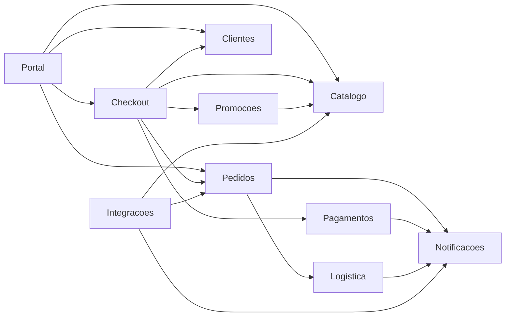
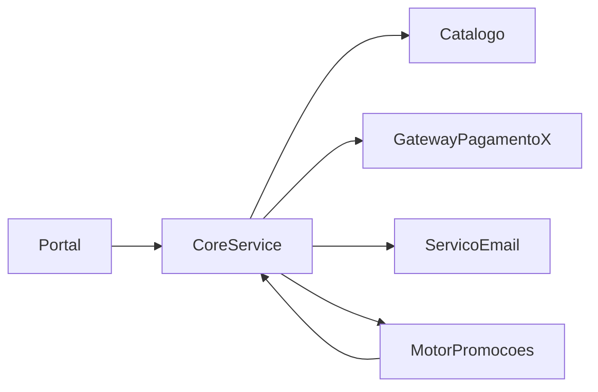

# Marketplace Orion — fonte da verdade

> Nenhuma aula inventa componente, dependência ou número. Tudo vem daqui. Se uma aula precisar de algo que não está neste documento, o documento é estendido primeiro.

Esta regra existe por um motivo concreto: a aula de métricas do Módulo 1 apresenta três valores diferentes de Fan-in para o mesmo componente, dentro do mesmo capítulo. O aluno que tentar refazer as contas não fecha com nada. Um documento único de números elimina essa classe inteira de erro.

---

## A empresa

A Orion começou como loja online de nicho vendendo eletrônicos de catálogo próprio. Em dois anos abriu a plataforma para vendedores parceiros e passou a operar como marketplace.

**Situação atual:**

- picos de até 8x o volume normal de pedidos em campanhas;
- múltiplos parceiros de pagamento e de logística, com contratos e prazos distintos;
- operação em regiões com regras comerciais e fiscais diferentes;
- equipe de plataforma de porte médio, sem espaço para reescrita completa.

**Sintomas recorrentes** (matéria-prima das aulas):

- incidentes intermitentes no checkout em horário de pico;
- alto custo para substituir uma integração crítica;
- tempo crescente entre pedir uma mudança de negócio e entregá-la;
- regressões em funcionalidades sem relação aparente com o que foi alterado;
- discussões técnicas que terminam em preferência pessoal por falta de evidência.

---

## Componentes canônicos

Dez componentes. Os nomes são fixos — ver "Linguagem ubíqua" abaixo.

| Componente | Responsabilidade | Não é responsável por |
|---|---|---|
| `Portal` | camada de entrada web e mobile; compõe telas | regra de negócio de qualquer tipo |
| `Checkout` | orquestrar o fechamento de compra | calcular preço, cobrar, despachar |
| `Catalogo` | produtos, categorias, preço de tabela, disponibilidade | desconto, reserva de estoque |
| `Clientes` | cadastro, identificação, endereços | autenticação de parceiro, crédito |
| `Promocoes` | cupons, campanhas, regras de desconto | aplicar desconto no pedido já emitido |
| `Pagamentos` | cobrança, estorno, conciliação com provedores | decidir se a compra pode ser fechada |
| `Pedidos` | pedido emitido, itens, ciclo de vida, histórico | cobrar, despachar, notificar diretamente |
| `Logistica` | frete, despacho, rastreio, parceiros logísticos | prazo prometido na vitrine |
| `Notificacoes` | e-mail, push, SMS transacional | decidir quando algo deve ser comunicado |
| `Integracoes` | camada genérica de adaptação a parceiros | ver nota abaixo |

!!! info "Sobre `Integracoes`"

    Componente construído há um ano para "padronizar toda integração com parceiro". Foi projetado de forma altamente abstrata, mas nenhum time adotou: `Pagamentos` e `Logistica` continuaram falando direto com seus provedores. Hoje ele depende de meio sistema e ninguém depende dele.

    É um caso real e deliberado no domínio. Serve para a aula de métricas mostrar a *Zone of Uselessness* com um exemplo que tem história, e não como categoria abstrata.

---

## Grafo de dependências oficial

`A --> B` significa: **A depende de B**.

**17 arestas.** Este é o estado atual do sistema, e é o único grafo do qual as aulas derivam.

Uma aula pode usar um **recorte** (subconjunto de componentes), e deve dizer que é recorte. Não pode usar um grafo diferente.

---

## Números oficiais

Convenções de contagem em `06-code-style.md`. Definições:

- $C_a$ (fan-in) — quantos componentes dependem deste;
- $C_e$ (fan-out) — de quantos componentes este depende;
- $N_a$ — elementos abstratos do componente;
- $N_c$ — total de elementos do componente.

| Componente | $C_a$ | $C_e$ | $I$ | $N_a$ | $N_c$ | $A$ | $D$ |
|---|---|---|---|---|---|---|---|
| `Portal` | 0 | 4 | 1,00 | 0 | 6 | 0,00 | **0,00** |
| `Checkout` | 1 | 5 | 0,83 | 2 | 10 | 0,20 | **0,03** |
| `Logistica` | 1 | 1 | 0,50 | 2 | 5 | 0,40 | **0,10** |
| `Pagamentos` | 1 | 1 | 0,50 | 2 | 6 | 0,33 | **0,17** |
| `Promocoes` | 1 | 1 | 0,50 | 1 | 7 | 0,14 | **0,36** |
| `Pedidos` | 3 | 2 | 0,40 | 1 | 9 | 0,11 | **0,49** |
| `Notificacoes` | 4 | 0 | 0,00 | 2 | 4 | 0,50 | **0,50** |
| `Integracoes` | 0 | 3 | 1,00 | 5 | 6 | 0,83 | **0,83** |
| `Catalogo` | 4 | 0 | 0,00 | 1 | 10 | 0,10 | **0,90** |
| `Clientes` | 2 | 0 | 0,00 | 0 | 5 | 0,00 | **1,00** |

Verificação: a soma dos $C_a$ é 17 e a soma dos $C_e$ é 17, iguais ao número de arestas do grafo. Qualquer alteração no grafo exige refazer esta conta.

Valores arredondados para duas casas. As frações exatas menos óbvias: `Checkout` $I = 5/6$; `Promocoes` $A = 1/7$; `Pedidos` $A = 1/9$; `Integracoes` $A = 5/6$.

### Leituras que estes números permitem

Estes casos são deliberados. Cada um sustenta um argumento de aula:

- **`Clientes` com $D = 1,00$** — o pior caso possível. Totalmente concreto, e duas coisas dependem dele. Qualquer mudança propaga, e não há ponto de extensão. *Zone of Pain* no extremo.
- **`Catalogo` com $D = 0,90$** — quatro dependentes, quase nenhuma abstração. Mesmo diagnóstico, com mais gente afetada.
- **`Integracoes` com $D = 0,83$** — abstração alta e ninguém consumindo. *Zone of Uselessness*. Junto com `Catalogo`, permite a demonstração central: **$D$ alto não diz qual dos dois problemas é.** Os dois estão longe da sequência principal por motivos opostos, e $D$, sozinho, não distingue. Só o plano $A \times I$ distingue.
- **`Checkout` com $D = 0,03$** — praticamente em cima da sequência principal, e é o componente que mais causa incidente. Este é o contraexemplo mais valioso do curso: a métrica está ótima e o problema é real. Fan-out 5 e posição no caminho crítico não aparecem em $D$. **Métrica é sintoma, não veredito.**
- **`Portal` com $D = 0,00$** — instabilidade máxima e zero abstração, e está correto assim. Componente de borda deve ser volátil. Serve para desfazer a ideia de que instabilidade alta é defeito.

---

## Recorte legado (para a aula de acoplamento)

Antes da separação atual, `Checkout`, `Promocoes` e parte de `Pedidos` viviam em um único componente chamado `CoreService`, que tinha ciclo com `Promocoes`:

Este recorte é **histórico** e só pode ser usado para demonstrar o problema que a estrutura atual resolveu. Nunca misturar com os números oficiais acima — os componentes nem existem mais com esses nomes.

---

## Linguagem ubíqua

Nomes fixos. Sem sinônimos, em texto, código ou diagrama.

| Sempre | Nunca |
|---|---|
| `Checkout` | fechamento, finalização, carrinho |
| `Catalogo` | produtos, vitrine, estoque |
| `Clientes` | usuários, compradores, `Usuarios` |
| `Pedidos` | vendas, ordens, compras |
| `Pagamentos` | cobrança, financeiro, gateway |
| `Promocoes` | descontos, cupons, campanhas |
| `Logistica` | entrega, envio, frete |
| `Notificacoes` | comunicação, avisos, e-mails |
| Marketplace Orion | Orion Marketplace, a Orion S.A. |

O Módulo 1 usa `Usuarios` em um diagrama e `Clientes` em outro, para a mesma coisa. Corrigir ao revisar.

---

## As duas trilhas

Nunca se misturam. Cada uma tem escopo, artefato e destino próprios.

### Mini-Orion Checkout — trilha do professor

**O que é:** recorte pequeno e executável, resolvido em aula.

**Escopo fixo:** `Checkout`, `Pagamentos`, `Notificacoes` e o mínimo de `Catalogo` e `Pedidos` para o fluxo fechar.

**Onde vive:** `code/mini-orion/aulaNN/`, uma pasta por aula em que o código muda. Executável, com testes.

**Regra de evolução:** o código de uma aula parte do estado da aula anterior. Nomes de classe e de método são estáveis ao longo do curso — se `ServicoCheckout` mudar de nome, muda em todas as aulas seguintes, não só na atual.

**O que nunca contém:** persistência real, framework web, infraestrutura, concorrência de verdade. É evidência de decisão estrutural, não sistema de produção.

!!! warning "Estado atual"

    O Mini-Orion ainda não existe como código. Hoje as aulas do Módulo 1 usam snippets isolados e mutuamente incoerentes — o `Checkout` da Aula 1, o da Aula 3 e o `CoreService` da Aula 8 são três sistemas diferentes. Item de `12-backlog.md`.

### Orion Evolution Lab — trilha dos grupos

**O que é:** projeto dos alunos sobre um recorte amplo do Orion. **Nunca resolvido no material.**

**Escopo:** grafo completo, ou recorte escolhido pelo grupo e justificado.

**Artefatos, acumuláveis ao longo do curso:**

| Artefato | Formato | Aparece a partir de |
|---|---|---|
| Mapa de componentes e dependências | diagrama + tabela | primeiras aulas |
| Registro de diagnóstico | componente, problema, evidência, impacto | aulas de acoplamento |
| ADR | contexto, decisão, alternativas, consequências | aula de decisões |
| Tabela de métricas | $C_a$, $C_e$, $A$, $I$, $D$ + leitura | aula de métricas |
| Proposta de evolução | priorizada, com trade-off por item | oficina |

Cada grupo mantém seus artefatos em pasta própria; o material publica apenas o **formato** e os **critérios** (`09-assessment.md`), nunca o conteúdo preenchido.

**Regra dura:** se o material entregar a resposta do Evolution Lab, a trilha perde a função. Resolução comentada do professor só existe sobre o Mini-Orion.

---

## Estendendo o domínio

Quando uma aula precisar de algo que não existe aqui:

1. verificar se o conceito não pode ser demonstrado com o que já existe (quase sempre pode);
2. se não puder, estender **este documento** primeiro — componente, dependências, números;
3. recalcular a tabela de métricas inteira, já que $C_a$ e $C_e$ de outros componentes mudam;
4. só então escrever a aula.

Nunca o inverso. Componente que nasce dentro de uma aula é como o Módulo 1 acumulou três versões incompatíveis do mesmo checkout.
