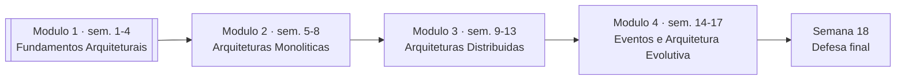

# Arquitetura de Software

Disciplina do Bacharelado em Sistemas de Informação, organizada para desenvolver pensamento arquitetural aplicado a sistemas reais. O foco não está em decorar estilos arquiteturais, mas em aprender a tomar decisões sob restrições, justificar trade-offs e avaliar a qualidade estrutural de soluções de software.

## Visão geral da disciplina

Esta disciplina possui 18 semanas e está organizada em módulos progressivos. O Módulo 1 estabelece os fundamentos que serão reutilizados continuamente nos demais módulos: monólitos, arquiteturas distribuídas, integração orientada a eventos e arquitetura evolutiva.

O Módulo 1, em destaque, é o único disponível no momento. A semana 18 é reservada à apresentação e defesa da proposta arquitetural desenvolvida ao longo do semestre.

## O que você vai desenvolver

Ao longo da disciplina, você será treinado para:

- interpretar arquiteturas existentes com criticidade;
- identificar riscos estruturais antes de eles virarem incidentes;
- avaliar impacto de decisões arquiteturais no médio e no longo prazo;
- sustentar propostas com linguagem técnica e evidências.

!!! info "Referência central"

    A espinha dorsal conceitual da disciplina é o livro **Fundamentals of Software Architecture** (Mark Richards e Neal Ford), complementado por autores clássicos como Parnas, Stevens, Martin e Bass quando necessário.

## Estratégia didática

A disciplina trabalha com um domínio unificado de **Marketplace**, para conectar os conceitos aula após aula. Em vez de exemplos desconectados, os temas se acumulam em uma narrativa única: começamos definindo arquitetura e terminamos diagnosticando tecnicamente um sistema completo.

## Por onde começar

Inicie pela página do módulo:

- [Módulo 1 — Fundamentos de Arquitetura de Software](modulo1/index.md)
