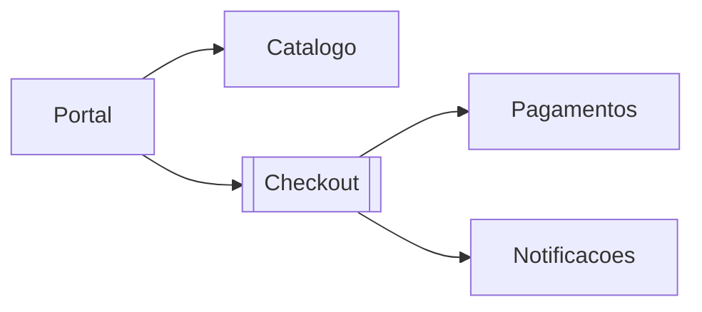

# Aula 1 — O que é Arquitetura de Software?

## Objetivo da aula

Compreender arquitetura de software como disciplina de decisões estruturais de alto impacto, distinguindo arquitetura de design e implementação no contexto de um sistema de Marketplace.

## Competências desenvolvidas

- diferenciar decisões arquiteturais de decisões locais de código;
- identificar características arquiteturais relevantes ao negócio;
- explicar o papel do arquiteto de software em times de desenvolvimento;
- justificar por que arquitetura é, antes de tudo, uma disciplina de decisões.

## Contextualização


Abrimos o módulo com o estudo de caso contínuo **Marketplace Orion**, que conecta vendedores, compradores, catálogo, checkout e logística. A empresa cresceu rápido, mas começou a enfrentar sintomas recorrentes: demora para entregar funcionalidades, incidentes em produção e dificuldade de entender o impacto de mudanças.

Esses sintomas não aparecem porque faltam classes ou frameworks. Eles aparecem porque faltam decisões arquiteturais explícitas.

## Motivação

Imagine a seguinte situação: o time precisa adicionar uma nova regra de frete em 48 horas. O código compila, os testes unitários passam, mas uma alteração no checkout quebra integração com pagamentos. Esse tipo de problema raramente é apenas "bug de código". Quase sempre ele revela uma fragilidade estrutural.

Arquitetura existe para reduzir esse tipo de surpresa.

### Problema da aula

No caso Orion, o problema central é este: o time está reagindo a incidentes sem um critério claro para separar decisões arquiteturais de decisões locais de implementação. Antes de discutir ferramentas, precisamos decidir **o que realmente pertence à arquitetura**.

## Desenvolvimento conceitual

### Arquitetura versus design

Arquitetura e design não são opostos; são níveis diferentes de decisão.

- **Arquitetura** define restrições, limites e estruturas que afetam o sistema inteiro ou partes amplas dele.
- **Design** detalha como uma parte específica funciona dentro dessas restrições.

Uma decisão como "checkout e catálogo serão componentes independentes" é arquitetural. Uma decisão como "usar Strategy para cálculo de desconto" é de design.

### Decisões arquiteturais

Seguindo Richards e Ford, uma decisão arquitetural tem três marcas:

- alto impacto estrutural;
- difícil reversão sem custo significativo;
- efeito sobre características arquiteturais (desempenho, escalabilidade, segurança, testabilidade, etc.).

Por isso, arquitetura não se resume a diagramas. Arquitetura é a gestão consciente de decisões difíceis.

### Papel do arquiteto

O arquiteto não é "dono do diagrama" nem "revisor final de PR". Em um time saudável, ele atua como:

- facilitador de decisões técnicas;
- guardião de trade-offs explícitos;
- elo entre contexto de negócio e estrutura técnica;
- promotor de linguagem arquitetural comum no time.

!!! info "Nota histórica"

    Mark Richards e Neal Ford reforçam que o papel central da arquitetura moderna está menos em produzir artefatos estáticos e mais em orientar decisões contínuas ao longo da evolução do sistema.

### Características arquiteturais

Características arquiteturais são propriedades que orientam decisões estruturais. No Marketplace, alguns exemplos recorrentes:

- disponibilidade durante campanhas;
- desempenho no fluxo de busca e checkout;
- segurança em autenticação e pagamento;
- escalabilidade do catálogo;
- modifiabilidade para novas regras comerciais.

Sem priorização explícita dessas características, toda decisão vira opinião.

### Arquitetura como disciplina de decisões

Ao longo da disciplina, adotaremos uma prática: toda decisão importante deve responder cinco perguntas.

1. Qual problema real estamos resolvendo?
2. Quais características arquiteturais estão em jogo?
3. Quais alternativas existem?
4. Quais trade-offs cada alternativa traz?
5. Como registrar e comunicar a decisão?

## Exemplos

### Exemplo 1 — Decisão implícita (risco alto)

Problema demonstrado: o checkout precisa fechar compra rapidamente, mas o fluxo foi escrito de forma direta e sem fronteiras explícitas.

```python
# checkout.py
def finalizar_compra(carrinho, usuario):
    total = 0.0
    for item in carrinho:
        total += item["preco"] * item["quantidade"]

    # pagamento acoplado diretamente ao gateway concreto
    resposta = enviar_para_gateway_x(total, usuario["cartao"])
    if resposta["status"] != "aprovado":
        raise RuntimeError("Pagamento recusado")

    # notificação acoplada ao mesmo fluxo
    enviar_email(usuario["email"], "Pedido confirmado")
    return {"status": "ok", "total": total}
```

Esse código pode funcionar, mas ele embute decisões arquiteturais sem explicitar consequências: acoplamento com provedor de pagamento, baixa testabilidade do fluxo e pouca flexibilidade para evoluir notificações.

### Exemplo 2 — As mesmas responsabilidades, com as decisões explícitas

O mesmo fluxo, fazendo exatamente as mesmas três coisas: somar, cobrar e avisar.

```python
from typing import Protocol


class GatewayPagamento(Protocol):
    def cobrar(self, valor: float, token: str) -> bool: ...


class Notificador(Protocol):
    def publicar(self, destinatario: str, assunto: str) -> None: ...


class ServicoCheckout:
    def __init__(self, gateway: GatewayPagamento, notificador: Notificador) -> None:
        self.gateway = gateway
        self.notificador = notificador

    def finalizar_compra(self, carrinho: list[dict], usuario: dict) -> str:
        total = sum(i["preco"] * i["quantidade"] for i in carrinho)

        if not self.gateway.cobrar(total, usuario["cartao"]):
            return "pagamento_recusado"

        # A compra ja e valida aqui. O aviso vem depois, e por fora.
        self.notificador.publicar(usuario["email"], "Pedido confirmado")
        return "pedido_confirmado"
```

Compare os dois com atenção, porque a diferença **não** é a quantidade de abstração.

Nos dois, o checkout soma, cobra e avisa. O que mudou foi quem escolhe o provedor de pagamento e o meio de notificação. No primeiro, o `ServicoCheckout` decide — e a decisão está soldada no código, invisível, tomada por quem escreveu a linha às três da tarde de uma terça. No segundo, ele recebe as duas capacidades prontas, e a escolha passou a ser feita em outro lugar, onde alguém pode discuti-la.

Repare que **as duas decisões continuam existindo**. Arquitetura não elimina decisões; ela move as decisões caras para onde são visíveis.

!!! warning "Um alerta sobre este exemplo"

    A segunda versão não é universalmente melhor. Ela tem mais partes móveis, exige montar as dependências em algum lugar, e num sistema pequeno com um único gateway que nunca vai mudar, ela é puro custo sem retorno.

    A pergunta certa nunca é "qual código está mais desacoplado". É: **este sistema vai precisar trocar de provedor de pagamento?** Se a resposta for não, a primeira versão está certa.

    Só que "não" é uma aposta sobre o futuro — e é justamente esse tipo de aposta que a Aula 2 vai ensinar a registrar.

## Onde as decisões vivem



Leitura das setas: `A --> B` significa que **A depende de B**. `Checkout` está em destaque por ser o foco da decisão desta aula.

As duas setas que saem do `Checkout` são o assunto. Elas existem em qualquer versão do sistema — o checkout precisa cobrar e precisa avisar o cliente. O que a decisão arquitetural define não é **se** elas existem, mas **de que forma**: se o `Checkout` conhece o provedor de pagamento pelo nome, ou conhece apenas a capacidade de cobrar.

Repare no que este diagrama não mostra, e que decide tudo: qual das duas setas pode falhar sem derrubar a compra. Uma cobrança recusada é uma compra que não acontece. Um e-mail que não saiu é um aborrecimento. Trate as duas com o mesmo rigor e você paga caro pelo e-mail; trate com o mesmo descaso e você perde dinheiro.

Diagrama nenhum captura essa diferença. É por isso que arquitetura não se resume a desenhar caixas.

## Exercícios

1. **Classifique.** Arquitetural ou de design?

    a. Usar mensageria entre `Checkout` e `Notificacoes`.
    b. Renomear a variável `subtotal` para `total_parcial`.
    c. Dividir `Catalogo` e `Checkout` em componentes distintos.
    d. Escolher `pytest` para os testes automatizados.
    e. Usar Strategy para o cálculo de desconto dentro de `Promocoes`.

    ??? note "Resposta comentada"

        **a — arquitetural.** Muda a forma como dois componentes se comunicam, introduz assincronia e obriga a lidar com consistência eventual. Reverter significa desfazer o barramento e refazer o tratamento de falha.

        **b — nem uma coisa nem outra.** É uma mudança local de legibilidade. Sem impacto estrutural e reversível em segundos, não atende a nenhuma das três marcas. Nem toda decisão técnica é arquitetural, e tratar tudo como arquitetura paralisa o time.

        **c — arquitetural.** Define fronteira, e fronteira define quem pode depender de quem. É o exemplo mais claro dos cinco.

        **d — de design, com uma ressalva.** Trocar `pytest` por `unittest` é trabalhoso e não muda a estrutura do sistema. Mas se a escolha da ferramenta **impedir** uma característica priorizada — por exemplo, se não permitir os testes de arquitetura que veremos na Aula 7 — ela sobe de nível. O que torna uma decisão arquitetural não é a categoria da coisa decidida, é o efeito.

        **e — de design.** Acontece inteiramente dentro de um componente, sem atravessar fronteira. Trocar Strategy por uma cadeia de `if` seria feio e local.

        O padrão: **b** e **e** falham na primeira marca (impacto estrutural amplo); **a** e **c** atendem às três.

2. **Analise.** Volte ao Exemplo 1 e liste as decisões arquiteturais que ele **já tomou**, ainda que ninguém as tenha discutido.

    ??? note "Resposta comentada"

        Pelo menos quatro, todas invisíveis:

        - **O provedor de pagamento é único e conhecido pelo nome.** Trocar exige editar o checkout. Ninguém decidiu isso; ficou decidido.
        - **A notificação está no caminho crítico.** Se `enviar_email` levantar exceção, a compra falha depois de cobrada. Alguém aceitou perder vendas por causa do servidor de e-mail — sem saber que estava aceitando.
        - **O carrinho é `list[dict]`.** O formato virou contrato implícito com todo mundo que chama a função.
        - **A falha de pagamento levanta exceção em vez de retornar estado.** Quem chama é obrigado a usar `try`.

        Nenhuma delas foi errada por si só. O problema é que todas foram tomadas por omissão, e agora estão espalhadas no código em vez de registradas em algum lugar onde possam ser revistas.

        Este é o sentido preciso de "decisão implícita": não é ausência de decisão, é decisão sem dono e sem justificativa.

3. **Aplique.** Escolha uma das decisões implícitas que você encontrou no exercício 2 e responda às cinco perguntas da seção "Arquitetura como disciplina de decisões".

    ??? note "Resposta comentada"

        Tomando a notificação no caminho crítico:

        1. **Problema real:** vendas cobradas se perdem quando o servidor de e-mail falha.
        2. **Características em jogo:** disponibilidade do checkout contra consistência da comunicação com o cliente.
        3. **Alternativas:** manter síncrono e aceitar o risco; publicar evento e notificar depois; tentar enviar e ignorar a falha registrando em log.
        4. **Trade-offs:** a segunda desacopla mas cria uma janela em que o pedido existe e o cliente não sabe; a terceira é mais simples que a segunda e não garante reprocessamento.
        5. **Registro:** um ADR — que é exatamente o formato da próxima aula.

        Repare que o exercício não pede a resposta certa. Ele pede que a decisão saia do código e vire uma discussão que alguém pode contestar.

4. **Julgue.** A Orion vai lançar uma campanha de duas horas com 8x o volume normal de checkout. O prazo é de dez dias, não há orçamento para infraestrutura adicional e reescrever o sistema está fora de questão.

    Liste cinco decisões que o time precisa tomar e ordene-as. Para cada uma, diga qual característica ela protege e quanto custaria reverter.

    Não há resposta única — três arquitetos competentes produziriam três ordens diferentes. Uma boa resposta deixa explícito **o critério** usado para ordenar (risco de perda de receita? custo de reversão? prazo?) e nomeia pelo menos uma decisão que foi deixada de fora e por quê. Uma resposta que lista cinco decisões sem ordená-las não fez o exercício.

## Atividade em grupo

???+ info "Cenário: campanha Flash Orion"

    **Contexto**

    Campanha de 2 horas, expectativa de 8x o volume normal de checkout.

    **Quem está na mesa**

    - **Júlia** (produto): quer maximizar conversão durante a janela.
    - **Rafael** (plataforma): teme indisponibilidade do gateway principal no pico.
    - **Camila** (atendimento): não pode absorver enxurrada de "não recebi confirmação".

    **Restrições**

    - 10 dias até a campanha;
    - sem reescrita do sistema;
    - sem orçamento para infraestrutura adicional.

Em grupos de 3 a 4:

1. Percorram o fluxo de compra e listem **todas** as decisões implícitas que conseguirem encontrar, como no exercício 2.
2. Separem as que são arquiteturais das que não são, usando as três marcas.
3. Para cada decisão arquitetural, registrem: característica protegida, custo de reversão, e quem na mesa se importa com ela.
4. Produzam um quadro de prioridades com no máximo **três** ações — o prazo é de dez dias e a equipe é a que existe.
5. Digam o que ficou de fora e qual o risco de deixar de fora.

O item 5 é obrigatório. Um plano que atende Júlia, Rafael e Camila ao mesmo tempo, em dez dias e sem orçamento, não é um plano — é uma lista de desejos.

### Aplicação no Orion Evolution Lab

Repitam os passos 1 a 3 sobre o recorte do grupo. O resultado é o primeiro artefato do projeto: uma lista de decisões arquiteturais que o sistema já tomou sem ninguém ter discutido.

Formatos e critérios de avaliação em [Orion Evolution Lab](../orion/index.md).

## Resumo

Arquitetura é a gestão consciente de decisões caras de reverter. A distinção entre arquitetura e design não é taxonomia: ela diz onde vale a pena parar e discutir antes de escrever código.

O que fica em aberto é como escolher. Se toda decisão arquitetural é cara de reverter, e nenhuma alternativa é gratuita, decidir rápido é arriscado e decidir devagar é caro. A próxima aula apresenta as duas leis que dão método a isso — e uma prática, o ADR, que existe porque daqui a dois anos ninguém vai lembrar por que escolhemos o que escolhemos.

## Principais conceitos

- arquitetura de software;
- decisão arquitetural;
- características arquiteturais;
- arquitetura versus design;
- papel do arquiteto.

## Leitura complementar

- Richards, Mark; Ford, Neal. *Fundamentals of Software Architecture*. Cap. 1 e Cap. 2.
- Bass, Len; Clements, Paul; Kazman, Rick. *Software Architecture in Practice*. Introdução.

## Referências

- RICHARDS, Mark; FORD, Neal. *Fundamentals of Software Architecture: An Engineering Approach*. O'Reilly, 2020.
- BASS, Len; CLEMENTS, Paul; KAZMAN, Rick. *Software Architecture in Practice*. 4. ed. Addison-Wesley, 2021.