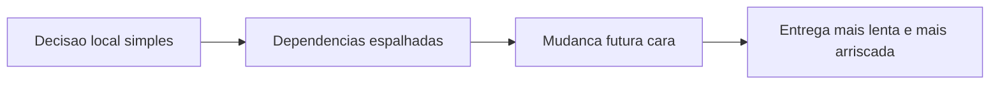
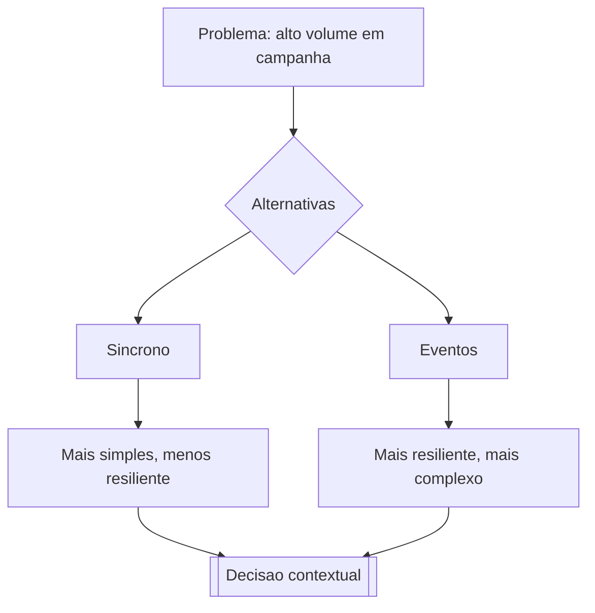

# Aula 2 — Leis da Arquitetura, trade-offs e ADR

## Objetivo da aula

Aplicar as leis da arquitetura para analisar decisões do Marketplace, compreendendo trade-offs, custo da mudança e os elementos centrais do pensamento arquitetural.

## Competências desenvolvidas

- interpretar a Primeira e a Segunda Lei da Arquitetura;
- avaliar decisões sob perspectiva de trade-off;
- relacionar escolhas estruturais com custo de mudança;
- usar pensamento arquitetural para discutir alternativas de solução.

## Contextualização


Na aula anterior, definimos arquitetura como disciplina de decisões. Agora surge a pergunta mais difícil: como escolher entre alternativas imperfeitas quando o sistema precisa evoluir sob pressão de prazo, risco e custo?

No **Marketplace Orion**, o time quer acelerar o lançamento de promoções sem perder estabilidade no checkout. Esse conflito é típico de decisão arquitetural real.

## Motivação

Toda arquitetura relevante envolve tensão entre objetivos concorrentes. Não existe decisão grátis. Quando escolhemos otimizar desempenho, talvez aumentemos complexidade operacional. Quando reduzimos acoplamento, talvez paguemos com mais esforço inicial de integração.

Entender esse equilíbrio é o centro do pensamento arquitetural.

### Problema da aula

No Orion, a equipe precisa decidir como integrar um novo parceiro de pagamentos sem comprometer o checkout em campanha. O problema não é apenas técnico: é decidir com clareza **o que ganhar, o que perder e por quê**.

## Desenvolvimento conceitual

### Primeira Lei da Arquitetura

"Tudo na arquitetura de software é um trade-off." Não existe solução universalmente melhor; existe solução mais adequada ao contexto.

Aplicação imediata no Orion: reduzir latência no checkout pode exigir maior complexidade de operação. A lei orienta a tornar essa troca explícita, e não escondida.

### Segunda Lei da Arquitetura

"Por que é mais importante do que como." A justificativa da decisão importa mais do que a tecnologia escolhida em si. Sem explicitar o porquê, a arquitetura vira coleção de preferências pessoais.

Aplicação imediata no Orion: escolher "fila" ou "chamada síncrona" só faz sentido quando o contexto de disponibilidade, prazo e custo está documentado.

!!! info "Nota histórica"

    Neal Ford popularizou, junto com Mark Richards, a ideia de que decisões arquiteturais precisam ser tratadas como hipóteses justificadas por contexto, e não como escolhas definitivas descoladas do negócio.

### Trade-offs em arquitetura

Trade-off é a relação entre ganhos e perdas ao escolher uma alternativa.

Exemplo no Marketplace:

- integrar checkout e pagamento por chamada síncrona direta;
- ou desacoplar com fila de eventos.

A primeira opção simplifica o fluxo imediato, mas pode reduzir resiliência. A segunda melhora desacoplamento e tolerância a falhas, porém aumenta complexidade operacional.

### Custo da mudança

Uma decisão arquitetural ruim tende a encarecer mudanças futuras de forma não linear. O custo cresce porque a decisão se espalha em múltiplos pontos do sistema.



### Pensamento arquitetural

Pensamento arquitetural é a prática de antecipar consequências estruturais antes da implementação completa.

No módulo, trabalharemos sempre com este ciclo:

1. problema de negócio;
2. opções arquiteturais;
3. impactos em características arquiteturais;
4. trade-offs;
5. decisão registrada.

## Exemplos

### Exemplo 1 — Escolha entre chamada direta e evento

```python
from dataclasses import dataclass


@dataclass
class Pedido:
    id: str
    total: float


class CheckoutSincrono:
    def __init__(self, pagamentos) -> None:
        self.pagamentos = pagamentos

    def confirmar(self, pedido: Pedido) -> str:
        aprovado = self.pagamentos.cobrar(pedido.id, pedido.total)
        return "confirmado" if aprovado else "recusado"
```

Esse desenho tende a ser simples para começar, mas o checkout fica sensível à disponibilidade do componente de pagamentos.

```python
class CheckoutOrientadoAEventos:
    def __init__(self, barramento_eventos) -> None:
        self.barramento = barramento_eventos

    def confirmar(self, pedido: Pedido) -> str:
        self.barramento.publicar("pedido_criado", {"pedido_id": pedido.id, "total": pedido.total})
        return "processando"
```

Aqui, checkout responde rápido e desacopla fluxos, mas o sistema passa a exigir controle de consistência assíncrona.

### Exemplo 2 — Registro simples de decisão arquitetural

Problema demonstrado: como registrar a decisão de forma que qualquer integrante do time entenda o contexto e as consequências sem depender de memória informal.

???+ info "ADR de referência (formato documental)"

    | Campo | Conteúdo |
    |---|---|
    | **Identificador** | ADR-001 |
    | **Título** | Integração Checkout-Pagamentos em campanha |
    | **Status** | Aceita |
    | **Contexto** | Campanhas geram picos de 8x e indisponibilidade parcial do gateway atual. |
    | **Decisão** | Publicar evento de pedido criado e processar pagamento de forma assíncrona. |
    | **Alternativa descartada** | Manter a chamada síncrona e aumentar o timeout. Descartada porque o timeout maior degrada a experiência de todos para acomodar a falha de alguns. |
    | **Consequências positivas** | maior resiliência em pico; desacoplamento entre checkout e provedor. |
    | **Consequências negativas** | maior complexidade de observabilidade; consistência eventual entre pedido e cobrança. |
    | **Reversão** | Alta. Voltar ao síncrono exige remover o barramento e refazer o tratamento de falha. Estimado em 3 semanas. |

O valor do ADR não está no formato, e sim em dois campos que costumam ser omitidos.

**Alternativa descartada** — sem ela, o registro não prova que houve escolha. Daqui a um ano, quem ler vai supor que ninguém pensou no óbvio, e vai reabrir a discussão.

**Consequências negativas** — um ADR só com benefícios não é decisão, é anúncio. Toda decisão arquitetural cobra alguma coisa; se você não consegue nomear o que ela cobra, provavelmente ainda não entendeu a decisão.

!!! tip "O teste do ADR"

    Daqui a dois anos alguém vai olhar este sistema e pensar "por que diabos fizeram assim?".

    O ADR é bom se responder essa pergunta sem que a pessoa precise encontrar você.

## Diagramas



Este diagrama é de raciocínio, não de dependência: as setas indicam o encadeamento da análise, e não quem depende de quem.

Legenda rápida:

- nós `Sincrono` e `Eventos`: alternativas arquiteturais candidatas;
- nós intermediários: impactos principais percebidos em cada alternativa;
- nó `Decisao contextual`: reforça que a escolha depende de contexto, não de regra absoluta.

O diagrama mostra por que as Leis da Arquitetura são úteis. A decisão emerge da comparação de perdas e ganhos, e não de preferência tecnológica.

## Exercícios

1. **Nomeie o custo.** Para cada decisão, diga o que ela cobra. Toda uma delas tem preço; o exercício é encontrá-lo.

    a. Cache agressivo no `Catalogo`.
    b. Validação de promoções em tempo real no `Checkout`.
    c. Autenticação centralizada em um único componente.

    ??? note "Resposta comentada"

        **a — paga em consistência e em custo de mudança.** O cliente pode ver preço desatualizado, e o pior caso é a vitrine anunciar um valor que o checkout não honra. Além disso, invalidação de cache é notoriamente difícil: cada regra nova de preço precisa saber o que invalidar, o que amarra `Promocoes` ao cache do `Catalogo`.

        **b — paga em disponibilidade e latência.** O `Checkout` passa a depender de `Promocoes` estar de pé e rápido no momento mais crítico do fluxo. O ganho é que o desconto está sempre correto; o custo é uma indisponibilidade a mais no caminho da receita.

        **c — paga em disponibilidade e acoplamento.** Um ponto único de falha que derruba tudo, e um componente do qual todos dependem — o que o torna muito caro de mudar. O ganho, real, é que a regra de autenticação existe em um lugar só e não diverge.

        O padrão que se repete nas três: **o benefício é imediato e visível, o custo é diferido e estrutural.** É por isso que decisões arquiteturais ruins parecem boas na semana em que são tomadas.

2. **Analise.** A Segunda Lei diz que "por quê" importa mais que "como". Dois times documentaram a mesma decisão. Qual registro sobrevive melhor ao tempo, e por quê?

    > **Registro A:** "Usamos RabbitMQ com filas duráveis e confirmação manual, três consumidores por fila, dead-letter após cinco tentativas."

    > **Registro B:** "Optamos por processar pagamento de forma assíncrona porque o gateway fica indisponível em campanha e não podemos perder pedidos. Aceitamos consistência eventual entre pedido e cobrança. Se a taxa de falha do gateway cair abaixo de 0,1%, vale reconsiderar o síncrono, que é mais simples."

    ??? note "Resposta comentada"

        **B**, e a diferença não é o nível de detalhe — é que A responde "como" e B responde "por quê".

        Daqui a dois anos, o RabbitMQ pode ter sido trocado por Kafka, ou por SQS. O registro A vira arqueologia: descreve com precisão uma configuração que não existe mais, e não ajuda ninguém a decidir nada.

        O registro B continua valendo, porque o que ele documenta é a **condição** que justificou a escolha. E ele faz algo mais raro: diz sob qual circunstância a decisão deixaria de valer. Isso transforma a decisão em hipótese verificável, e não em dogma.

        Note que A não é inútil — é documentação operacional legítima. Só não é ADR.

3. **Aplique.** Escreva um ADR completo, com todos os campos, para esta decisão: *o `Catalogo` passará a servir preços a partir de um cache com validade de 5 minutos.*

    ??? note "Resposta comentada"

        Um registro aceitável:

        | Campo | Conteúdo |
        |---|---|
        | **Identificador** | ADR-002 |
        | **Título** | Cache de preços no Catalogo com validade de 5 minutos |
        | **Status** | Aceita |
        | **Contexto** | A busca responde em 800 ms no percentil 95 e degrada em campanha. 90% das consultas são de leitura sobre produtos cujo preço muda poucas vezes por dia. |
        | **Decisão** | Servir preços de cache com TTL de 5 minutos. |
        | **Alternativa descartada** | Otimizar as consultas ao banco. Descartada porque o ganho estimado era de 30% e precisamos de uma ordem de grandeza; fica como trabalho paralelo. |
        | **Consequências positivas** | Busca abaixo de 300 ms; carga no banco cai; suporta o pico sem infraestrutura nova. |
        | **Consequências negativas** | Cliente pode ver preço até 5 min desatualizado. Se `Promocoes` alterar um preço, a vitrine e o checkout divergem nesse intervalo. |
        | **Reversão** | Baixa. Desligar o cache é uma configuração. O risco é já termos construído coisas em cima do desempenho novo. |

        Dois erros comuns nesta questão. O primeiro é omitir a consequência negativa — sem ela não é decisão, é anúncio. O segundo é escrever "consequência negativa: complexidade adicional", que é genérico demais para ser útil: **o custo precisa ser algo que alguém consiga observar acontecendo.**

4. **Julgue.** A Orion assinou com um novo parceiro de pagamentos para reduzir taxas. O parceiro atual continua ativo por seis meses, o prazo é de três semanas, não pode haver downtime no checkout e há quatro pessoas disponíveis.

    Proponha duas alternativas de integração — ambas defensáveis — e escolha uma.

    Não há resposta única. O que se avalia: se as duas alternativas são **de verdade** (uma alternativa montada para perder zera o exercício), se o custo de cada uma está nomeado em algo concreto, e se a escolha está amarrada às restrições do cenário e não a um princípio geral. "Escolhemos a segunda porque é mais desacoplada" não é justificativa — desacoplada em relação a quê, e a que preço, dentro de três semanas?

## Atividade em grupo

???+ info "Cenário: novo parceiro de pagamentos"

    **Contexto**

    A Orion assinou com um novo parceiro para reduzir taxa por transação. O parceiro atual permanece ativo por 6 meses — os dois vão coexistir.

    **Quem está na mesa**

    - **Ana** (financeiro): quer a redução de custo já.
    - **Diego** (arquitetura): não quer trocar um acoplamento por outro.
    - **Bruna** (produto): não aceita queda na conversão, nem por um dia.

    **Restrições**

    - 3 semanas;
    - zero downtime no checkout;
    - 4 pessoas.

Em grupos:

1. Proponham **duas** alternativas de integração, ambas defensáveis.
2. Para cada uma, avaliem: impacto na conversão, custo de mudança daqui a 6 meses quando o parceiro antigo sair, risco operacional durante a coexistência, e esforço dentro das 3 semanas.
3. Escolham uma e escrevam o ADR completo, com todos os campos — incluindo alternativa descartada e custo de reversão.
4. Identifiquem **qual das três pessoas da mesa fica insatisfeita** com a escolha, e o que vocês diriam a ela.

O item 4 é o ponto da atividade. Uma decisão arquitetural que agrada a todos os interessados quase sempre significa que o conflito real foi adiado, não resolvido.

Ao final, comparem os ADRs entre os grupos. Cenários idênticos vão produzir decisões diferentes — e a discussão sobre **por que** elas diferem vale mais que qualquer uma delas isoladamente.

### Aplicação no Orion Evolution Lab

Escrevam retroativamente o ADR de uma decisão que já existe no recorte do grupo — uma que ninguém registrou na época. Reconstruir o "por quê" de uma decisão antiga é exatamente o trabalho que o ADR existe para evitar.

Formato e critérios em [Orion Evolution Lab](../orion/index.md).

## Resumo

Arquitetura é escolha sob restrição, não busca por solução perfeita. As duas Leis dão o método: tornar o trade-off explícito, e registrar o porquê antes que ele se perca.

Mas escolher supõe um critério, e ainda não temos nenhum. Dizer que uma alternativa "é mais resiliente" só decide alguma coisa se resiliência estiver acima de simplicidade na lista de prioridades do Orion — e essa lista não existe. É por isso que a reunião da próxima aula está na terceira semana sem conclusão.

## Principais conceitos

- Primeira Lei da Arquitetura;
- Segunda Lei da Arquitetura;
- trade-offs arquiteturais;
- custo da mudança;
- pensamento arquitetural.

## Leitura complementar

- Richards, Mark; Ford, Neal. *Fundamentals of Software Architecture*. Cap. 3 (Modularity) e seções sobre trade-offs.
- Ford, Neal et al. *Building Evolutionary Architectures*. Introdução.

## Referências

- RICHARDS, Mark; FORD, Neal. *Fundamentals of Software Architecture: An Engineering Approach*. O'Reilly, 2020.
- FORD, Neal; PARSONS, Rebecca; KUA, Patrick. *Building Evolutionary Architectures*. O'Reilly, 2017.