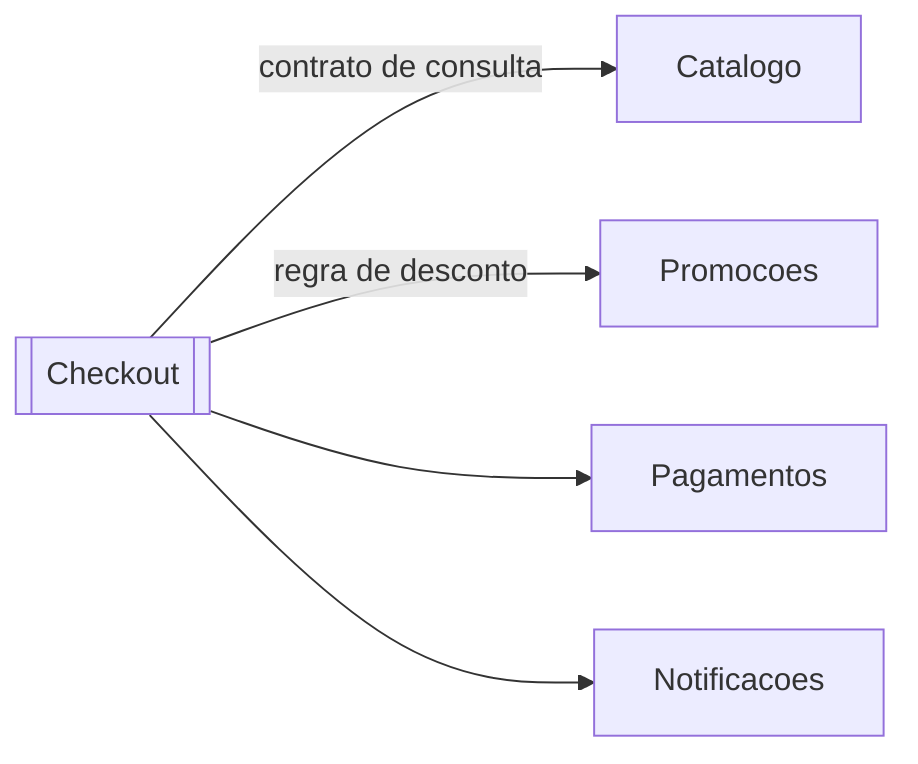

# Aula 4 — Modularidade e Componentes

## Objetivo da aula

Compreender como modularidade e componentização sustentam a evolução arquitetural do Marketplace, conectando decomposição, encapsulamento e interfaces com qualidade estrutural.

## Competências desenvolvidas

- decompor um problema arquitetural em módulos coesos;
- diferenciar módulo de componente no contexto de arquitetura;
- desenhar interfaces claras entre componentes;
- identificar dependências que aumentam risco de mudança.

## Contextualização


Após discutir decisões e trade-offs, o time do **Marketplace Orion** precisa reorganizar o sistema para suportar crescimento do catálogo, promoções sazonais e novos meios de pagamento. O principal desafio agora não é adicionar código, mas controlar complexidade estrutural.

## Motivação

Sistemas sem modularidade clara geralmente apresentam três sintomas:

- toda mudança afeta múltiplas áreas;
- bugs surgem em partes aparentemente não relacionadas;
- o tempo de onboarding de novos desenvolvedores aumenta.

Modularidade reduz esses efeitos ao limitar o alcance do impacto.

### Problema da aula

No Orion, o problema não é "como dividir arquivos", mas como definir componentes que possam evoluir sem provocar efeitos colaterais em toda a plataforma.

## Desenvolvimento conceitual

### O que é modularidade

Modularidade é a capacidade de organizar o sistema em partes com responsabilidade clara, fronteiras explícitas e baixo acoplamento entre elas.

Em termos práticos: se um módulo muda, os demais devem sofrer o mínimo possível.

### Encapsulamento em nível arquitetural

Encapsulamento não vale apenas para classes. Em arquitetura, também encapsulamos decisões internas de componentes.

Exemplo: o componente de catálogo pode mudar seu mecanismo de busca sem exigir mudanças no checkout, desde que a interface pública permaneça estável.

### Interfaces como contratos

Interfaces são acordos técnicos entre componentes. Elas diminuem dependência de detalhes internos e facilitam substituições.

### Componentes e dependências

Um componente arquitetural deve ser visto como unidade de responsabilidade e implantação lógica. Não precisa ser um microserviço; pode ser um módulo interno bem delimitado em um monólito.

Quando falamos em componente no Orion, sempre analisaremos cinco critérios:

1. responsabilidade principal;
2. fronteira explícita;
3. interface/contrato público;
4. dependências permitidas;
5. invariantes que não devem vazar para outros componentes.

!!! info "Nota histórica"

    David Parnas mostrou que decomposição eficiente não deve seguir apenas etapas de processamento, mas esconder decisões que tendem a mudar. Essa ideia sustenta o uso de componentes com fronteiras bem encapsuladas.

### Decomposição

Decomposição é a estratégia de dividir o sistema em partes significativas para o negócio e para a manutenção técnica. No Marketplace, uma decomposição inicial plausível inclui:

- Catálogo;
- Checkout;
- Pagamentos;
- Promoções;
- Notificações.

## Exemplos

### Exemplo 1 — Componente com interface estável

Problema demonstrado: o checkout precisa consultar produtos sem depender de detalhes de armazenamento do catálogo.

```python
from dataclasses import dataclass
from typing import Protocol


@dataclass
class Produto:
    sku: str
    nome: str
    preco: float


class Catalogo(Protocol):
    def buscar_por_sku(self, sku: str) -> Produto | None:
        ...


class CatalogoMemoria:
    def __init__(self, produtos: list[Produto]) -> None:
        self._produtos = {p.sku: p for p in produtos}

    def buscar_por_sku(self, sku: str) -> Produto | None:
        return self._produtos.get(sku)
```

O restante do sistema depende do contrato `Catalogo`, não da estrutura de armazenamento interna.

### Exemplo 2 — Checkout consumindo o contrato

Aplicação: o checkout resolve seu problema de cálculo sem conhecer a implementação do catálogo.

```python
class ServicoCheckout:
    def __init__(self, catalogo: Catalogo) -> None:
        self.catalogo = catalogo

    def calcular_subtotal(self, sku: str, quantidade: int) -> float:
        produto = self.catalogo.buscar_por_sku(sku)
        if produto is None:
            raise ValueError("Produto não encontrado")
        return produto.preco * quantidade
```

Componente de checkout permanece estável mesmo se o catálogo migrar de memória para banco ou API externa.

Os dois exemplos em conjunto mostram que componente bom não é o que "tem mais código", mas o que protege suas decisões internas por contrato.

## Diagramas

O recorte do Mini-Orion, com as dependências que acabamos de estabelecer:



Leitura das setas: `A --> B` significa que **A depende de B**.

Vale insistir nisso, porque é onde mais se erra. O `Checkout` é quem precisa conhecer o `Catalogo` para calcular um subtotal — logo a seta sai do `Checkout`. O dado do produto viaja no sentido contrário, do `Catalogo` para o `Checkout`, mas **fluxo de dado e dependência não são a mesma coisa e frequentemente apontam para lados opostos**. Quem confunde os dois inverte todos os cálculos da Aula 7.

`Checkout` aparece em destaque por ser o consumidor de todos esses contratos: quatro setas saindo, nenhuma entrando. Guarde essa assimetria — ela terá um nome e um número daqui a três aulas.

O que este diagrama **não** mostra: o que acontece quando um desses quatro componentes está indisponível. Voltaremos a isso na próxima aula.

## Exercícios

1. **Classifique.** Dependência aceitável ou fronteira violada?

    a. `Checkout` chama `catalogo.buscar_por_sku(sku)`.
    b. `Checkout` executa `SELECT preco FROM catalogo_produtos WHERE sku = ?`.
    c. `Promocoes` depende de um contrato de cálculo publicado por `Checkout`.
    d. `Checkout` importa `CatalogoMemoria` diretamente, em vez do `Protocol` `Catalogo`.

    ??? note "Resposta comentada"

        **a — aceitável.** Depende da capacidade, não da implementação. `Catalogo` pode migrar de memória para banco ou API sem que `Checkout` saiba.

        **b — violação.** `Checkout` passou a depender do esquema interno do `Catalogo`. Uma renomeação de coluna — mudança que deveria ser interna e barata — quebra outro componente. É a fronteira existindo no diagrama e não no código.

        **c — violação, e a mais interessante das quatro.** A direção está errada. `Promocoes` é um serviço de cálculo; ele não deveria conhecer quem o consome. Uma dependência apontando "para cima", do fornecedor para o cliente, costuma indicar que a responsabilidade foi colocada no componente errado — e é o embrião de um ciclo.

        **d — violação, ainda que sutil.** O contrato existe e não está sendo usado. `Checkout` amarrou-se a uma implementação específica, e a fronteira vira decorativa. É a violação mais comum na prática, porque não parece violação nenhuma: o código funciona, os testes passam, e ninguém percebe até precisar trocar a implementação.

2. **Projete.** Escreva o `Protocol` do componente `Notificacoes`, considerando que `Pedidos`, `Pagamentos` e `Logistica` precisam avisar o cliente sobre coisas diferentes.

    ??? note "Resposta comentada"

        A tentação é escrever um método por tipo de aviso:

        ```python
        class Notificacoes(Protocol):
            def enviar_confirmacao(self, email: str) -> None: ...
            def enviar_falha_pagamento(self, email: str) -> None: ...
            def enviar_codigo_rastreio(self, email: str, codigo: str) -> None: ...
        ```

        O problema aparece no quarto aviso: o contrato cresce a cada necessidade nova de qualquer um dos três consumidores. Pior, `Notificacoes` passou a conhecer o vocabulário de negócio de todo mundo — "falha de pagamento" é conceito de `Pagamentos`, não de quem envia e-mail.

        Melhor:

        ```python
        @dataclass(frozen=True)
        class EventoNotificacao:
            destinatario: str
            assunto: str

        class Notificador(Protocol):
            def publicar(self, evento: EventoNotificacao) -> None: ...
        ```

        Um método só. `Notificacoes` sabe entregar mensagens e nada mais; cada componente monta o evento com o próprio vocabulário. É o contrato que está em `code/mini-orion/02-fronteiras/`.

        A heurística geral: **um contrato que cresce toda vez que um consumidor tem uma necessidade nova está no nível errado de abstração.**

3. **Analise.** No recorte do Mini-Orion, `Checkout` tem quatro dependências e nenhuma dependente. Isso é bom ou ruim?

    ??? note "Resposta comentada"

        Nem uma coisa nem outra sem mais contexto — mas é uma assimetria informativa.

        Quatro setas saindo significam que `Checkout` quebra se qualquer um dos quatro quebrar. Nenhuma entrando significa que ele pode mudar à vontade, porque ninguém depende dele.

        Para um componente que **orquestra um fluxo**, esse é o perfil esperado e correto: ele coordena e por isso conhece todos; ninguém coordena ele. O mesmo perfil num componente que deveria ser reutilizável seria sinal de problema.

        O que a assimetria não diz é se as quatro dependências são igualmente perigosas. Uma delas está no caminho crítico da receita e outra manda e-mail — e o diagrama trata as duas como setas idênticas.

        Guarde a observação: na Aula 7 essas duas contagens vão ganhar nome ($C_a$ e $C_e$) e virar uma fórmula.

4. **Julgue.** Este é o `Checkout` real da Orion hoje:

    ```python
    class CheckoutService:
        def fechar(self, carrinho, cliente):
            desconto = PromocoesDB().calcular(cliente["nivel"], carrinho)
            CatalogoDB().registrar_saida(carrinho)
            GatewayPagamentoX().cobrar(carrinho.total - desconto)
            ServicoEmail().enviar(cliente["email"], "Pedido confirmado")
    ```

    Você tem duas semanas e não pode criar serviço novo nem alterar comportamento. Proponha a decomposição e diga **por onde começar**.

    Não há resposta única. O que se avalia: se cada componente proposto tem responsabilidade descritível em uma frase, se as dependências permitidas estão declaradas, e sobretudo se há uma **ordem** justificada — duas semanas não dão para tudo, e escolher o primeiro passo é a parte difícil. Uma resposta que redesenha o sistema inteiro sem dizer o que fazer na segunda-feira não respondeu à pergunta.

## Atividade em grupo

Sobre o mesmo `CheckoutService` do exercício 4:

1. Listem todas as fronteiras violadas, uma por linha de código.
2. Para cada uma, digam **qual mudança futura ela encarece**. "Está acoplado" não conta; "trocar de gateway exige editar o checkout" conta.
3. Desenhem a decomposição alvo em Mermaid, declarando a convenção das setas.
4. Para cada componente: responsabilidade em uma frase, contrato público, dependências permitidas.
5. Escrevam o que o diagrama de vocês **não** representa.
6. Priorizem: qual fronteira vocês estabeleceriam primeiro nas duas semanas, e por quê.

O item 5 é obrigatório e costuma ser esquecido. Todo diagrama arquitetural omite alguma coisa — omitir sem avisar é o defeito clássico, e é o que faz um desenho parecer mais confiável do que é.

### Aplicação no Orion Evolution Lab

Produzam o mapa de componentes e dependências do recorte do grupo, no formato acima. Este é o artefato que todas as aulas seguintes vão usar — o diagnóstico da Aula 5, as connascências da Aula 6 e as métricas da Aula 7 são todos calculados em cima dele.

Formato e critérios em [Orion Evolution Lab](../orion/index.md).

## Resumo

Modularidade e componentes controlam complexidade e custo de mudança. O Orion deixou de ser uma caixa só: agora tem fronteiras, contratos e dependências declaradas.

O que ainda não sabemos é se essa decomposição é **boa**. Desenhar caixas é fácil, e uma fronteira que existe no diagrama mas não no código não protege ninguém. A próxima aula traz os dois critérios que separam uma fronteira real de uma aparente — e mostra que uma delas, no nosso próprio recorte, está pior do que parece.

## Principais conceitos

- modularidade;
- encapsulamento arquitetural;
- interfaces;
- componentes;
- dependências;
- decomposição.

## Leitura complementar

- Richards, Mark; Ford, Neal. *Fundamentals of Software Architecture*. Cap. sobre componentes e modularidade.
- Parnas, David. *On the Criteria To Be Used in Decomposing Systems into Modules*.

## Referências

- RICHARDS, Mark; FORD, Neal. *Fundamentals of Software Architecture: An Engineering Approach*. O'Reilly, 2020.
- PARNAS, D. L. On the Criteria To Be Used in Decomposing Systems into Modules. *Communications of the ACM*, 1972.