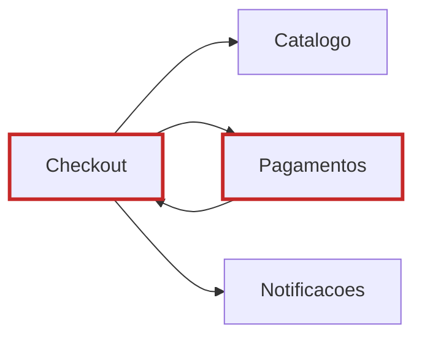

# Aula 5 — Acoplamento e Coesão

## Objetivo da aula

Analisar qualidade estrutural do Marketplace por meio de acoplamento e coesão, identificando responsabilidades mal distribuídas e propondo melhorias arquiteturais.

## Competências desenvolvidas

- diferenciar tipos de acoplamento em decisões de arquitetura;
- avaliar coesão em módulos e componentes;
- reconhecer sinais de responsabilidade mal alocada;
- propor ajustes estruturais com justificativa técnica.

## Contextualização


Com o **Marketplace Orion** decomposto em componentes, o próximo passo é avaliar se a decomposição ficou boa. Dois sistemas podem ter o mesmo diagrama macro e, ainda assim, qualidades estruturais muito diferentes dependendo de como dependências e responsabilidades foram distribuídas.

## Motivação

Acoplamento alto e coesão baixa costumam gerar um padrão conhecido em times: cada nova funcionalidade fica mais lenta e mais arriscada do que a anterior. A arquitetura começa a "cobrar juros" de decisões ruins.

### Problema da aula

No Orion, o problema é distinguir se a decomposição feita na aula anterior é realmente sustentável ou apenas uma reorganização superficial. Para isso, precisamos avaliar qualidade estrutural com critérios claros.

## Desenvolvimento conceitual

### Acoplamento

Acoplamento mede o grau de dependência entre partes do sistema.

- **Acoplamento desejável**: dependências claras, por contrato, com direção consistente.
- **Acoplamento problemático**: dependências cíclicas, dependência de detalhe interno ou conhecimento excessivo entre componentes.

Quanto maior o acoplamento indevido, maior o custo de mudança.

### Coesão

Coesão indica o quanto as responsabilidades de uma parte estão relacionadas entre si.

- **Alta coesão**: componente focado em um objetivo claro;
- **Baixa coesão**: componente mistura regras de domínios distintos.

Componentes com baixa coesão tendem a ser "classes Deus" em escala arquitetural.

!!! info "Nota histórica"

    Larry Constantine, Glenford Myers e Wayne Stevens ajudaram a consolidar coesão e acoplamento como critérios práticos de qualidade estrutural, ainda hoje centrais para avaliar componentes.

### Acoplamento e coesão em conjunto

A combinação arquitetural mais saudável tende a ser:

- alta coesão interna;
- baixo acoplamento externo.

## Exemplos

### Exemplo 1 — Coesão perdida por acúmulo

Este é o `Checkout` do Mini-Orion depois de um ano de pedidos pequenos e razoáveis.

```python title="mini_orion/checkout.py" hl_lines="4 5 9"
class ServicoCheckout:
    def fechar_pedido(self, carrinho: Carrinho, cliente: Cliente) -> str:
        total = self._somar_itens(carrinho)
        total = self._aplicar_cupom(total, cliente)
        total = self._calcular_frete(total, cliente.cep)
        aprovado = self._cobrar(total, cliente.cartao)
        if not aprovado:
            return "recusado"
        self._reservar_estoque(carrinho)
        self._enviar_confirmacao(cliente.email)
        return "confirmado"
```

As três linhas destacadas chegaram em momentos diferentes. Regra de cupom: pediram para aplicar antes de cobrar, e o lugar mais rápido era ali. Frete: mesma história, três meses depois. Reserva de estoque: "é só uma chamada".

Nenhuma dessas linhas foi um erro no dia em que foi escrita. Cada uma resolveu um problema real pelo caminho mais curto — e é assim que a coesão se perde, não por uma decisão ruim, mas por trinta decisões locais defensáveis.

O resultado é que o `ServicoCheckout` hoje muda por cinco motivos independentes: mudou a regra de cupom, mudou a tabela de frete, mudou o provedor de pagamento, mudou a política de estoque, mudou o texto do e-mail. Cinco frentes de trabalho no mesmo arquivo, cada uma podendo quebrar as outras quatro.

Esse é o teste prático de coesão: **por quantos motivos distintos este componente muda?** Se a resposta é mais de um, e os motivos vêm de áreas de negócio diferentes, a coesão está baixa.

### Exemplo 2 — Responsabilidades redistribuídas

```python title="mini_orion/checkout.py"
class ServicoCheckout:
    def __init__(self, precos: Precificador, pagamentos: Pagamentos,
                 pedidos: Pedidos, notificacoes: Notificacoes) -> None:
        self.precos = precos
        self.pagamentos = pagamentos
        self.pedidos = pedidos
        self.notificacoes = notificacoes

    def fechar_pedido(self, carrinho: Carrinho, cliente: Cliente) -> str:
        total = self.precos.calcular(carrinho, cliente)
        if not self.pagamentos.cobrar(total, cliente.cartao):
            return "recusado"
        pedido = self.pedidos.emitir(carrinho, cliente, total)
        self.notificacoes.confirmar(pedido)
        return "confirmado"
```

O `Checkout` agora muda por um motivo só: quando a **sequência** do fechamento muda. Cupom, frete e imposto foram para o `Precificador`; a emissão do pedido, para `Pedidos`.

Repare no que **não** melhorou: o `Checkout` continua dependendo de quatro componentes. O acoplamento não caiu — mudou de natureza. Antes ele conhecia as regras de cupom; agora conhece um contrato que sabe calcular preço. É a diferença entre depender de uma capacidade e depender de uma implementação, e é o que torna uma dependência tolerável.

Alta coesão não elimina dependências. Ela torna cada uma explicável em uma frase.

### Exemplo 3 — Dependência cíclica

```python
class ServicoPagamentos:
    def __init__(self, checkout: "ServicoCheckout") -> None:
        self.checkout = checkout            # para consultar o estado do pedido

    def estornar(self, pedido_id: str) -> bool:
        if self.checkout.status(pedido_id) != "confirmado":
            return False
        return self._executar_estorno(pedido_id)


class ServicoCheckout:
    def __init__(self, pagamentos: ServicoPagamentos) -> None:
        self.pagamentos = pagamentos        # para cobrar
```

O ciclo nasceu de uma necessidade legítima: para estornar, `Pagamentos` precisa saber se o pedido chegou a ser confirmado. A saída mais curta foi perguntar ao `Checkout`.

A saída correta era outra. `Pagamentos` deveria receber o estado de que precisa como parâmetro, ou consultá-lo em `Pedidos`, que é quem de fato guarda o ciclo de vida. **Ciclo quase sempre indica que a informação está no componente errado** — e o atalho é mais barato hoje e mais caro em todas as mudanças seguintes.

## Diagramas

O ciclo, desenhado:



Leitura das setas: `A --> B` significa que **A depende de B**.

`Checkout` depende de `Pagamentos` para cobrar. E `Pagamentos`, para saber se pode estornar, foi consultar o estado do pedido no `Checkout`. Cada um precisa do outro para funcionar.

O custo aparece em três lugares, e nenhum deles é estético:

- **Teste.** Não dá para testar `Pagamentos` sem levantar `Checkout` junto, e vice-versa. O que era teste unitário virou teste de integração.
- **Mudança.** Qualquer alteração em um exige revalidar o outro. Os dois passam a ser, na prática, um componente só — com a desvantagem de estarem em arquivos separados, o que esconde o fato.
- **Ordem de inicialização.** Alguém tem que ser construído primeiro, e a solução costuma ser um `setter` chamado depois do construtor. A partir daí existe uma janela em que o objeto está incompleto.

Ciclos raramente são desenhados de propósito. Eles aparecem quando alguém precisa de um dado que está do outro lado da fronteira e resolve o problema pelo caminho mais curto.

## Exercícios

1. **Diagnostique.** Para cada cenário, o problema principal é acoplamento, coesão, ou os dois?

    a. `Checkout` lê diretamente a tabela interna de `Promocoes`.
    b. `Checkout` usa o contrato `CalculadoraPromocao`.
    c. Um componente `Core` faz autenticação, catálogo, pagamento e relatório.
    d. `Pedidos` expõe 14 métodos públicos, todos sobre pedido, e é usado por 3 componentes.

    ??? note "Resposta comentada"

        **a — acoplamento**, do tipo pior: a dependência é sobre estrutura interna, não sobre capacidade. A coesão de `Checkout` não muda por causa disso.

        **b — nenhum dos dois.** Existe dependência, e ela é saudável: sobre uma capacidade, com direção correta. Acoplamento não é para ser eliminado. Este cenário está no exercício justamente para não deixar ninguém concluir que toda seta é problema.

        **c — coesão**, e grave. `Core` muda por quatro motivos sem relação entre si. O acoplamento alto que ele certamente tem é **consequência**, não causa: um componente que faz tudo precisa conhecer todo mundo. Atacar as dependências sem dividir o componente não resolveria nada.

        **d — provavelmente nenhum dos dois.** Quatorze métodos parece muito, mas todos tratam do mesmo assunto e o componente muda por um motivo só. Coesão se mede por **motivos de mudança**, não por tamanho. Um componente grande e focado é melhor que três pequenos e entrelaçados.

        A confusão entre **c** e **d** é o ponto: contar métodos ou linhas não mede coesão.

2. **Analise.** Volte ao Exemplo 1. As cinco responsabilidades do `ServicoCheckout` chegaram uma de cada vez, cada uma justificada. Que pergunta o time deveria ter feito na terceira vez, e que teria evitado as duas seguintes?

    ??? note "Resposta comentada"

        "Este componente já muda por quantos motivos?"

        Nenhuma das cinco inclusões era irracional isoladamente. O erro não está em nenhuma delas — está em nunca ter havido um momento em que alguém somasse.

        Uma versão prática da pergunta, aplicável em revisão de código: *se esta linha entrar, quantas equipes diferentes passam a ter motivo para editar este arquivo?* Quando a resposta passa de uma, a linha provavelmente pertence a outro lugar.

        Repare que essa pergunta não exige ferramenta, métrica nem reunião de arquitetura. Exige só que alguém a faça.

3. **Reduza.** Este trecho é do `Checkout`. Reescreva eliminando a dependência estrutural.

    ```python
    class ServicoCheckout:
        def aplicar_desconto(self, cliente, total):
            conn = PromocoesDB.conectar()
            linha = conn.query(
                "SELECT percentual FROM cupons WHERE nivel = ?", cliente.nivel
            )
            return total * (1 - linha["percentual"] / 100)
    ```

    ??? note "Resposta comentada"

        ```python
        class CalculadoraPromocao(Protocol):
            def desconto_para(self, cliente: Cliente, total: float) -> float: ...


        class ServicoCheckout:
            def __init__(self, promocoes: CalculadoraPromocao) -> None:
                self._promocoes = promocoes

            def aplicar_desconto(self, cliente: Cliente, total: float) -> float:
                return total - self._promocoes.desconto_para(cliente, total)
        ```

        Três coisas saíram do `Checkout`: o esquema da tabela, o SQL, e a regra de que desconto é percentual sobre o total.

        A terceira é a mais importante e a mais fácil de deixar passar. Na versão original, se a Orion criar um cupom de valor fixo — R$ 20 de desconto — o `Checkout` precisa mudar, porque a matemática do desconto estava nele. Na versão nova, `Promocoes` devolve um valor e o `Checkout` subtrai; qualquer regra nova de promoção é invisível daqui.

        Um bom teste da refatoração: **liste as mudanças futuras que deixaram de tocar neste arquivo.** Se a lista estiver vazia, você moveu código sem mover responsabilidade.

4. **Julgue.** O `CoreOrion` da Orion concentra catálogo, checkout, pagamentos, promoções e relatórios. Além disso, `Checkout` e `Pagamentos` formam ciclo, e `Checkout` e `Promocoes` também.

    ```mermaid
    flowchart LR
        CoreOrion --> Catalogo
        CoreOrion --> Checkout
        CoreOrion --> Pagamentos
        CoreOrion --> Promocoes
        CoreOrion --> Relatorios
        Checkout --> Promocoes
        Promocoes --> Checkout
        Checkout --> Pagamentos
        Pagamentos --> Checkout
    ```

    Leitura das setas: `A --> B` significa que **A depende de B**.

    Você pode fazer **uma** coisa neste trimestre: quebrar os dois ciclos, ou dividir o `CoreOrion`. Qual, e por quê?

    Não há resposta única, e as duas escolhas têm defensores fortes. Quebrar os ciclos primeiro dá ganho imediato em testabilidade e é de baixo risco. Dividir o `CoreOrion` primeiro ataca a causa — os ciclos provavelmente existem *porque* as responsabilidades estão no lugar errado — mas é caro e demorado.

    O que se avalia é se a resposta nomeia o critério (risco? ganho imediato? causa raiz?), reconhece o que a outra opção teria de bom, e diz o que observaríamos daqui a seis meses para saber se a escolha foi acertada.

## Atividade em grupo

Sobre o diagrama do exercício 4:

1. Para cada componente, respondam: **por quantos motivos distintos ele muda?** Nomeiem os motivos.
2. Marquem as dependências que são sobre estrutura interna, e não sobre capacidade.
3. Para cada ciclo, digam qual informação está no componente errado — ciclo quase sempre é sintoma disso, não causa.
4. Proponham um desenho com no máximo seis componentes e sem ciclo.
5. Priorizem duas mudanças e estimem o custo de cada uma em algo concreto: quantos arquivos mudam, quantos testes quebram, quantas equipes precisam ser avisadas.
6. Digam qual problema estrutural vocês estão **deixando** no sistema, e por quê.

O item 6 é obrigatório. Nenhuma refatoração de um trimestre resolve tudo, e reconhecer o que fica para trás é parte da proposta — não uma falha dela.

### Aplicação no Orion Evolution Lab

Produzam o registro de diagnóstico do recorte do grupo: por componente, o problema, a evidência e o impacto. Evidência é uma linha de código, uma dependência no grafo ou um incidente — "parece confuso" não conta.

Formato e critérios em [Orion Evolution Lab](../orion/index.md).

## Resumo

Acoplamento e coesão são as duas lentes que dizem se a decomposição da aula anterior sustenta evolução ou apenas parece organizada. Coesão se mede por uma pergunta — por quantos motivos distintos este componente muda — e acoplamento não é para ser eliminado, mas para ter a natureza certa: depender de uma capacidade custa pouco, depender de uma implementação custa caro.

Ainda assim, o vocabulário é grosso. Dizer que `Checkout` e `Pagamentos` "estão acoplados" descreve igualmente bem uma mudança de vinte minutos e uma de três dias — e a próxima aula abre exatamente com esse par de mudanças, para mostrar por que precisamos de precisão maior antes de decidir onde mexer.

## Principais conceitos

- acoplamento;
- coesão;
- dependências cíclicas;
- responsabilidade;
- qualidade estrutural.

## Leitura complementar

- Richards, Mark; Ford, Neal. *Fundamentals of Software Architecture*. Seções de acoplamento e coesão.
- Stevens, Wayne; Myers, Glenford; Constantine, Larry. *Structured Design* (cohesion/coupling).

## Referências

- RICHARDS, Mark; FORD, Neal. *Fundamentals of Software Architecture: An Engineering Approach*. O'Reilly, 2020.
- STEVENS, W.; MYERS, G.; CONSTANTINE, L. Structured Design. *IBM Systems Journal*, 1974.