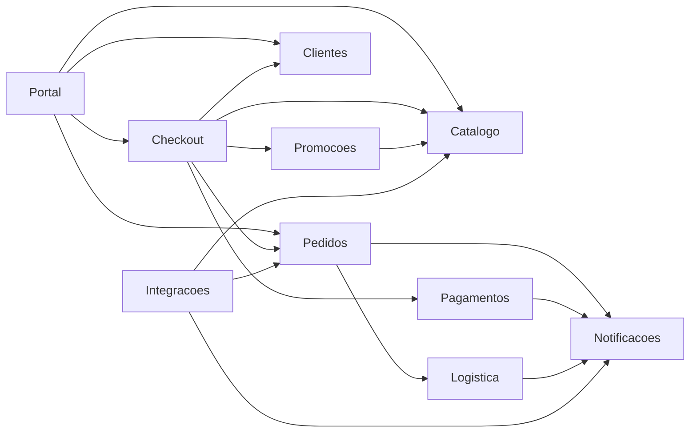

# Aula 7 — Métricas e governança arquitetural

## Objetivo da aula

Medir a estrutura do Orion, interpretar o que os números dizem e o que eles não conseguem dizer, e transformar uma decisão arquitetural em verificação automatizada.

## Competências desenvolvidas

- calcular $C_a$, $C_e$, $A$, $I$ e $D$ a partir de um grafo de dependências;
- posicionar componentes no plano $A \times I$ e distinguir Zone of Pain de Zone of Uselessness;
- identificar situações em que a métrica não aponta o problema real;
- escrever um teste de arquitetura que impede a regressão de uma decisão.

## O empate

Duas propostas de refatoração disputam o mesmo trimestre no Orion.

Uma equipe quer atacar o `Catalogo`: alegam que qualquer mudança lá respinga em meio sistema. A outra quer atacar o `Checkout`: alegam que é ele que cai nas campanhas e derruba a receita.

As duas alegações são verdadeiras. Os dois grupos são competentes. A reunião já dura três semanas e o argumento de cada lado é a experiência de quem trabalha naquele componente — o que significa que quem falar mais alto ganha.

É aqui que a medição entra. Não para dar a resposta, mas para tirar a discussão do campo da preferência e colocá-la em cima de algo que as duas equipes possam olhar juntas.

## Desenvolvimento conceitual

### Antes de medir: para que lado aponta a seta?

Toda métrica desta aula depende de uma única convenção, e ela precisa estar clara antes do primeiro cálculo.

!!! important "Convenção de leitura"

    Em todo diagrama de dependência desta disciplina, `A --> B` significa **A depende de B**.

    A seta aponta na direção do conhecimento: quem tem a seta saindo é quem precisa conhecer o outro para funcionar. `Checkout --> Pagamentos` porque o checkout não fecha compra sem cobrar.

Repare que dependência e fluxo de dados frequentemente apontam para lados opostos. `Checkout` depende de `Pagamentos`, mas a resposta da cobrança viaja de `Pagamentos` para `Checkout`. Se você desenhar o fluxo e contar como se fosse dependência, todos os números saem invertidos — e a análise conclui exatamente o contrário do que deveria.

### Fan-in e Fan-out

- **Fan-in** ($C_a$, acoplamento aferente): quantos componentes dependem deste. No diagrama, são as setas que **chegam**.
- **Fan-out** ($C_e$, acoplamento eferente): de quantos componentes este depende. São as setas que **saem**.

Significado arquitetural:

- Fan-in alto indica componente central: muita gente quebra se ele mudar. Isso pede estabilidade, não necessariamente correção.
- Fan-out alto indica componente exposto: ele quebra quando qualquer um dos seus quebra.

Um componente pode ter os dois altos. É o caso mais desconfortável, e costuma ser o que aparece nos relatórios de incidente.

### Abstractness (A)

$$
A = \dfrac{N_a}{N_c}
$$

Ou seja: a fração dos elementos do componente que são contrato, e não implementação. Zero significa que tudo é concreto; um significa que o componente inteiro é feito de contratos.

- $N_a$: número de elementos abstratos;
- $N_c$: total de elementos do componente.

Significado arquitetural: quanto mais abstrato, maior o potencial de extensão e substituição. Mas abstração sem consumidor é custo sem retorno — voltaremos a isso.

!!! warning "O que conta como abstrato em Python?"

    A fórmula parece objetiva, mas `$N_a$` depende de uma decisão que a fórmula não toma. Em Java, "interface" é uma palavra da linguagem. Python não tem interface — tem `Protocol`, `ABC`, `Enum`, `dataclass`, e cabe a nós decidir o que é contrato.

    A convenção desta disciplina:

    | Elemento | Conta como abstrato? |
    |---|---|
    | `class X(Protocol)` | sim |
    | `class X(ABC)` com ao menos um `@abstractmethod` | sim |
    | `class X(ABC)` sem nenhum `@abstractmethod` | não |
    | Classe base concreta, ainda que herdada | não |
    | `Enum`, `@dataclass`, `TypedDict` | não |

    `ABC` sem método abstrato é concreta na prática: é convenção do autor, não contrato imposto pela linguagem. A métrica mede contrato.

    Guarde o princípio, que vale além desta aula: **toda métrica embute uma decisão de contagem.** Duas equipes medindo o mesmo sistema com convenções diferentes chegam a números diferentes, e nenhuma está errada. Saber qual convenção foi usada faz parte de saber ler a métrica — e é a primeira pergunta a fazer quando alguém apresenta um número.

### Instability (I)

$$
I = \dfrac{C_e}{C_a + C_e}
$$

Ou seja: a fração das dependências do componente que apontam para fora dele. Se ele só depende dos outros e ninguém depende dele, o valor é 1.

- $C_a$ (acoplamento aferente): dependências de entrada, o Fan-in;
- $C_e$ (acoplamento eferente): dependências de saída, o Fan-out.

- $I \approx 0$: componente **estável** — muitos dependem dele, ele depende de poucos. Estável aqui significa "difícil de mudar sem quebrar terceiros", não "bem feito".
- $I \approx 1$: componente **instável** — depende de muitos, poucos dependem dele. Pode mudar à vontade.

Instabilidade alta não é defeito. Um componente de borda **deve** ser instável: é ele quem absorve a variação para que o núcleo não precise mudar.

### Distance from Main Sequence (D)

A sequência principal é a reta $A + I = 1$: quanto mais estável um componente, mais abstrato ele deveria ser, para que os outros possam depender de contratos em vez de implementações.

$$
D = \left|A + I - 1\right|
$$

Ou seja: a distância entre onde o componente está e onde ele deveria estar nesse equilíbrio. Zero é estar exatamente em cima da reta.

Os dois extremos têm nome:

- **Zone of Pain** — abstração baixa, estabilidade alta. Concreto e com muita gente dependendo dele: mudar dói, e não há ponto de extensão.
- **Zone of Uselessness** — abstração alta, estabilidade baixa. Cheio de contratos que ninguém consome.

!!! danger "$D$ sozinho não distingue as duas zonas"

    Repare na fórmula: $D$ é um valor absoluto. Um componente com $A = 0{,}0$ e $I = 0{,}0$ e outro com $A = 1{,}0$ e $I = 1{,}0$ têm **o mesmo $D = 1$**, sendo problemas opostos.

    Um está rígido demais; o outro, abstrato à toa. As receitas são contrárias: o primeiro precisa ganhar contratos, o segundo precisa perder abstração ou ganhar consumidores.

    Consequência prática: **uma lista ordenada por $D$ diz onde olhar, e nunca o que fazer.** Para saber o que fazer é preciso o par $(A, I)$ — e é por isso que a visualização desta aula é um plano de dois eixos, e não um ranking.

!!! info "Nota histórica"

    Robert Martin popularizou o uso conjunto de abstração e instabilidade como diagnóstico estrutural em nível de pacote e componente.

## Medindo o Orion

### O grafo de onde tudo sai

Todas as contas desta aula derivam do grafo de dependências do Orion. Ele é o mesmo que usamos desde a Aula 4, e nada aqui é inventado para o exercício.



Leitura das setas: `A --> B` significa que **A depende de B**.

O que este diagrama **não** mostra: volume de chamadas, criticidade de negócio, e quais dependências são síncronas. Três coisas que vão fazer falta na hora de priorizar — e é por isso que métrica sozinha não decide nada.

São 17 arestas. Contá-las é a primeira verificação: a soma de todos os $C_a$ e a soma de todos os $C_e$ precisam dar 17 cada uma. Se não derem, há erro de leitura antes de qualquer conta.

### Calculando

Contar setas à mão funciona com dez componentes e erra com cinquenta. Vamos automatizar desde o começo.

```python title="metricas.py"
from dataclasses import dataclass

DEPENDENCIAS = [
    ("Portal", "Catalogo"), ("Portal", "Checkout"),
    ("Portal", "Pedidos"), ("Portal", "Clientes"),
    ("Checkout", "Catalogo"), ("Checkout", "Clientes"),
    ("Checkout", "Promocoes"), ("Checkout", "Pagamentos"),
    ("Checkout", "Pedidos"),
    ("Promocoes", "Catalogo"),
    ("Pedidos", "Notificacoes"), ("Pedidos", "Logistica"),
    ("Pagamentos", "Notificacoes"),
    ("Logistica", "Notificacoes"),
    ("Integracoes", "Catalogo"), ("Integracoes", "Pedidos"),
    ("Integracoes", "Notificacoes"),
]

# (abstratos, total) por componente, pela convenção de contagem da disciplina
ELEMENTOS = {
    "Portal": (0, 6), "Checkout": (2, 10), "Catalogo": (1, 10),
    "Clientes": (0, 5), "Promocoes": (1, 7), "Pagamentos": (2, 6),
    "Pedidos": (1, 9), "Logistica": (2, 5), "Notificacoes": (2, 4),
    "Integracoes": (5, 6),
}


@dataclass
class Metricas:
    ca: int
    ce: int
    abstratos: int
    total: int

    @property
    def instability(self) -> float:
        return self.ce / (self.ca + self.ce) if (self.ca + self.ce) else 0.0

    @property
    def abstractness(self) -> float:
        return self.abstratos / self.total if self.total else 0.0

    @property
    def distance(self) -> float:
        return abs(self.abstractness + self.instability - 1)
```

O cálculo em si é trivial. O trabalho de verdade é decidir o que entra em `DEPENDENCIAS` e em `ELEMENTOS` — e essas duas decisões não estão na fórmula.

### A tabela do Orion

| Componente | $C_a$ | $C_e$ | $I$ | $N_a$ | $N_c$ | $A$ | $D$ |
|---|---|---|---|---|---|---|---|
| `Portal` | 0 | 4 | 1,00 | 0 | 6 | 0,00 | **0,00** |
| `Checkout` | 1 | 5 | 0,83 | 2 | 10 | 0,20 | **0,03** |
| `Logistica` | 1 | 1 | 0,50 | 2 | 5 | 0,40 | **0,10** |
| `Pagamentos` | 1 | 1 | 0,50 | 2 | 6 | 0,33 | **0,17** |
| `Promocoes` | 1 | 1 | 0,50 | 1 | 7 | 0,14 | **0,36** |
| `Pedidos` | 3 | 2 | 0,40 | 1 | 9 | 0,11 | **0,49** |
| `Notificacoes` | 4 | 0 | 0,00 | 2 | 4 | 0,50 | **0,50** |
| `Integracoes` | 0 | 3 | 1,00 | 5 | 6 | 0,83 | **0,83** |
| `Catalogo` | 4 | 0 | 0,00 | 1 | 10 | 0,10 | **0,90** |
| `Clientes` | 2 | 0 | 0,00 | 0 | 5 | 0,00 | **1,00** |

Confira: $\sum C_a = 17$ e $\sum C_e = 17$, iguais ao número de arestas.

## O plano A × I

Ordenar por $D$ produz o ranking acima. Mas já vimos que $D$ não distingue os dois tipos de problema. Este é o gráfico que distingue.

<svg viewBox="0 0 500 400" role="img" aria-label="Plano Abstractness versus Instability dos componentes do Orion" style="max-width:100%;height:auto;color:inherit">
  <g fill="none" stroke="currentColor" stroke-opacity="0.35">
    <path d="M70 350 L460 350 M70 350 L70 50"/>
  </g>
  <circle cx="70" cy="350" r="62" fill="#e53935" fill-opacity="0.14"/>
  <circle cx="460" cy="50" r="62" fill="#8e24aa" fill-opacity="0.14"/>
  <path d="M70 50 L460 350" stroke="currentColor" stroke-opacity="0.5" stroke-dasharray="6 4" fill="none"/>
  <g fill="currentColor" font-size="12" font-family="system-ui,sans-serif">
    <text x="265" y="386" text-anchor="middle" fill-opacity="0.75">Instability (I) →</text>
    <text x="24" y="200" text-anchor="middle" fill-opacity="0.75" transform="rotate(-90 24 200)">Abstractness (A) →</text>
    <text x="70" y="368" text-anchor="middle" fill-opacity="0.6">0</text>
    <text x="460" y="368" text-anchor="middle" fill-opacity="0.6">1</text>
    <text x="58" y="354" text-anchor="end" fill-opacity="0.6">0</text>
    <text x="58" y="54" text-anchor="end" fill-opacity="0.6">1</text>
    <text x="200" y="172" fill-opacity="0.55" transform="rotate(37.6 200 172)">sequência principal</text>
    <text x="76" y="330" font-size="11" font-weight="600" fill="#e53935">ZONE OF PAIN</text>
    <text x="454" y="76" font-size="11" font-weight="600" text-anchor="end" fill="#8e24aa">ZONE OF USELESSNESS</text>
  </g>
  <g fill="currentColor">
    <circle cx="460" cy="350" r="5"/><circle cx="393" cy="290" r="5"/>
    <circle cx="265" cy="230" r="5"/><circle cx="265" cy="251" r="5"/>
    <circle cx="265" cy="308" r="5"/><circle cx="226" cy="317" r="5"/>
    <circle cx="70" cy="200" r="5"/><circle cx="70" cy="320" r="6" fill="#e53935"/>
    <circle cx="70" cy="350" r="6" fill="#e53935"/><circle cx="460" cy="101" r="6" fill="#8e24aa"/>
  </g>
  <g fill="currentColor" font-size="12" font-family="system-ui,sans-serif">
    <text x="452" y="340" text-anchor="end">Portal</text>
    <text x="385" y="281" text-anchor="end">Checkout</text>
    <text x="274" y="226">Logistica</text>
    <text x="274" y="262">Pagamentos</text>
    <text x="274" y="312">Promocoes</text>
    <text x="218" y="333" text-anchor="end">Pedidos</text>
    <text x="80" y="196">Notificacoes</text>
    <text x="82" y="316">Catalogo</text>
    <text x="82" y="346">Clientes</text>
    <text x="450" y="95" text-anchor="end">Integracoes</text>
  </g>
</svg>

A linha tracejada é a sequência principal. Quanto mais longe dela, maior o $D$ — mas agora o **lado** importa.

Compare os dois componentes mais distantes:

- **`Catalogo`** ($A = 0{,}10$, $I = 0{,}00$, $D = 0{,}90$) está no canto inferior esquerdo. Quatro componentes dependem dele e ele quase não oferece contrato. É a Zone of Pain: qualquer mudança propaga, e não há ponto de extensão para absorvê-la.
- **`Integracoes`** ($A = 0{,}83$, $I = 1{,}00$, $D = 0{,}83$) está no canto superior direito. Foi construído há um ano para padronizar toda integração com parceiro, é quase inteiro feito de contratos — e **nenhum time adotou**. `Pagamentos` e `Logistica` continuaram falando direto com seus provedores. É a Zone of Uselessness: abstração paga e não consumida.

Os dois têm $D$ praticamente igual. As receitas são opostas: `Catalogo` precisa ganhar contratos, `Integracoes` precisa perder abstração ou ganhar consumidores. **Num gráfico de barras de $D$, eles seriam vizinhos indistinguíveis.**

### O caso que desmonta a métrica

Olhe `Checkout`: $D = 0{,}03$. Praticamente em cima da sequência principal — o melhor número da tabela depois do `Portal`.

E `Checkout` é o componente que mais causa incidente no Orion.

Fan-out 5, no caminho crítico da receita, sensível à indisponibilidade de qualquer um dos cinco. Nada disso aparece em $D$, porque $D$ não sabe o que é caminho crítico nem o que é receita.

!!! important "O que levar desta aula"

    **Métrica é sintoma, não veredito.** Ela diz onde olhar, com que urgência comparar, e serve para tirar a discussão do campo da preferência pessoal.

    Ela não sabe o que o componente faz para o negócio. Uma tabela de métricas que contradiz o relatório de incidentes não está errada — está incompleta, e o relatório de incidentes é a parte que falta.

Repare também no `Portal`: $I = 1{,}00$, o mais instável de todos, e $D = 0{,}00$, perfeito. Componente de borda deve ser volátil, e nenhum número aqui é motivo de alarme.

## Medindo código de verdade

Até aqui os números vieram de um grafo que alguém desenhou. Num sistema real ninguém desenha o grafo: ele é extraído do código, porque o desenho e o código divergem em questão de semanas.

No Mini-Orion, o grafo sai do próprio `import`:

```bash
pip install pydeps import-linter
pydeps mini_orion --max-bacon=2 --cluster
```

Mais interessante que medir é **impedir a regressão**. Na Aula 5 tiramos a notificação do caminho crítico do checkout. Nada garante que ela não volte — exceto um teste:

```ini title="setup.cfg"
[importlinter]
root_package = mini_orion

[importlinter:contract:checkout-nao-notifica]
name = Checkout nao pode depender de Notificacoes
type = forbidden
source_modules = mini_orion.checkout
forbidden_modules = mini_orion.notificacoes
```

```bash
lint-imports    # falha se alguem reintroduzir o import
```

Isso muda a natureza da decisão arquitetural: ela deixa de ser um acordo verbal que decai com a rotatividade do time e passa a ser uma verificação que roda na CI. É a mesma ideia que o Módulo 4 vai levar adiante sob o nome de *fitness function*.

## Exercícios

Use a tabela do Orion desta aula. Confira suas respostas antes de seguir.

1. **Calcule.** `Catalogo` e `Notificacoes` têm ambos $C_e = 0$ e portanto $I = 0$. Por que o $D$ deles é tão diferente — 0,90 contra 0,50?

    ??? note "Resposta comentada"

        Porque $I$ é só metade da conta. Os dois são igualmente estáveis, mas `Notificacoes` tem $A = 0{,}50$ (2 de 4 elementos são contrato) e `Catalogo` tem $A = 0{,}10$ (1 de 10).

        Um componente estável precisa ser abstrato na mesma medida, para que os dependentes se apoiem em contratos. `Notificacoes` cumpre metade disso; `Catalogo` quase nada. Daí $D = |0{,}50 + 0 - 1| = 0{,}50$ contra $D = |0{,}10 + 0 - 1| = 0{,}90$.

        Concretamente: os quatro dependentes do `Catalogo` estão amarrados à implementação dele.

2. **Calcule.** Um componente tem $C_a = 6$, $C_e = 2$, $N_a = 2$, $N_c = 10$. Encontre $A$, $I$ e $D$ e diga em que região do plano ele cai.

    ??? note "Resposta comentada"

        $I = \frac{2}{6+2} = 0{,}25$ — bastante estável. $A = \frac{2}{10} = 0{,}20$ — pouco abstrato. $D = |0{,}20 + 0{,}25 - 1| = 0{,}55$.

        No plano, canto inferior esquerdo: estável e concreto. Caminhando para a Zone of Pain, ainda que sem o extremo do `Clientes`. Seis componentes dependem dele e ele oferece dois pontos de extensão.

3. **Analise.** Recalcule $I$ do `Checkout` supondo que a dependência com `Promocoes` seja eliminada. O que acontece com $D$? Isso torna o `Checkout` melhor?

    ??? note "Resposta comentada"

        $C_e$ cai de 5 para 4, então $I = \frac{4}{1+4} = 0{,}80$ e $D = |0{,}20 + 0{,}80 - 1| = 0{,}00$. O $D$ melhora — de 0,03 para 0,00.

        E o ganho é irrelevante. O `Checkout` já estava praticamente sobre a sequência principal; a métrica não tinha o que apontar nem antes nem depois. O ganho real de remover a dependência, se houver, está em outro lugar: uma indisponibilidade a menos no caminho crítico da compra.

        A lição: otimizar o número é fácil e frequentemente inútil. A pergunta certa nunca é "como melhoro o $D$".

4. **Julgue.** Você tem orçamento para atacar **um** componente neste trimestre. `Catalogo` ($D = 0{,}90$), `Clientes` ($D = 1{,}00$) ou `Checkout` ($D = 0{,}03$)?

    Não há resposta única. Uma boa resposta nomeia o critério de escolha — risco de propagação, frequência de mudança, impacto em receita — e diz o que está abrindo mão ao não escolher os outros dois. Uma resposta que apenas pega o maior $D$ não usou nada desta aula.

## Atividade em grupo

Sobre o recorte do seu Orion Evolution Lab:

1. Extraia o grafo de dependências e confira que $\sum C_a = \sum C_e$ = número de arestas.
2. Monte a tabela completa: $C_a$, $C_e$, $I$, $N_a$, $N_c$, $A$, $D$. Declare a convenção de contagem usada.
3. Posicione os componentes no plano $A \times I$.
4. Escreva a leitura arquitetural, obrigatoriamente incluindo:
    - o componente que a métrica aponta como pior, e o que fazer com ele;
    - **um caso em que a métrica não aponta o problema real** — como o `Checkout` desta aula.
5. Proponha no máximo três ações, em ordem, com o critério de priorização explícito.

O item 4 é o que separa uma entrega mecânica de uma análise. Ver os pesos em [Avaliação](../orion/index.md).

## Resumo

Medimos o Orion e descobrimos duas coisas. A primeira é que a medição tira a discussão do campo da opinião: `Catalogo` e `Clientes` estão objetivamente rígidos, e isso não é mais uma impressão de quem trabalha neles.

A segunda é mais desconfortável. O componente com o melhor número da tabela é o que mais causa incidente, e o gráfico que ordena por $D$ esconde a diferença entre estar rígido demais e estar abstrato à toa. A métrica não erra — ela responde exatamente à pergunta que a fórmula faz, e essa pergunta é mais estreita do que a nossa.

Temos agora vocabulário qualitativo, evidência quantitativa e um teste que impede a regressão. Falta usar tudo junto sobre um sistema inteiro, sob restrição de orçamento e prazo. É o que a Aula 8 faz.

E o empate do começo da aula? Continua empatado — mas agora as duas equipes discutem sobre a mesma tabela, e a decisão final terá que dizer qual critério prevaleceu. Isso é o máximo que uma métrica entrega, e já é muito.

## Principais conceitos

- acoplamento aferente ($C_a$) e eferente ($C_e$);
- Abstractness ($A$), Instability ($I$), Distance from Main Sequence ($D$);
- sequência principal, Zone of Pain, Zone of Uselessness;
- convenção de contagem como parte da métrica;
- limites da medição;
- teste de arquitetura como governança.

## Leitura complementar

- Richards, Mark; Ford, Neal. *Fundamentals of Software Architecture*. Cap. 4 — Architecture Characteristics Defined, e a seção de métricas de modularidade do Cap. 3.
- Martin, Robert C. *Agile Software Development, Principles, Patterns, and Practices*. Cap. 20 — Principles of Package Design.

## Referências

- RICHARDS, Mark; FORD, Neal. *Fundamentals of Software Architecture: An Engineering Approach*. O'Reilly, 2020.
- MARTIN, Robert C. *Agile Software Development, Principles, Patterns, and Practices*. Prentice Hall, 2002.
