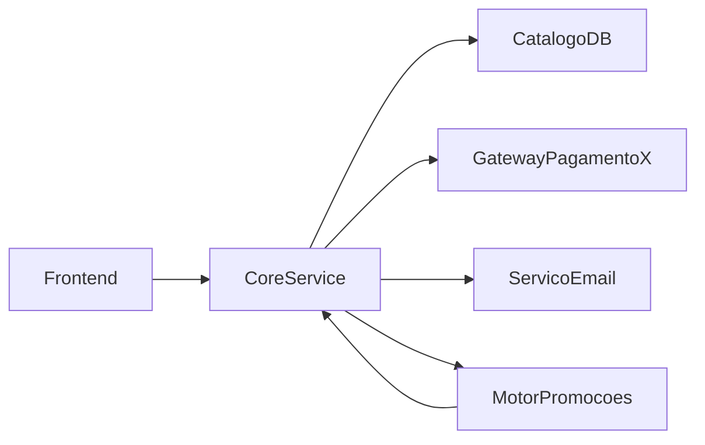
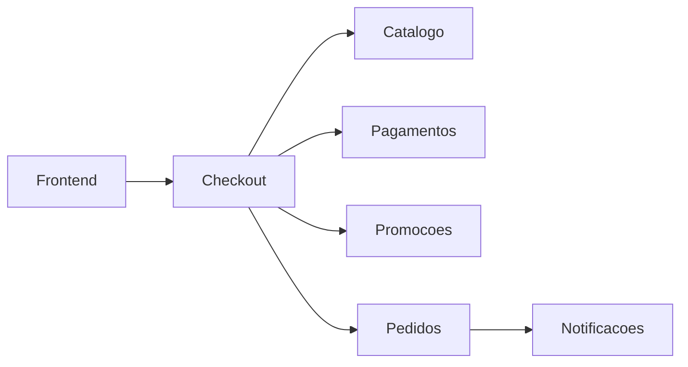

# Aula 8 — Oficina de Diagnóstico Arquitetural

## Objetivo da aula

Integrar os conceitos do módulo em uma análise arquitetural completa de um sistema de Marketplace, com diagnóstico técnico, cálculo de métricas e proposta de melhorias justificadas.

## Competências desenvolvidas

- identificar componentes e responsabilidades em um sistema realista;
- analisar acoplamento, coesão e connascência;
- calcular métricas arquiteturais e interpretar resultados;
- propor melhorias com base em trade-offs e custo de mudança;
- defender decisões arquiteturais com argumentação técnica.

## Contextualização


Esta aula encerra o Módulo 1. Até aqui, cada conceito foi trabalhado separadamente para construir repertório. Agora, o foco é síntese: olhar para um sistema imperfeito e produzir diagnóstico arquitetural consistente no **Marketplace Orion**.

## Motivação

No mundo profissional, arquitetos raramente começam em sistema "limpo". O cenário mais comum é entrar em um sistema que já está em produção e precisa evoluir sob pressão. Saber diagnosticar esse contexto é competência central.

### Problema da aula

No Orion, o desafio final do módulo é produzir um diagnóstico arquitetural completo, com evidências qualitativas e quantitativas, e transformar esse diagnóstico em um plano de evolução tecnicamente justificável.

## Desenvolvimento conceitual

### Cenário da oficina

O Marketplace está em produção e apresenta sintomas:

- incidentes no checkout em dias de campanha;
- dificuldade de trocar gateway de pagamento;
- regressões ao alterar regras de promoção;
- crescimento do tempo de entrega de funcionalidades.

### Recorte arquitetural inicial



Sinal inicial: um componente central (`CoreService`) concentra muitas responsabilidades e possui ciclo com promoções.

Esse recorte explica por que mudanças simples geram regressões amplas. O objetivo da oficina é sair dessa estrutura para um desenho com fronteiras explícitas.

### Código-base simplificado para análise

Problema demonstrado: um único componente concentra regras de domínio, integração externa e comunicação, elevando acoplamento e reduzindo coesão.

```python
class CoreService:
    def fechar_compra(self, carrinho, cliente):
        total = self._calcular_total(carrinho)
        total = self._aplicar_promocao(total, cliente)
        aprovado = gateway_x_cobrar(total, cliente["cartao"])
        if not aprovado:
            return "recusado"
        self._salvar_pedido(cliente, carrinho, total)
        self._enviar_email(cliente["email"], "Pedido confirmado")
        return "confirmado"

    def _aplicar_promocao(self, total, cliente):
        # regra acoplada ao motor e a dados do cliente
        if cliente.get("nivel") == "gold":
            return total * 0.9
        return total
```

!!! info "Nota histórica"

    A prática de avaliação arquitetural sistemática ganhou força com autores como Bass, Clements e Kazman, reforçando a análise baseada em evidências e cenários concretos.

## Exemplos

### Exemplo de roteiro de diagnóstico

```python
from dataclasses import dataclass


@dataclass
class Diagnostico:
    componente: str
    problema: str
    evidencias: list[str]
    impacto: str
    proposta: str


item = Diagnostico(
    componente="CoreService",
    problema="Baixa coesao e alto acoplamento",
    evidencias=[
        "concentra checkout, promocao, pagamento e notificacao",
        "dependencia direta de gateway_x_cobrar",
    ],
    impacto="mudancas pequenas geram regressao em fluxo critico",
    proposta="separar componentes de checkout, pagamentos e notificacoes",
)
```

Esse formato ajuda a transformar percepção em análise comunicável.

### Exemplo de cálculo de métricas da oficina

```python
def instability(fan_in: int, fan_out: int) -> float:
    return fan_out / (fan_in + fan_out) if (fan_in + fan_out) else 0.0


core_fan_in = 5
core_fan_out = 4
print(round(instability(core_fan_in, core_fan_out), 2))
```

Valor isolado não basta: ele precisa ser lido junto com responsabilidades e criticidade do componente.

## Diagramas

### Proposta arquitetural após diagnóstico



Objetivo da proposta: reduzir concentração de responsabilidades e explicitar fronteiras.

- `Checkout` atua como orquestrador de fluxo, não como implementador de tudo;
- `Pagamentos`, `Promocoes` e `Pedidos` assumem responsabilidades específicas;
- `Notificacoes` é desacoplado do fechamento crítico da compra.

Essa organização reduz acoplamento cruzado e torna o impacto de mudança mais previsível.

## Aquecimento

As aulas anteriores tinham exercícios com gabarito. Esta não tem: a oficina inteira é o exercício, e a partir daqui não existe resposta comentada — existe defesa.

Antes de começar, cinco minutos sozinho com o recorte acima. Anote:

- os componentes que você consegue nomear, e a responsabilidade de cada um em uma frase;
- dois pontos de alto acoplamento e duas evidências de baixa coesão;
- três connascências que atravessam fronteira;
- sua aposta sobre qual mudança daria o maior retorno.

Guarde a última anotação. Ao final da oficina, compare com a decisão a que o grupo chegou. Se forem iguais, verifique se o grupo realmente discutiu ou se convergiu cedo demais para a primeira opinião expressa.

## A oficina

Dois encontros, quatro etapas. O mapa e as métricas já existem — foram construídos nas Aulas 4 e 7 — e reconstruí-los aqui consumiria a oficina inteira sem exercitar nada novo. O que se exercita aqui é **decidir sob restrição**, que é a competência do módulo.

### Encontro 1 — Diagnóstico (50 min)

| Etapa | Tempo |
|---|---|
| Ler o recorte e o código-base; listar o que incomoda | 10 min |
| Diagnóstico por componente: problema, evidência, impacto | 25 min |
| Identificar as três connascências mais fortes que atravessam fronteira | 15 min |

Entrega do encontro: uma tabela de diagnóstico. Sem propostas ainda — a tentação de já resolver é grande e prejudica o diagnóstico.

### Encontro 2 — Proposta e defesa (50 min)

| Etapa | Tempo |
|---|---|
| Priorizar sob a restrição de orçamento abaixo | 20 min |
| Escrever um ADR para a ação escolhida | 15 min |
| Defesa diante das perguntas da turma | 15 min |

!!! danger "A restrição"

    Vocês têm **um trimestre e duas pessoas**. Isso dá para uma ação estrutural, não três.

    Escolham uma. E digam explicitamente o que estão deixando de fazer e o que pode acontecer por causa disso.

A restrição é o ponto da oficina. Uma lista de dez melhorias é fácil e não vale nada — nenhum time tem dez trimestres. Priorizar é escolher o que **não** fazer, e sustentar essa escolha.

### Material de apoio

Fórmulas:

$$ A = \dfrac{N_a}{N_c} \qquad I = \dfrac{C_e}{C_a + C_e} \qquad D = \left|A + I - 1\right| $$

O grafo, a tabela de métricas completa e a convenção de contagem estão na [Aula 7](aula07-metricas-governanca.md). O recorte legado do `CoreService`, com o ciclo, está no começo desta aula.

### Perguntas da banca

Cada grupo responde, ao final:

1. Qual problema foi priorizado, e qual evidência sustenta a prioridade?
2. O que ficou de fora, e qual o risco de deixar de fora?
3. Qual trade-off foi aceito?
4. **O que vocês observariam daqui a seis meses se a decisão estivesse errada?**

A quarta é a que separa proposta de palpite. Decisão que não pode ser desmentida por nenhuma observação futura não é decisão técnica.

Uma pergunta da banca deve sempre oferecer uma alternativa legítima que o grupo **não** escolheu — não para derrubar, mas para verificar se o grupo entende por que não a escolheu.

### Avaliação

Rubrica com pesos em [Avaliação do Orion Evolution Lab](../orion/index.md).

Dois lembretes que valem nota: proposta sem nenhum custo nomeado tem teto de 60; alternativa montada só para perder zera o critério de alternativas.

## Resumo

A oficina consolida o objetivo central do módulo: formar capacidade de análise arquitetural com base técnica, não apenas opinião. O estudante que conclui esta etapa está preparado para discutir arquiteturas de maior escala nos módulos seguintes.


Nos módulos seguintes, o mesmo raciocínio de diagnóstico aplicado no Orion será reutilizado em novos contextos arquiteturais. A mudança de estilo arquitetural não elimina os fundamentos; ela exige aplicá-los com mais maturidade.

## Principais conceitos

- diagnóstico arquitetural;
- evidência estrutural;
- acoplamento, coesão e connascência aplicados;
- métricas com interpretação;
- proposta de evolução arquitetural com trade-offs.

## Leitura complementar

- Richards, Mark; Ford, Neal. *Fundamentals of Software Architecture*. Revisão dos capítulos de pensamento arquitetural, modularidade, connascência e métricas.
- Bass, Len; Clements, Paul; Kazman, Rick. *Software Architecture in Practice*. Capítulos sobre avaliação arquitetural.

## Referências

- RICHARDS, Mark; FORD, Neal. *Fundamentals of Software Architecture: An Engineering Approach*. O'Reilly, 2020.
- BASS, Len; CLEMENTS, Paul; KAZMAN, Rick. *Software Architecture in Practice*. 4. ed. Addison-Wesley, 2021.
