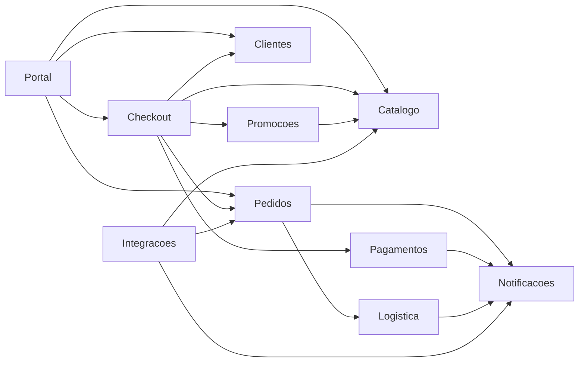
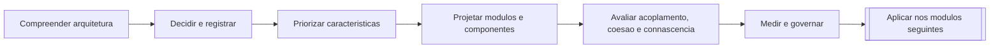
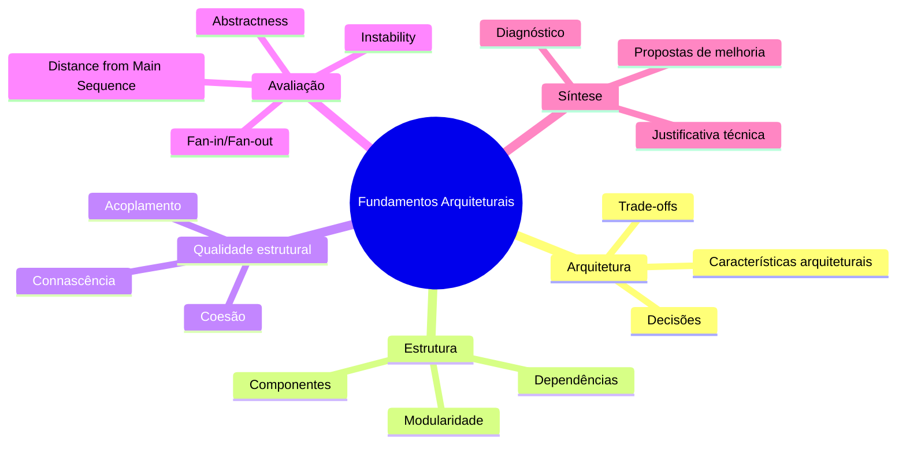
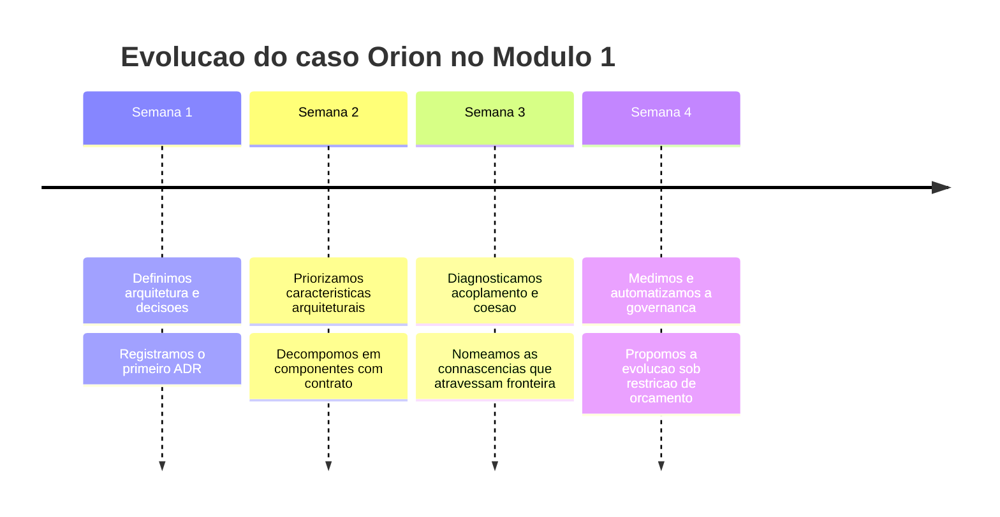

# Módulo 1 — Fundamentos de Arquitetura de Software

## Apresentação do módulo

Este módulo é a base conceitual da disciplina. Em quatro semanas, você construirá o repertório necessário para analisar arquiteturas com profundidade, identificar fragilidades estruturais e justificar tecnicamente decisões arquiteturais.

Aqui, o objetivo não é aprender um framework nem decorar checklists. O objetivo é desenvolver **pensamento arquitetural**.

## Estudo de caso contínuo: Marketplace Orion

Durante todo o módulo, trabalharemos sobre o mesmo estudo de caso: **Marketplace Orion**.

???+ info "Contexto completo do caso Orion"

	**Histórico da empresa**

	A Orion começou como uma loja online de nicho, vendendo eletrônicos por catálogo próprio. Em dois anos, abriu a plataforma para vendedores parceiros e passou a operar como marketplace.

	**Crescimento recente**

	- aumento de 6x no volume de pedidos em períodos de campanha;
	- entrada de novos parceiros logísticos e de pagamento;
	- expansão para diferentes regiões com regras comerciais distintas.

	**Problemas atuais**

	- incidentes intermitentes no checkout em horários de pico;
	- alta dificuldade para substituir integrações críticas;
	- tempo crescente para entregar mudanças de negócio;
	- regressões em funcionalidades aparentemente não relacionadas.

	**Principais módulos do sistema atual**

	- Catálogo
	- Checkout
	- Pagamentos
	- Promoções
	- Pedidos
	- Notificações
	- Logística

	**Desafios arquiteturais do módulo**

	- definir fronteiras de componentes com responsabilidades claras;
	- reduzir acoplamentos que elevam custo de mudança;
	- aumentar capacidade de evolução sem reescritas massivas;
	- justificar decisões com base em trade-offs e métricas.



Leitura das setas: `A --> B` significa que **A depende de B**. Esta convenção vale para todo diagrama de dependência da disciplina, e dela saem todos os cálculos da Aula 7.

## As duas trilhas

Cada aula trabalha sobre duas trilhas, com propósitos diferentes. Elas nunca se misturam.

### Mini-Orion Checkout — o exemplo do professor

Recorte pequeno e **executável**, resolvido em aula. Vive em `code/mini-orion/`, com testes que passam, e evolui em três estados ao longo do módulo:

| Estado | O que tem | Aulas |
|---|---|---|
| `01-acoplado` | provedor de pagamento concreto dentro do checkout, notificação no caminho crítico | 1 e 2 |
| `02-fronteiras` | contratos explícitos, notificação fora do caminho crítico | 3 a 5 |
| `03-governado` | connascências reduzidas, decisões verificadas automaticamente | 6 a 8 |

A leitura mais proveitosa é comparar os **testes** de um estado para o outro, antes de comparar o código. Arquitetura se manifesta primeiro como dificuldade de testar.

### Orion Evolution Lab — o projeto dos grupos

Recorte amplo, analisado por vocês, e **nunca resolvido no material**. Produz artefatos que se acumulam aula após aula: mapa de dependências, diagnóstico, ADRs, tabela de métricas e proposta de evolução.

Formatos, critérios e pesos em [Orion Evolution Lab](../orion/index.md).

## Como cada aula funciona

O fio condutor é sempre o mesmo, ainda que a forma varie:

```
Sintoma → Diagnóstico → Alternativas → Trade-off → Decisão → Evidência
```

A aula começa por um fato concreto do Orion — um incidente, um prazo estourado, uma métrica que piorou — e não por uma definição. O conceito aparece quando o sintoma o exige.

Toda decisão apresentada vem com **pelo menos uma alternativa que também seria defensável** e com o custo que ela cobra. Isso é deliberado: em arquitetura, saber justificar a escolha vale mais que a escolha.

!!! warning "Papel do Módulo 1 no restante da disciplina"

    Os módulos seguintes reutilizam continuamente os conceitos estudados aqui. Ao discutir monólitos, serviços distribuídos, arquitetura orientada a eventos e evolução arquitetural, sempre voltaremos a modularidade, componentes, acoplamento, coesão, connascência e métricas.

## Objetivos gerais

Ao final do módulo, você deverá ser capaz de:

- distinguir arquitetura de design e de implementação;
- analisar decisões arquiteturais com base em trade-offs e custo de mudança;
- decompor um sistema em módulos e componentes com justificativa técnica;
- diagnosticar problemas de acoplamento, coesão e connascência;
- interpretar métricas arquiteturais e propor melhorias;
- produzir uma análise arquitetural argumentada, com evidências.

## Competências desenvolvidas

- raciocínio sistêmico sobre estrutura e evolução de software;
- comunicação técnica de decisões arquiteturais;
- leitura crítica de diagramas e dependências;
- avaliação de qualidade estrutural além do código-fonte isolado.

## Relação com toda a disciplina

O Módulo 1 estabelece o vocabulário e os critérios de análise que serão aplicados em todos os demais contextos arquiteturais da disciplina. Em outras palavras, ele funciona como o eixo de continuidade pedagógica do semestre.



Aqui as setas indicam pré-requisito: cada etapa só faz sentido depois da anterior. Não é possível priorizar características sem saber o que é uma decisão arquitetural, nem medir acoplamento sem ter fronteiras definidas.

## Organização das quatro semanas

| Semana | Aulas |
|---|---|
| 1 | **1** — O que é Arquitetura de Software? · **2** — Leis da Arquitetura, trade-offs e ADR |
| 2 | **3** — Características arquiteturais · **4** — Modularidade e Componentes |
| 3 | **5** — Acoplamento e Coesão · **6** — Connascência |
| 4 | **7** — Métricas e governança · **8** — Oficina de Diagnóstico |

A Aula 8 ocupa os dois encontros da semana 4: priorizar sob restrição é a competência central do módulo e não cabe em uma aula.

## Mapa conceitual do módulo



## Resultados esperados ao final do módulo

Ao concluir o Módulo 1, você deverá conseguir olhar para um sistema de software e responder, com argumentos técnicos: onde estão os principais riscos estruturais, por que eles importam e quais mudanças arquiteturais fazem mais sentido para o contexto.



## Referência-base do módulo

- RICHARDS, Mark; FORD, Neal. *Fundamentals of Software Architecture: An Engineering Approach*. O'Reilly, 2020.

## Aulas

1. [O que é Arquitetura de Software?](aula01-o-que-e-arquitetura.md) — decisão arquitetural, arquitetura versus design
2. [Leis da Arquitetura, trade-offs e ADR](aula02-leis-trade-offs-adr.md) — as duas leis, custo da mudança, registro de decisão
3. [Características arquiteturais](aula03-caracteristicas-arquiteturais.md) — identificar, priorizar, tornar mensurável
4. [Modularidade e Componentes](aula04-modularidade-componentes.md) — fronteira, contrato, decomposição
5. [Acoplamento e Coesão](aula05-acoplamento-coesao.md) — aferente e eferente, ciclos
6. [Connascência](aula06-connascencia.md) — as nove formas, força, localidade e grau
7. [Métricas e governança](aula07-metricas-governanca.md) — $C_a$, $C_e$, $A$, $I$, $D$, plano $A \times I$, teste de arquitetura
8. [Oficina de Diagnóstico](aula08-oficina-diagnostico.md) — síntese e defesa
