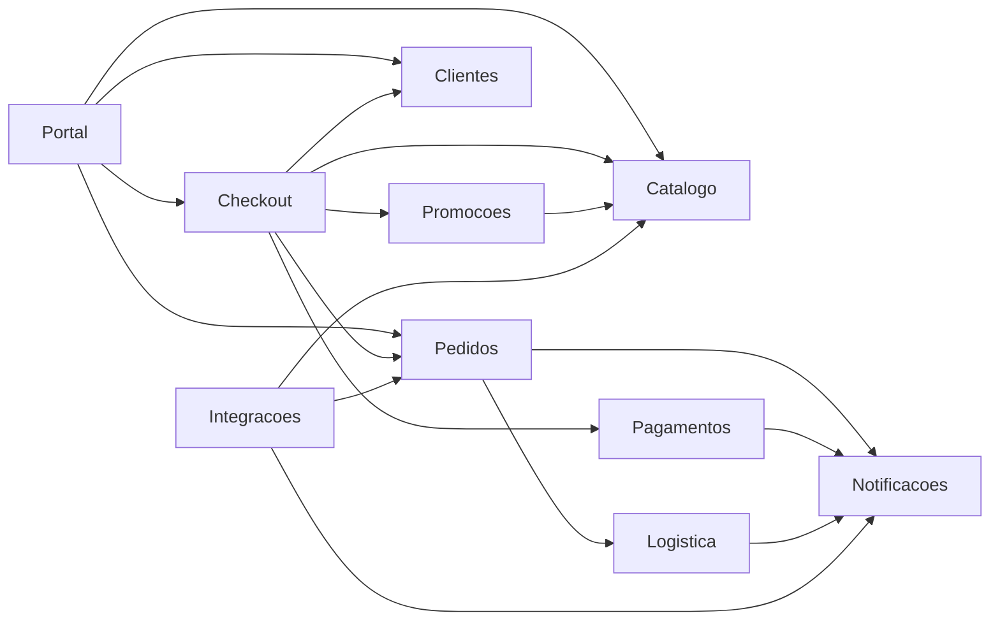

# Aula 9 — O monólito não é o problema

## Objetivo e competências

Ao final desta aula, você deve conseguir:

- distinguir monólito — decisão de empacotamento e de deploy — de ausência de fronteira interna;
- reconhecer quando "vamos para microsserviços" é um diagnóstico e quando é reflexo;
- nomear os custos que a distribuição cobra todo dia, antes de o Módulo 3 medi-los;
- escrever um ADR que fixa "não distribuir agora" com um gatilho de reversão que alguém consegue observar.

## O pedido de um plano de migração

Na reunião de planejamento do trimestre, a diretoria da Orion pede ao time de plataforma um "plano de migração para microsserviços" para o ano seguinte. O pedido vem com uma moldura: o monólito é tratado como dívida a quitar, e a migração, como o pagamento dessa dívida. A pergunta em pauta não é *se* migrar, é *em quanto tempo*.

O time devolve uma pergunta antes de aceitar a tarefa: o que exatamente a migração resolveria? A resposta que volta é "monólito não escala". Nenhum componente é apontado. Nenhuma carga é descrita — o pico de 8x em campanha existe, mas ninguém liga o incidente do checkout ao fato de o sistema subir como um artefato só. Nenhuma medição acompanha a afirmação. É o oposto do que o Módulo 1 praticou: lá, toda alegação vinha amarrada a uma aresta do grafo, a um trecho de código ou a um número. Aqui, a frase que justifica um ano de roadmap não aponta para lugar nenhum.

## Empacotamento, não ausência de estrutura

"Monólito" descreve como o sistema é entregue: um único artefato, um único processo em execução, um único pipeline de deploy. A palavra não diz nada sobre como as fronteiras internas estão organizadas. Dois sistemas com o mesmo empacotamento podem ter estruturas internas opostas, e é a estrutura interna — não o empacotamento — que determina o custo de mudar.

### Big ball of mud e monólito estruturado

O *big ball of mud* — o monólito sem fronteira interna reconhecível — é o caso em que qualquer parte alcança qualquer outra, e uma mudança em um ponto propaga sem limite previsível. O monólito estruturado tem o mesmo empacotamento e o oposto por dentro: módulos com interface definida, direção de dependência governada, contratos que falham a análise quando alguém os viola.

O Orion hoje é o segundo caso, não o primeiro. O Módulo 1 já mostrou fronteiras: cada componente tem responsabilidade nomeada, o grafo de 17 arestas é conhecido, e o Mini-Orion em `03-governado` carrega três contratos de `import-linter` que quebram a integração contínua se um import proibido volta.

```ini title="code/mini-orion/03-governado/setup.cfg (recorte)"
[importlinter:contract:checkout-depende-de-contratos]
type = forbidden
source_modules = mini_orion.checkout
forbidden_modules =
    mini_orion.pagamentos
    mini_orion.notificacoes

[importlinter:contract:contratos-nao-dependem-de-implementacoes]
type = forbidden
source_modules = mini_orion.contratos
forbidden_modules =
    mini_orion.checkout
    mini_orion.pagamentos
    mini_orion.notificacoes
    mini_orion.pedidos

[importlinter:contract:sem-ciclos]
type = independence
modules =
    mini_orion.pagamentos
    mini_orion.notificacoes
    mini_orion.pedidos
```

São três decisões de arquitetura viradas em verificação: `Checkout` só enxerga contratos de `Pagamentos` e `Notificacoes`, e não a implementação; o pacote de contratos não depende de nada concreto; e esses três componentes não formam ciclo. Nenhum dos três exige rede. Fronteira interna é barata, e parte dela já está montada.

### O que a distribuição cobra todo dia

Separar um componente em um processo próprio, atrás de uma chamada de rede, muda a conta. Cinco custos entram, e o Módulo 3 vai medir cada um:

- **latência de rede** — uma chamada que era de microssegundos passa a milissegundos, e o fechamento de compra faz várias em sequência;
- **falha parcial** — `Pagamentos` indisponível deixa de ser uma exceção que o Python levanta na hora e vira timeout, repetição e estado ambíguo do lado de quem chamou;
- **transação sem garantia** — cobrar e emitir o pedido em processos separados não tem commit único; é preciso lidar com o caso de um ter acontecido e o outro não;
- **operação** — mais artefatos para versionar, implantar, monitorar e reverter, cada um com seu ciclo;
- **observabilidade** — o rastro de uma requisição que hoje é um *stack trace* passa a ser correlação de logs entre serviços.

Nada disso é argumento contra distribuir algum dia. É o preço que entra na conta, e a conta só fecha quando há um ganho concreto do outro lado. Na reunião, ninguém nomeou o ganho.

### A pergunta que vale a pena

"Quando saímos do monólito?" pressupõe que sair é o destino. A pergunta que leva a algum lugar é outra: o que, na estrutura interna do Orion, está travando a entrega?

Se a resposta for "qualquer mudança em `Promocoes` obriga a revalidar o checkout inteiro", a causa é acoplamento e connascência atravessando fronteira — vocabulário do Módulo 1 — e o tratamento começa por reforçar a fronteira, não por cortá-la com um cabo de rede. Se for "o time de conciliação não consegue subir uma correção sem esperar o deploy de `Catalogo`", a causa é um pipeline compartilhado, e há mais de uma forma de resolver isso antes de separar processos. A distribuição responde a alguns desses problemas e a nenhum de graça; identificá-los primeiro é o que diz se ela é a resposta.

As três respostas em pauta na reunião, lado a lado:

| Alternativa | O que resolve | O que custa | Quando não vale |
|---|---|---|---|
| Reforçar fronteira interna (camadas, módulos, contratos) | mudança que vaza entre componentes; base para extrair depois | tempo de equipe; disciplina de contrato na revisão | quando uma parte já tem requisito operacional próprio e medido |
| Começar a extrair `Pagamentos` | cadência de release e escala próprias para a conciliação | latência, falha parcial, transação sem commit único, novo pipeline | quando o ganho não está medido e a fronteira lógica ainda não existe |
| Entregar o plano de migração pedido | atende à diretoria no curto prazo | compromete 12 meses de roadmap sem diagnóstico | quando nenhum gargalo foi localizado com evidência |

### O grafo oficial, relido

O Módulo 1 desenhou este grafo para contar dependências. Aqui ele responde a outra pergunta: se o Orion já é um monólito estruturado, quanto dessa estrutura está de fato imposta no sistema inteiro?



Leitura das setas: `A --> B` significa que **A depende de B**. Legenda do estado atual: nenhuma fronteira interna imposta — só nomes. Nada impede `Portal` de alcançar o interior de `Catalogo`; a separação entre os dois vive na tabela de responsabilidades e na disciplina de quem escreve o código, não em um contrato que falha quando é violado. O Mini-Orion tem três desses contratos; o sistema de dez componentes, quase nenhum.

O que o diagrama **não** mostra: o volume de tráfego em cada aresta, quais arestas causam incidente, e a diferença entre depender de um contrato e depender de uma implementação. É o mesmo grafo de 17 arestas do Módulo 1, relido com a pergunta deste módulo.

## ADR-009 — Orion como deployable único por 12 meses

### Contexto

A diretoria pediu um plano de migração para microsserviços. O Módulo 1 mostrou que o Orion é um monólito estruturado com fronteiras parciais, não um *big ball of mud*. Nenhum componente foi apontado como gargalo com evidência; o pico de 8x no checkout é real, mas não há medição que o ligue ao empacotamento único. O time de plataforma é de porte médio e tem um trimestre de orçamento, sem espaço para reescrita.

### Decisão

O Orion permanece um único *deployable* pelos próximos 12 meses. O trabalho arquitetural do período é reforçar fronteiras internas — camadas, módulos de domínio, contratos de `import-linter` —, não separar processos.

### Alternativas consideradas

**Começar a extrair `Pagamentos` agora.** `Pagamentos` tem $C_a = 1$ e $C_e = 1$: um dos menores acoplamentos do grafo, um candidato plausível a serviço. Um time competente escolheria isto para dar à conciliação uma cadência de release própria. Descartada porque o ganho não está medido e o custo é certo e imediato — cobrança e emissão de pedido sem commit único, um novo pipeline, observabilidade distribuída — e porque extrair antes de a fronteira lógica existir é extrair no escuro.

**Aceitar o pedido e entregar o plano de migração completo.** Atende à diretoria no curto prazo. Descartada porque comprometer 12 meses de roadmap com uma decisão sem diagnóstico é o oposto do que o Módulo 1 praticou: o plano descreveria um destino que ninguém justificou.

### Consequências

**Positivas.** O commit único no fechamento de compra continua valendo. Há um só pipeline para operar. O esforço vai para fronteira interna, que é pré-condição de qualquer extração futura e útil mesmo que a extração nunca aconteça. A decisão é barata de sustentar, porque não consome orçamento de migração.

**Negativas.** Um bug em `Catalogo` ainda pode derrubar o checkout — a falha não fica isolada por processo. `Pagamentos` continua subindo e descendo junto com o resto, sem janela de manutenção própria. A diretoria pode ler a decisão como imobilismo, e o trabalho de fronteira precisa ser comunicado como progresso. Se o diagnóstico de um gargalo aparecer no mês 3, a escolha é esperar o fim do horizonte de 12 meses ou reabrir o ADR antes dele.

### Reversão

Reabrir a decisão custa o plano de migração que não foi feito agora, mais o levantamento de fronteiras que o período vai produzir — que é justamente o insumo de uma extração, então o custo é menor do que parece. Gatilho observável de reabertura: a fila de deploy de um módulo bloquear o release de outro mais de uma vez por sprint durante um trimestre inteiro; ou uma parte do sistema passar a exigir escala independente medida — por exemplo, a conciliação de `Pagamentos` precisando de janela e ritmo próprios que o deploy único impede. "Quando crescer" não é gatilho.

## Exercícios

1. **Classifique.** Para cada afirmação, diga se é verdadeira ou falsa e justifique em uma frase.

    a. Todo monólito é um *big ball of mud*.
    b. Sair do monólito elimina a possibilidade de uma falha em um componente derrubar outro.
    c. Um contrato de `import-linter` é uma fronteira interna sem custo de rede.
    d. Se o checkout tem incidente em pico, a causa é o empacotamento único.

    ??? note "Resposta comentada"

        **a — Falso.** Monólito é empacotamento; *big ball of mud* é ausência de fronteira interna. O Orion é monólito e tem fronteiras: os três contratos de `03-governado` e as responsabilidades da tabela de componentes.

        **b — Falso na forma absoluta.** Distribuir isola a falha por processo, mas cria a falha parcial: timeout, repetição, estado ambíguo. Troca uma classe de falha por outra; não faz a falha desaparecer.

        **c — Verdadeiro.** O contrato é verificado na análise estática, dentro da integração contínua. Não há chamada de rede; a fronteira é lógica.

        **d — Falso, ou pelo menos não sustentado.** Um incidente em pico pode ser contenção de recurso, consulta cara ou falta de limite de carga — nada disso é resolvido separando processos, e parte piora. Sem medição ligando o incidente ao deploy único, a afirmação é palpite.

2. **Avalie a evidência.** Este é um trecho do log de um incidente no checkout do Orion durante uma campanha.

    ```text
    02:14:07  checkout   INFO   sessao=9c21 iniciando fechamento
    02:14:07  checkout   INFO   sessao=9c21 consulta de precos em Catalogo, itens=3
    02:14:12  checkout   WARN   sessao=9c21 consulta de precos respondeu em 4820ms
    02:14:12  catalogo   WARN   pool de conexoes esgotado, fila crescente
    02:14:12  catalogo   INFO   consulta batch de reprecificacao em curso (parceiro X, via Integracoes)
    02:14:19  checkout   ERROR  sessao=9c21 timeout aguardando Catalogo; fechamento abortado
    ```

    Este log sustenta a conclusão "precisamos de microsserviços"? Responda em duas ou três frases.

    ??? note "Resposta comentada"

        Não sustenta. O log aponta uma causa específica e local: `Catalogo` esgotou o pool de conexões porque uma consulta batch de reprecificação de parceiro — a aresta `Integracoes --> Catalogo` do grafo — rodou concorrente ao pico de checkout. O tratamento cabe dentro do monólito: separar a carga batch da carga interativa, pôr limite e timeout curto na chamada de `Checkout` a `Catalogo`, dimensionar o pool. Separar `Catalogo` em serviço move a mesma fila para trás de uma chamada de rede e ainda acrescenta timeout distribuído. O log é evidência de um problema de isolamento de carga, não de empacotamento.

3. **Complete o ADR.** O registro abaixo está sem as consequências negativas e sem a reversão. Escreva as duas partes.

    > **Contexto.** `Notificacoes` é folha do grafo: $C_a = 4$, $C_e = 0$. Quatro componentes chamam `Notificacoes` de forma síncrona no fluxo. É candidata natural a extração.
    > **Decisão.** `Notificacoes` permanece componente interno pelos próximos 12 meses.
    > **Alternativas.** Extrair já, para dar a `Notificacoes` escala e deploy próprios — descartada porque não há medição de volume que a justifique.
    > **Consequências positivas.** Chamada em processo, sem serialização nem rede; um pipeline a menos para operar.

    ??? note "Resposta comentada"

        **Consequências negativas** que a resposta precisa cobrir: se a chamada for síncrona, uma lentidão do provedor de e-mail entra no caminho crítico e pode segurar o fechamento; `Notificacoes` indisponível afeta os quatro componentes que dependem dela; o volume de notificação cresce junto com o do sistema, sem poder escalar sozinho.

        **Reversão:** um gatilho observável e datável. Por exemplo: a latência do provedor de notificação entrar no caminho crítico do checkout acima de um limite escolhido, em uma fração escolhida das requisições, por dois ou três sprints seguidos; ou o volume diário de notificação passar a exigir capacidade própria. Os números do limite são escolha de quem escreve o ADR — o que se cobra é que sejam observáveis e tenham prazo, não "quando ficar lento".

4. **Julgue.** A Orion deveria começar a extrair `Pagamentos` agora?

    As duas posições têm defensores competentes. A favor de extrair: `Pagamentos` tem um dos menores acoplamentos do grafo ($C_a = 1$, $C_e = 1$), a conciliação tem um ritmo operacional distinto do resto, e fronteira lógica sem fronteira física às vezes nunca sai do papel. Contra: o ganho não está medido, o custo de rede é certo, e o sistema de dez componentes mal tem fronteira interna imposta — extrair sem isso é extrair no escuro.

    Mais de uma resposta é aceitável. O que se avalia é se a sua resposta nomeia o critério que decide (ganho medido? risco de reversão? cadência de release?), reconhece o que a posição oposta tem de válido, e diz o que observaríamos em seis meses para saber se a escolha foi acertada. Uma resposta sem critério nomeado não conta como resposta técnica.

## Atividade em grupo

Para o recorte do seu grupo no Orion Evolution Lab, escrevam o ADR "não distribuir nos próximos 12 meses" no formato Contexto / Decisão / Alternativas / Consequências (positivas **e** negativas) / Reversão.

1. **Contexto:** a restrição real do recorte — quantas pessoas, quanto prazo, o que já é fronteira imposta e o que é só nome.
2. **Alternativa de distribuição concreta:** qual componente do recorte sairia primeiro, e por que alguém competente proporia isso agora.
3. **Consequências negativas:** ao menos duas, uma sobre isolamento de falha e uma sobre operação.
4. **Obrigatório — a condição sob a qual este ADR estaria errado:** um sinal observável e datável que, se aparecesse, obrigaria a reabrir a decisão antes dos 12 meses. "Quando crescer" e "se ficar lento" não valem; "a fila de deploy de X bloquear o release de Y mais de uma vez por sprint durante um trimestre" vale.

O item 4 é o ponto da atividade. Um ADR que não sabe dizer quando estaria errado é um anúncio, não uma decisão. Formato e critérios em [Orion Evolution Lab](../orion/index.md).

## O que ficou decidido e o que vem na Aula 10

Ficou decidido não distribuir o Orion nos próximos 12 meses: ninguém nomeou o ganho da migração, o custo dela é certo, e o orçamento do período rende mais aplicado à fronteira interna. O ADR-009 registra isso com um gatilho de reversão que se pode observar — fila de deploy travando release, ou uma parte do sistema exigindo escala própria medida.

O ADR aposta em "reforçar a fronteira interna". Resta a pergunta de que fronteira o Orion tem hoje, de fato. Para o Mini-Orion, são três contratos. Para as dez caixas do grafo, quase nada: a separação entre `Portal` e `Catalogo` está no nome e na tabela de responsabilidades, e nenhuma verificação impede um de alcançar o interior do outro. A Aula 10 pega a primeira forma de impor essa fronteira sem separar processo — as camadas — e examina o que elas governam e o que deixam passar.

## Leitura complementar

- Richards, Mark; Ford, Neal. *Fundamentals of Software Architecture*. Cap. 9 — Foundations (*big ball of mud*; arquitetura monolítica versus distribuída).

## Referências

- RICHARDS, Mark; FORD, Neal. *Fundamentals of Software Architecture: An Engineering Approach*. O'Reilly, 2020.
