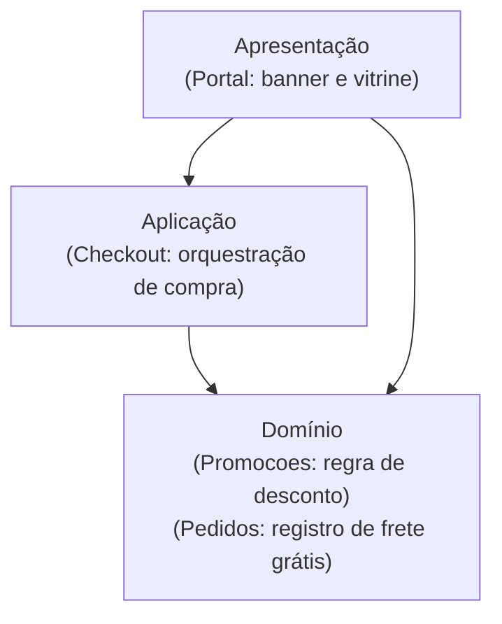

# Aula 10 — Monólito em camadas: o que governa e o que não isola

## Objetivo e competências

Ao final desta aula, você deve conseguir:

- classificar a direção de dependência entre camadas como permitida ou proibida pela regra de dependência;
- comparar camadas fechadas e abertas, avaliando o trade-off entre isolamento vertical e o anti-padrão de repasse (*sinkhole*);
- reconhecer que a regra de dependência só se sustenta com verificação automatizada, e situar onde o Python — via `import-linter` — se encaixa entre os mecanismos que outros ecossistemas usam para o mesmo fim;
- ler e configurar contratos de governança estática (como `type = layers` e `type = forbidden` no `setup.cfg`);
- traçar o caminho de uma mudança de negócio pelas camadas técnicas e explicar por que a separação horizontal não contém alterações funcionais;
- apontar em um mapa de componentes elementos que não se encaixam na hierarquia de camadas.

## Dois desenhos da mesma arquitetura

Na retrospectiva de arquitetura do Marketplace Orion, dois integrantes da equipe vão ao quadro desenhar o sistema. Os desenhos não batem.

O primeiro desenha três faixas horizontais bem delineadas — apresentação em cima, lógica de negócio no centro e infraestrutura na base — distribuindo os componentes canônicos nessas caixas. O segundo desenha as dez caixas e as dezessete setas do grafo de dependências oficial (Aula 7), sem faixa nenhuma, afirmando categoricamente que camada ali é ficção: não há no código nada que impeça qualquer arquivo de chamar qualquer outro.

Os dois estão olhando para a mesma base de código. A divergência ilustra a distância comum entre a intenção arquitetural e a realidade estrutural do software:

1. **O desenho com camadas é uma aspiração de organização**: expressa como os desenvolvedores gostariam que o sistema estivesse ordenado em papéis tecnológicos.
2. **O grafo oficial sem camadas é o fato observável**: reflete o que uma análise de dependências estáticas de fato encontra. O grafo mostra `Portal --> Catalogo` direto, sem passar por nenhuma abstração intermediária de aplicação, e `Checkout` sustentando conexões simultâneas com cinco componentes de naturezas distintas (`Catalogo`, `Clientes`, `Promocoes`, `Pagamentos`, `Pedidos`).

A fragilidade dessa "camada informal" é posta à prova semanas depois, quando a equipe recebe uma demanda comercial típica: *"implementar cupom de frete grátis vinculado à campanha promocional que estiver ativa"*.

À primeira vista, trata-se de uma regra simples de promoção. Na prática, para colocá-la em produção, a equipe precisa alterar:
- `Portal`, para exibir o selo de frete grátis na vitrine enquanto a campanha estiver ativa;
- `Promocoes`, para checar se o carrinho contém item elegível à campanha e calcular o abatimento;
- `Checkout`, para consultar essa elegibilidade durante o fechamento e consolidar o total;
- `Pedidos`, para registrar no pedido emitido que a isenção de frete foi concedida via cupom de campanha.

Quatro componentes alterados para atender a uma única regra de negócio. Nenhum deles pertence à mesma faixa horizontal. Para entender por que isso acontece — e por que essa é a dinâmica inevitável desse estilo arquitetural —, precisamos examinar a mecânica formal da arquitetura em camadas.

## A arquitetura em camadas: corte por papel tecnológico

A **arquitetura em camadas** (*layered architecture*, ou arquitetura *N-Tier*) organiza os artefatos de software agrupando-os por **papel tecnológico**. O princípio orientador é a separação de preocupações técnicas (*separation of technical concerns*): elementos responsáveis por capturar entrada e renderizar respostas ficam juntos; elementos responsáveis por coordenar fluxos de execução ficam juntos; elementos que expressam regras conceituais ficam juntos; e elementos que conversam com banco de dados ou redes externas ficam juntos.

Trata-se de um corte fundamentalmente **horizontal** do sistema.

```
┌─────────────────────────────────────────────────────────────┐
│ 1. Apresentação (Interface, Web, CLI, Serialização)        │
└──────────────────────────────┬──────────────────────────────┘
                               │  (dependência desce)
┌──────────────────────────────▼──────────────────────────────┐
│ 2. Aplicação (Orquestração de casos de uso, transações)     │
└──────────────────────────────┬──────────────────────────────┘
                               │  (dependência desce)
┌──────────────────────────────▼──────────────────────────────┐
│ 3. Domínio (Entidades, regras de negócio, contratos)        │
└──────────────────────────────┬──────────────────────────────┘
                               │  (dependência desce / inverte)
┌──────────────────────────────▼──────────────────────────────┐
│ 4. Infraestrutura (Bancos de dados, filas, APIs externas)   │
└─────────────────────────────────────────────────────────────┘
```

### As quatro camadas canônicas

Embora o número de camadas varie entre projetos, a divisão clássica de quatro níveis estabelece responsabilidades bem delimitadas:

| Camada | Responsabilidade principal | O que não deve conter | No Mini-Orion |
|---|---|---|---|
| **Apresentação** | Ponto de entrada, recepção de requisições, validação de payload, tradução de DTOs para o cliente externo | Regras de cálculo comercial ou acesso direto a bancos | `apresentacao/app.py` (composição da aplicação) |
| **Aplicação** | Coordenação e orquestração do caso de uso; abertura de transações; orquestração da sequência de passos | Regras de cálculo intrínsecas de negócio ou SQL/chamadas HTTP | `aplicacao/checkout.py` (`ServicoCheckout.fechar_pedido`) |
| **Domínio** | Entidades fundamentais, regras de cálculo, invariantes do negócio, contratos abstratos de serviços | Detalhes de frameworks web, bibliotecas de serialização ou drivers | `dominio/` (`PedidoCobranca`, `ResultadoCobranca`, protocolos) |
| **Infraestrutura** | Implementações concretas de acesso a dados, mensageria, integração com gateways e serviços externos | Decisão sobre regras de negócio ou orquestração do fluxo | `infraestrutura/` (`GatewayPagamentoX`, `RepositorioPedidos`) |

### A Regra de Dependência: fluxo em runtime versus dependência estática

O pilar central da arquitetura em camadas moderna é a **Regra de Dependência**:
> *As dependências de código-fonte devem apontar exclusivamente para dentro (ou para baixo), em direção às políticas de negócio de mais alto nível.*

Isso exige separar dois conceitos que frequentemente se confundem:

1. **Fluxo de execução em tempo de execução (*Control Flow*)**: Quando um usuário final clica em "Comprar", o fluxo começa na Apresentação (`app.py`), desce para a Aplicação (`checkout.py`), consulta o Domínio (`modelos.py`), desce até a Infraestrutura (`pagamentos.py` chamando uma API HTTP externa) e retorna com o resultado subindo a pilha. O fluxo de controle desce e sobe.
2. **Direção da dependência estática (*Source Code Dependency*)**: Em tempo de compilação ou importação, a camada de Domínio **não conhece** a camada de Infraestrutura nem a de Apresentação. O Domínio define apenas uma abstração pura (uma interface ou `Protocol`). A camada de Infraestrutura depende do Domínio para implementar esse contrato, ou a camada de Aplicação depende do contrato definido no Domínio.

Quem orquestra a fiação (*wiring*) das implementações concretas aos contratos de domínio é a raiz de composição, geralmente localizada na borda da aplicação (na Apresentação). A inversão de dependência impede que mudanças em tecnologias de infraestrutura (como trocar o driver de banco de dados ou o parceiro de pagamento) forcem alterações nas regras de negócio.

### Camadas fechadas versus camadas abertas

Ao formalizar uma arquitetura em camadas, a decisão central não é apenas o número de camadas, mas se cada camada é **fechada** (*closed layer*) ou **aberta** (*open layer*):

- **Camada Fechada**: uma camada superior só pode se comunicar com a camada imediatamente inferior. A requisição é estritamente sequencial: Apresentação precisa passar por Aplicação para alcançar o Domínio.
- **Camada Aberta**: uma camada superior pode "saltar" níveis e acessar diretamente camadas mais profundas. Por exemplo, a Apresentação pode invocar o Domínio diretamente para ler dados, ignorando a camada de Aplicação.

```
      CAMADA FECHADA                           CAMADA ABERTA
┌─────────────────────────┐             ┌─────────────────────────┐
│      Apresentação       │             │      Apresentação       │
└────────────┬────────────┘             └──────┬────────────┬─────┘
             │                                 │            │ (salto)
┌────────────▼────────────┐             ┌──────▼─────┐      │
│        Aplicação        │             │ Aplicação  │      │
└────────────┬────────────┘             └──────┬─────┘      │
             │                                 │            │
┌────────────▼────────────┐             ┌──────▼────────────▼─────┐
│         Domínio         │             │         Domínio         │
└─────────────────────────┘             └─────────────────────────┘
```

Essa escolha envolve um trade-off arquitetural direto:

#### 1. Camadas Fechadas e o *Architecture Sinkhole Anti-Pattern*
A camada fechada proporciona **alto isolamento vertical**: se o Domínio sofrer uma grande reformulação de tipos, apenas a camada de Aplicação precisa ser inspecionada e adaptada; a Apresentação permanece resguardada.

No entanto, quando adotada de forma rígida em sistemas que realizam muitas consultas ou operações sem orquestração complexa, surge o **Architecture Sinkhole Anti-Pattern** (Richards & Ford):
- Desenvolvedores criam centenas de métodos na camada de Aplicação que só pegam a chamada da Apresentação e a repassam intacta para o repositório ou serviço de Domínio, sem executar nenhuma regra, autorização ou transformação.
- Se 80% do código de uma camada apenas repassa chamadas sem agregar valor computacional ou de negócio, essa camada virou um "ralo" de processamento e manutenção desnecessária.

#### 2. Camadas Abertas e o Risco de Vazamento (*Bypass Risk*)
Camadas abertas eliminam o código inútil de repasse, tornando operações de leitura direta muito mais ágeis. 

O preço cobrado é a **perda de isolamento**: a camada de Apresentação passa a criar laços de acoplamento direto com estruturas internas do Domínio. Quando uma entidade de domínio muda, telas e contratos de API externa quebram simultaneamente. Além disso, torna-se fácil contornar regras de negócio, pois desenvolvedores podem esquecer de chamar a orquestração da Aplicação quando deveriam.

### Governança automatizada, não combinado verbal

Uma restrição de camada que exista só em documentação ou em combinado verbal é violada em poucas semanas — em equipe dinâmica, mais cedo do que se imagina. Por isso a regra de dependência precisa de um mecanismo que a torne inegociável, e cada ecossistema resolve isso de um jeito. Python não tem modificador de acesso nem compilador que bloqueie um `import`, então a verificação sai do compilador e vai para uma ferramenta de análise estática rodando no CI: é o papel do `import-linter`, lendo contratos declarativos em `setup.cfg` e falhando o build quando uma aresta proibida aparece. Java resolve o mesmo problema com `ArchUnit` testando a estrutura de pacotes ou de módulos JPMS; .NET, com `NetArchTest` sobre assemblies e o modificador `internal`; monorepos TypeScript, com as tags de módulo do Nx ou o `dependency-cruiser`. A ferramenta muda; o papel se repete em todas — transformar uma decisão de camada em teste que quebra o build, não em regra que só existe na cabeça de quem lembra dela.

## O diagnóstico: onde a camada falha no Orion

Com esses conceitos estabelecidos, podemos voltar ao Marketplace Orion e analisar criticamente o que a camada resolve e o que ela é incapaz de conter.

### A mudança de negócio desce na vertical

Retomemos o cupom de frete grátis vinculado à campanha ativa. Quando rastreamos as alterações necessárias na base de código, observamos o seguinte traçado estrutural:



> **Convenção de leitura das setas**: `A --> B` significa que **A depende estaticamente de B** (A importa B).
> **O que o diagrama não mostra**: componentes de infraestrutura (gateways externos, bancos de dados) e o fluxo de dados em runtime, que percorre a direção oposta.

Ao analisar o diagrama, a limitação intrínseca da camada fica evidente:

1. **A camada governa a direção, não a extensão da mudança**: Todas as setas apontam para baixo. Em momento nenhum o Domínio importou a Aplicação, e a Aplicação não importou a Apresentação. O contrato de camadas está 100% satisfeito e verde.
2. **A mudança corta o sistema de ponta a ponta**: Como a funcionalidade é um conceito de negócio, ela precisa se manifestar na tela (Apresentação), no fluxo de fechamento (Aplicação) e no cálculo/armazenamento do pedido (Domínio). 

A arquitetura em camadas fatia o sistema por similaridade de tecnologia, mas as demandas de negócio fatiam o sistema por domínio funcional. Elas são perpendiculares: **a camada é horizontal; a feature é vertical**.

### Coesão por camada é coesão fraca

Na Aula 5, definimos coesão como a medida de quanto os elementos dentro de um mesmo módulo pertencem uns aos outros. Classificamos a coesão técnica (ou acidental) como **fraca**:
- Colocar `Pagamentos`, `Notificacoes`, `Logistica` e `Integracoes` na mesma camada de "Infraestrutura" une componentes que não compartilham motivos de mudança de negócio.
- O adaptador de pagamentos muda quando a operadora de cartão altera o formato de webhook; o adaptador de notificações muda quando o provedor de SMS migra de protocolo. Eles moram juntos apenas porque ambos usam sockets de rede.

Em contrapartida, a coesão forte une elementos que **mudam juntos pelo mesmo motivo de negócio**. Na arquitetura em camadas pura, elementos altamente coesos de um mesmo assunto (como a regra do cupom em `Promocoes` e o anúncio do cupom no `Portal`) são forçados a viver separados por fronteiras de camada.

### O paradoxo das métricas medidas por camada

Na Aula 7, aprendemos a calcular o acoplamento aferente ($C_a$), eferente ($C_e$), instabilidade ($I$) e distância da sequência principal ($D$). Se aplicarmos essas métricas considerando cada camada inteira como uma unidade estrutural:

- **Apresentação**: $C_a = 0$, $C_e = 2$, $I = 1{,}0$ (máxima instabilidade, adequado para borda).
- **Aplicação**: $C_a = 1$, $C_e = 1$, $I = 0{,}5$ (equilíbrio intermediário).
- **Domínio**: $C_a = 2$, $C_e = 0$, $I = 0{,}0$ (estabilidade máxima, nenhum acoplamento de saída).

O grafo entre camadas é limpo, estritamente acíclico e exibe métricas aparentemente impecáveis. No entanto, essas métricas agregadas criam uma ilusão estatística: elas medem a higiene da direção entre papéis técnicos, mas são completamente cegas à quantidade de assuntos de negócio que atravessam essas faixas. É a mesma lição que o componente `Checkout` nos deu no Módulo 1: ter métricas matemáticas elegantes não significa ter uma arquitetura imune a incidentes ou custos elevados de alteração.

### Connascência que atravessa as camadas

A ferramenta de precisão introduzida na Aula 6 — a connascência — permite diagnosticar o tipo de acoplamento residual que a camada mantém:

- **Connascência de Nome (Fraca, Estática)**: A Apresentação precisa conhecer o nome do atributo `frete_gratis_aplicado` retornado pelo Domínio. Essa forma fraca é perfeitamente tolerada entre camadas, pois linters e verificadores de tipo identificam renomeações instantaneamente.
- **Connascência de Execução (Forte, Dinâmica)**: Se para aplicar o cupom a Apresentação precisasse chamar primeiro `validar_elegibilidade()` no Domínio, depois `preparar_carrinho()` na Aplicação e finalmente `cobrar()` na Infraestrutura, na ordem exata, teríamos uma forma forte de connascência cruzando três níveis de camadas. A regra pedagógica da Aula 6 é taxativa: *connascência forte só é aceitável quando a localidade é máxima (dentro de uma mesma função ou módulo)*. Quando a connascência de execução cruza camadas, a arquitetura se torna frágil.

---

## Mini-Orion 04-camadas: a regra virada em contrato de CI

No repositório do Mini-Orion, o checkpoint `04-camadas` refatora a estrutura plana anterior em pacotes técnicos explícitos:

```text
mini_orion/
    apresentacao/    app.py (montagem do sistema)
    aplicacao/       checkout.py (ServicoCheckout)
    dominio/         modelos.py, contratos.py
    infraestrutura/  pagamentos.py, pedidos.py, notificacoes.py
```

### O arquivo de governança: setup.cfg

Para que a hierarquia não decaia em combinados verbais, dois contratos estáticos foram inseridos no `setup.cfg`:

```ini title="code/mini-orion/04-camadas/setup.cfg (recorte)"
[importlinter:contract:camadas]
name = Regra de dependencia: nenhuma camada importa uma acima
type = layers
layers =
    mini_orion.apresentacao
    mini_orion.aplicacao
    mini_orion.dominio

[importlinter:contract:dominio-nao-conhece-infra]
name = Dominio e aplicacao nao conhecem infraestrutura
type = forbidden
source_modules =
    mini_orion.dominio
    mini_orion.aplicacao
forbidden_modules =
    mini_orion.infraestrutura
```

Analisando a mecânica de cada contrato:

1. **`type = layers`**: define uma ordenação estrita. Módulos listados acima podem importar módulos listados abaixo. Ele implementa camadas **abertas**: `apresentacao` pode importar `dominio` diretamente (como ocorre em `app.py` para tipar dependências via `Protocol`), sem que o linter aponte violação. O que ele proíbe rigorosamente é a subida (`dominio` importar `aplicacao` ou `apresentacao`).
2. **`type = forbidden`**: complementa a regra de camadas. Como `infraestrutura` não faz parte da pilha sequencial de negócio (ela contém os adaptadores de saída), o contrato proíbe explicitamente que `dominio` ou `aplicacao` importem classes concretas de infraestrutura.

Ao executar a verificação estática, o resultado comprova a conformidade:

```text
$ lint-imports
Regra de dependencia: nenhuma camada importa uma acima KEPT
Dominio e aplicacao nao conhecem infraestrutura KEPT

Contracts: 2 kept, 0 broken.
```

### Provocando uma violação arquitetural

Para observar o papel de evidência do linter, imagine que um desenvolvedor decida "reaproveitar" uma constante ou método auxiliar presente no driver de pagamentos dentro de `dominio/contratos.py`:

```python title="mini_orion/dominio/contratos.py (violacao intencional)"
# Import proibido: camada interna acessando infraestrutura
from mini_orion.infraestrutura.pagamentos import GatewayPagamentoX
```

Ao rodar a verificação na esteira de integração contínua:

```text
$ lint-imports
Regra de dependencia: nenhuma camada importa uma acima KEPT
Dominio e aplicacao nao conhecem infraestrutura BROKEN

Contracts: 1 kept, 1 broken.

Broken contract: Dominio e aplicacao nao conhecem infraestrutura
----------------------------------------------------------------
mini_orion.dominio.contratos imports mini_orion.infraestrutura.pagamentos:
  mini_orion.dominio.contratos -> mini_orion.infraestrutura.pagamentos (l. 3)
```

A violação não depende de revisão manual em pull request. O build é rejeitado automaticamente pelo analisador estático.

### Registro de diagnóstico: onde a camada entrega e onde ela cobra

Avaliando o checkpoint `04-camadas` de forma honesta diante de trade-offs de engenharia:

| Onde a camada entrega valor concreto | Onde a camada não resolve ou cobra preço |
|---|---|
| **Direção verificável da dependência**: Nenhuma regra de negócio corre o risco de se acoplar a drivers concretos de banco ou frameworks de entrega. | **Não contém a mudança de negócio**: O cupom de desconto continua exigindo commits em arquivos espalhados por três pastas distintas. |
| **Facilidade para substituir adaptadores externos**: Adicionar um novo provedor (`GatewayPagamentoY`) alterou apenas `infraestrutura/pagamentos.py` e a raiz de composição em `app.py`. A lógica de checkout em `aplicacao/checkout.py` permaneceu intacta. | **Dificuldade para testar regras unitárias isoladas**: Para testar a regra "compra com cartão acima do limite é recusada", o teste ainda é obrigado a instanciar o caso de uso inteiro, simulando repositório e notificador. |

---

## Exercícios

1. **Classificação de dependências.** Considerando a hierarquia do Mini-Orion (`apresentacao > aplicacao > dominio`, com `infraestrutura` isolada por regra `forbidden`), avalie cada declaração de importação abaixo, dizendo se é **permitida** ou **proibida**, e qual contrato é responsável por essa validação:
   
    a. Em `mini_orion/aplicacao/checkout.py`: `from mini_orion.dominio.contratos import Gateway`  
    b. Em `mini_orion/dominio/modelos.py`: `from mini_orion.aplicacao.checkout import ServicoCheckout`  
    c. Em `mini_orion/apresentacao/app.py`: `from mini_orion.dominio.modelos import Pedido`  
    d. Em `mini_orion/dominio/contratos.py`: `from mini_orion.infraestrutura.pedidos import RepositorioPedidos`

    ??? note "Resposta comentada"

        **a — Permitida.** A camada de Aplicação depende da camada de Domínio, que está abaixo dela na hierarquia definida em `type = layers`.

        **b — Proibida.** O Domínio está tentando importar a camada de Aplicação, que está acima dele. O contrato `type = layers` acusa a violação imediatamente.

        **c — Permitida.** O contrato `type = layers` adota o modelo de camadas abertas por padrão. Portanto, a Apresentação pode "saltar" a Aplicação e importar diretamente os tipos de dados do Domínio.

        **d — Proibida.** O Domínio não pode importar classes da Infraestrutura. Quem acusa essa quebra não é o contrato `camadas` (pois a infraestrutura não faz parte da pilha hierárquica `layers`), mas sim o contrato explícito `type = forbidden` (`dominio-nao-conhece-infra`).

2. **Identificação de contrato.** Durante uma refatoração, um membro da equipe tenta injetar um serviço de mensageria diretamente em uma entidade do domínio para disparar e-mails automáticos ao alterar o estado do pedido. O linter emite:
   
    ```text
    mini_orion.dominio.modelos imports mini_orion.infraestrutura.notificacoes
    Contracts: 1 kept, 1 broken.
    ```
    
    Explique por que o contrato quebrado foi o `forbidden` e não o `layers`, e discuta o perigo arquitetural dessa dependência se ela fosse permitida.

    ??? note "Resposta comentada"

        O contrato `layers` analisa apenas a relação de precedência entre os módulos explicitamente listados na diretiva (`apresentacao`, `aplicacao`, `dominio`). Como `infraestrutura` não é um degrau dentro dessa lista hierárquica, o contrato `layers` ignora o import. É o contrato `forbidden` que fiscaliza e bloqueia as arestas entre o domínio/aplicação e a infraestrutura.
        
        O perigo arquitetural: permitir que entidades de domínio importem infraestrutura concreta faz com que regras conceituais passem a depender de bibliotecas de transporte (como clientes de e-mail ou drivers de banco). Isso impede a execução de testes unitários rápidos em memória e propaga qualquer mudança de protocolo externo diretamente para o coração do negócio.

3. **Rastreamento de mudança vertical.** Imagine o seguinte requisito no Marketplace Orion: *"O prazo estimado de entrega deve ser recalculado e armazenado caso o endereço do cliente mude após a emissão do pedido"*.
    Mapeie quais camadas e quais componentes do Orion seriam afetados por essa alteração, indicando sucintamente o papel de cada um.

    ??? note "Resposta comentada"

        A alteração é uma demanda de negócio que corta três camadas técnicas:
        - **Apresentação (`Portal`)**: necessita expor a opção de alteração de endereço no painel de pedidos e exibir a confirmação com o novo prazo.
        - **Aplicação (`Checkout` ou caso de uso de Pós-Venda)**: orquestra a sequência: recebe o novo endereço, consulta o serviço logístico para obter a nova estimativa e aciona a atualização do pedido.
        - **Domínio (`Pedidos`, `Clientes`, `Logistica`)**: `Clientes` valida as regras do novo endereço; `Logistica` calcula o novo prazo com base na tabela de frete; `Pedidos` atualiza o estado da entidade pedido com o novo snapshot e novo prazo.
        - **Infraestrutura**: adaptadores de persistência de `Pedidos` salvam a alteração no banco; adaptadores de `Notificacoes` enviam o e-mail comunicando a alteração.
        
        A constatação central: a hierarquia técnica em camadas organiza a direção do código, mas não impede que quatro ou cinco componentes precisem ser modificados conjuntamente.

4. **Julgamento de trade-off: camadas abertas versus fechadas.** Em um debate técnico, um engenheiro propõe: *"Devemos transformar todas as camadas do Orion em camadas estritamente fechadas. Nenhum componente da apresentação poderá tocar no domínio; tudo deverá passar obrigatoriamente por uma classe na camada de aplicação."*
    Defenda ou conteste essa proposta, apontando o critério arquitetural decisivo, os riscos envolvidos e o que você observaria no código em seis meses para avaliar se a decisão foi correta.

    ??? note "Resposta comentada"

        Não existe resposta absoluta; avalia-se a consistência do critério e o reconhecimento dos custos:
        - **Se você defende o fechamento estrito**: o critério é o isolamento máximo do Domínio contra vazamento de detalhes para interfaces de usuário ou APIs REST externas. Em seis meses, você observaria se a camada de apresentação permaneceu desacoplada de mudanças de modelagem interna do domínio.
        - **Se você contesta o fechamento estrito**: o critério é a produtividade e a prevenção do anti-padrão *Architecture Sinkhole*. O Orion possui diversas operações que são simples consultas (ex.: buscar detalhes do catálogo ou histórico de pedidos). Forçar a criação de classes de aplicação para métodos que apenas repassam chamadas criará dezenas de classes ocas ("pass-through").
        - **Sinal observável em 6 meses**: a proporção de métodos da camada de aplicação que não possuem lógica condicional, cálculo ou coordenação transacional. Se mais de 50% dos métodos apenas chamarem `return self._repo.buscar(id)`, a arquitetura caiu no *Sinkhole Anti-Pattern*.

---

## Atividade em grupo: Orion Evolution Lab

No recorte arquitetural adotado pelo seu grupo:

1. **Atribuição de camadas**: classifique cada componente do recorte em uma das quatro camadas canônicas (Apresentação, Aplicação, Domínio ou Infraestrutura). Registre em um parágrafo o critério adotado para componentes ambíguos.
2. **Auditoria de direção**: analise as dependências atuais do seu recorte e aponte se existe alguma dependência estática que aponte de baixo para cima (violação da regra de dependência).
3. **Traçado vertical**: selecione uma mudança de negócio plausível para o seu recorte (ex.: cancelamento de compra, alteração de meio de pagamento, campanha de cashback) e rastreie todas as camadas que seriam tocadas para implementá-la.
4. **O componente sem camada (Obrigatório)**: identifique qual componente do seu recorte **não se encaixa perfeitamente** na hierarquia de camadas (por exemplo, componentes como `Integracoes`, que tentam atuar como infraestrutura genérica mas não possuem consumidores, ou componentes que misturam apresentação e regra). Explique por que a arquitetura em camadas não é suficiente para acomodá-lo.

---

## Síntese e o próximo passo: a porta do domínio

A arquitetura em camadas cumpre o que promete: ela **governa a direção da dependência**. Com contratos verificáveis em CI, ela impede que detalhes tecnológicos de infraestrutura contaminem regras conceituais e torna a substituição de adaptadores externos uma tarefa previsível e isolada.

No entanto, ela é incapaz de conter mudanças funcionais. Como as camadas agrupam elementos por semelhança tecnológica, cada nova regra de negócio precisa atravessar a apresentação, a aplicação e o domínio. A coesão por camada é fraca, e as métricas horizontais de $C_a$ e $C_e$ mascaram a complexidade vertical que cada caso de uso carrega.

Isso nos coloca diante da pergunta fundamental que abre a **Aula 11**:
*E se, em vez de cortarmos o sistema em faixas horizontais de papéis tecnológicos, nós o cortássemos em blocos verticais por assunto de negócio — garantindo que cada domínio tenha uma porta única e inviolável?*

---

## Leitura complementar

- RICHARDS, Mark; FORD, Neal. *Fundamentals of Software Architecture*. O'Reilly, 2020. Cap. 10 — *Layered Architecture Style* (análise formal de camadas abertas vs. fechadas e o *Architecture Sinkhole Anti-Pattern*).
- MARTIN, Robert C. *Clean Architecture: A Craftsman's Guide to Software Structure and Design*. Prentice Hall, 2017. Cap. 22 — *The Clean Architecture* (a regra de dependência apontando para dentro).
- EVANS, Eric. *Domain-Driven Design: Tackling Complexity in the Heart of Software*. Addison-Wesley, 2003. Cap. 4 — *Isolating the Domain* (a separação clássica entre apresentação, aplicação, domínio e infraestrutura).

## Referências

- BASS, Len; CLEMENTS, Paul; KAZMAN, Rick. *Software Architecture in Practice*. 4. ed. Addison-Wesley, 2021.
- MARTIN, Robert C. *Clean Architecture: A Craftsman's Guide to Software Structure and Design*. Prentice Hall, 2017.
- RICHARDS, Mark; FORD, Neal. *Fundamentals of Software Architecture: An Engineering Approach*. O'Reilly, 2020.
