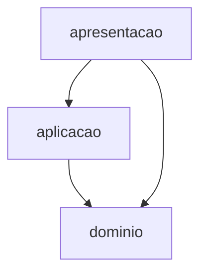

# Aula 10 — Monólito em camadas: o que governa e o que não isola

## Objetivo e competências

Ao final desta aula, você deve conseguir:

- classificar um `import` entre duas camadas como permitido ou proibido pela regra de dependência;
- ler um `setup.cfg` com contrato `type = layers` e dizer o que ele deixa passar;
- distinguir camada fechada de camada aberta e escolher entre as duas para um contexto dado;
- traçar uma mudança de negócio pelas camadas que ela atravessa e explicar por que a camada técnica não a contém;
- apontar, num mapa de componentes, o que não encaixa em camada nenhuma.

## Dois desenhos da mesma arquitetura

Na retrospectiva do grupo, dois integrantes vão ao quadro desenhar "a arquitetura do Orion". Os desenhos não batem. Um empilha três faixas horizontais — borda em cima, regra de negócio no meio, provedores embaixo — e distribui os dez componentes nelas. O outro desenha as dez caixas e as dezessete setas do grafo oficial, sem faixa nenhuma, e diz que camada ali é invenção: não há nada no código que a sustente.

Os dois estão descrevendo o mesmo sistema. A divergência não é de opinião — é que a camada, no Orion de hoje, existe só na cabeça de quem desenha. O grafo oficial mostra `Portal --> Catalogo` direto, sem passar por nenhuma faixa de "aplicação", e `Checkout` dependendo de cinco componentes (`Catalogo`, `Clientes`, `Promocoes`, `Pagamentos`, `Pedidos`) ao mesmo tempo. Nenhuma regra impede uma faixa de baixo de chamar uma de cima. O desenho com camadas é uma intenção; o desenho sem camadas é o que a análise de `import` encontraria.

Semanas depois, chega o pedido: "cupom de frete grátis acima de R$ 200". Uma regra de promoção. Para entregá-la, o time mexe em `Portal` (a vitrine anuncia o cupom), em `Promocoes` (a regra que decide se o cupom vale), em `Checkout` (que consulta a regra durante o fechamento) e em `Pedidos` (o pedido emitido registra o frete zerado). Quatro componentes para uma regra só. Nenhum desses quatro está na mesma faixa horizontal — e é isso que esta aula precisa explicar.

## Camada é um corte horizontal

Uma camada agrupa componentes por **papel técnico**: o que faz composição de tela fica junto, o que orquestra caso de uso fica junto, o que fala com provedor externo fica junto. É um corte horizontal do sistema.

### Quatro camadas técnicas

O arranjo mais comum tem quatro:

| Camada | Responde por | No Mini-Orion |
|---|---|---|
| Apresentação | entrada, composição, tradução para o mundo externo | `apresentacao/app.py` — a raiz de composição |
| Aplicação | orquestrar o caso de uso, sem regra de domínio própria | `aplicacao/checkout.py` — `ServicoCheckout.fechar_pedido` |
| Domínio | tipos e contratos do negócio, regras que não dependem de infra | `dominio/` — `PedidoCobranca`, `ResultadoCobranca`, os `Protocol` |
| Infraestrutura | implementações concretas: provedores, persistência, fila | `infraestrutura/` — `GatewayPagamentoX`, `RepositorioPedidos` |

No Orion inteiro, `Portal` seria a apresentação; `Checkout` orquestra, então tende à aplicação; `Catalogo`, `Promocoes`, `Pedidos` e `Clientes` guardam regra e estado de negócio, então tendem ao domínio; `Integracoes` e os adaptadores de provedor seriam infraestrutura. "Tende a" já é um aviso: nem todo componente cai limpo numa faixa.

### Fechada ou aberta: o que o contrato escolhe

Uma camada **fechada** obriga a passar por ela: `apresentacao` só fala com `aplicacao`, que só fala com `dominio`. Pular um nível é proibido. Uma camada **aberta** deixa passar reto: `apresentacao` pode falar direto com `dominio` sem incomodar `aplicacao`.

A diferença não é estética. Camada fechada dá **isolamento de mudança na vertical**: trocar `dominio` inteiro obriga a revisar só `aplicacao`, porque ninguém mais o enxerga. O preço é a "camada de repasse" — métodos em `aplicacao` que não fazem nada além de encaminhar a chamada para `dominio`. Camada aberta elimina o repasse e paga com menos isolamento: agora `apresentacao` também quebra quando `dominio` muda.

O `import-linter` tem um contrato para isso, e a escolha entre fechada e aberta é o que esse contrato expressa. É o que o Mini-Orion usa a partir de `04-camadas`, e voltamos a ele na seção da decisão.

### A regra de dependência aponta para dentro

A regra é uma só: **uma camada pode depender das que estão abaixo; nenhuma camada depende de uma acima.** `aplicacao` importa `dominio`; `dominio` não importa `aplicacao`. Infraestrutura fica na base ou fora da pilha, e o domínio não a conhece — quem liga o `GatewayPagamentoX` concreto ao caso de uso é a apresentação, na montagem.

Isso inverte a intuição de quem vem de POO, onde a dependência costuma seguir o fluxo de chamada. Aqui a seta de dependência e a seta de fluxo apontam para lados opostos: `aplicacao` chama `infraestrutura` em tempo de execução, mas depende só do `Protocol` que está no `dominio`. O fluxo desce e volta; a dependência só desce.

### O que a camada governa: a direção, agora verificável

Antes de `04-camadas`, "o domínio não depende de infraestrutura" era um acordo verbal — decaía com a rotatividade do time, como qualquer acordo verbal. Com o contrato de camadas no `setup.cfg`, virou verificação: um `import` na direção errada falha a integração contínua. Esse é o ganho concreto, e é real: a direção da dependência deixou de depender de vigilância humana.

### O que a camada não isola: a mudança de cupom

Voltamos ao "cupom de frete grátis". A regra nova é um assunto de negócio — promoção — e ela desce por todas as camadas: aparece na apresentação (anúncio), na aplicação (o checkout consulta), no domínio (a regra do cupom, o campo de frete no pedido). A camada é horizontal; a mudança de negócio é vertical. Elas se cruzam, não se contêm.

O contrato de camadas continua verde durante essa mudança inteira. Ele não tem nada a dizer sobre ela: cada arquivo tocado importa só o que está abaixo dele. A regra de dependência foi respeitada e mesmo assim quatro componentes mudaram. Camada governa direção, não extensão.

### Coesão por camada é coesão fraca

Agrupar por camada é pôr `Pagamentos`, `Notificacoes` e `Pedidos` na mesma caixa "infraestrutura" porque os três são infraestrutura — não porque sirvam ao mesmo propósito de negócio. É coesão por semelhança técnica, e o Módulo 1 já classificou esse tipo como fraco: o componente muda por motivos sem relação entre si.

A camada de aplicação do Orion, se existisse fechada, mudaria quando mudasse a orquestração de checkout, a de devolução, a de reembolso, a de cadastro — assuntos distintos, juntos por serem todos "casos de uso". Uma feature de negócio quer atravessar a caixa; a caixa foi desenhada para segurar o que tem o mesmo formato técnico, não o mesmo dono.

### Por que fan-in e fan-out por camada não mostram o custo

Se medirmos fan-in e fan-out tratando cada camada como um nó, o número fica bonito: quatro camadas, dependências só para baixo, grafo acíclico, $C_e$ baixo em cada uma. A métrica por camada aprova a estrutura.

O custo da mudança de cupom não aparece aí porque ele não é uma aresta entre camadas — é um caminho que desce dentro de várias delas ao mesmo tempo. Contar dependências entre faixas horizontais mede a higiene da direção; não mede quantos assuntos de negócio cada faixa carrega, nem quantas faixas um assunto precisa cruzar. É a mesma lição de `Checkout` com $D = 0{,}03$ no Módulo 1: a métrica pode estar ótima e o problema, real.

### A connascência que desce junto

O Módulo 1 lê acoplamento com três eixos: **força** (quão difícil é detectar e corrigir), **localidade** (quão perto estão as partes ligadas) e **grau** (quantos pontos participam). A heurística que saiu dali: connascência forte pode ficar dentro de um componente; a que atravessa fronteira precisa ser fraca.

A camada não muda essa conta — só a redistribui. Se a regra do cupom vive no domínio mas a apresentação precisa saber que existe um campo "frete grátis aplicado" para exibi-lo, há uma connascência de nome atravessando três camadas. É fraca (renomear é mecânico, a ferramenta ajuda), então a heurística tolera. Se a apresentação passasse a depender da *ordem* em que o checkout aplica cupom e frete, seria connascência de execução cruzando a mesma distância — forte, atravessando fronteira, o que a heurística proíbe. A camada organiza o mapa; ela não decide qual connascência ficou cruzando ele.

## A mudança que desce pelas três camadas

Pergunta que o diagrama responde: se a regra de dependência entre camadas está satisfeita, por que a mudança de cupom ainda toca tudo?



Leitura das setas: `A --> B` significa que **A depende de B**. As três setas apontam para baixo — a regra de camadas está satisfeita. A seta de `apresentacao` direto para `dominio` é o salto de nível que as camadas *abertas* permitem, e que `app.py` de fato usa.

Uma mudança de negócio como o cupom de frete grátis entra pela `apresentacao` (anúncio na vitrine), desce até `aplicacao` (o checkout consulta a regra) e chega ao `dominio` (a regra do cupom, o campo de frete no pedido). Ela corta as três de cima a baixo, na vertical, enquanto as camadas separam o sistema na horizontal.

O que o diagrama **não** mostra: `infraestrutura` — que fica fora desta pilha, alcançada só pela `apresentacao` na montagem; a fiação concreta dentro de `apresentacao/app.py` (qual gateway, qual repositório); e o sentido do fluxo de execução, que desce e volta, ao contrário da dependência, que só desce.

## Recorte de 04-camadas: a regra virou contrato

O Mini-Orion em `04-camadas` reorganiza o pacote plano de `03-governado` em quatro pastas — `apresentacao/`, `aplicacao/`, `dominio/`, `infraestrutura/` — e troca os três contratos por-módulo do estado anterior por dois contratos de camada. Este é o recorte do `setup.cfg`:

```ini title="code/mini-orion/04-camadas/setup.cfg (recorte)"
[importlinter:contract:camadas]
name = Regra de dependencia: nenhuma camada importa uma acima
type = layers
layers =
    mini_orion.apresentacao
    mini_orion.aplicacao
    mini_orion.dominio

[importlinter:contract:dominio-nao-conhece-infra]
name = Dominio e aplicacao nao conhecem infraestrutura
type = forbidden
source_modules =
    mini_orion.dominio
    mini_orion.aplicacao
forbidden_modules =
    mini_orion.infraestrutura
```

`type = layers` impõe camadas **abertas**. Cada camada listada pode importar qualquer uma abaixo dela, salto de nível incluído: `apresentacao/app.py` importa `mini_orion.dominio` direto — para tipar o parâmetro `gateway` como `Gateway` na função de montagem — e o contrato continua satisfeito. O que `layers` proíbe é a direção de volta: `dominio` importando `aplicacao`, ou `aplicacao` importando `apresentacao`. Fechar as camadas — barrar também o salto — exigiria contratos `forbidden` adicionais, um por par que se quer impedir. O Mini-Orion não os tem, e essa ausência é deliberada: é o material do Exercício 4.

O segundo contrato, `dominio-nao-conhece-infra`, é de outro tipo (`forbidden`) e cobre o que `layers` não alcança: `infraestrutura` está fora da pilha de três, então é esse contrato que impede `dominio` e `aplicacao` de importá-la.

A escolha de deixar as camadas abertas neste checkpoint tem um motivo e um custo. Motivo: o Mini-Orion tem três camadas e um caso de uso; fechar exigiria manter três contratos `forbidden` extras para um ganho de isolamento que ninguém está usando ainda. Custo: `apresentacao` quebra se `dominio` mudar, e nada no `setup.cfg` avisa se um salto de nível vira hábito. Fechar as camadas seria defensável num sistema maior, com mais casos de uso disputando a camada de aplicação.

Com o código como está, `lint-imports` fecha assim:

```text
Regra de dependencia: nenhuma camada importa uma acima KEPT
Dominio e aplicacao nao conhecem infraestrutura KEPT

Contracts: 2 kept, 0 broken.
```

Agora forçamos uma violação: `dominio/contratos.py` passa a importar `mini_orion.infraestrutura.pagamentos` — por exemplo, para "aproveitar" a constante `LIMITE` do `GatewayPagamentoX` em vez de redeclará-la. O contrato `camadas` ordena só `apresentacao > aplicacao > dominio`; `infraestrutura` não está nessa lista, então `camadas` não considera esse `import`. Quem o pega é o outro contrato:

```text
Regra de dependencia: nenhuma camada importa uma acima KEPT
Dominio e aplicacao nao conhecem infraestrutura BROKEN

Dominio e aplicacao nao conhecem infraestrutura
- mini_orion.dominio.contratos -> mini_orion.infraestrutura.pagamentos

Contracts: 1 kept, 1 broken.
```

A evidência é o linter vermelho, não o argumento. E o contrato que falha não é a regra de camadas — é a proibição explícita de o domínio olhar para a infraestrutura.

### Registro de diagnóstico: onde a camada paga e onde não

Dois pontos onde a camada, neste checkpoint, entrega:

- **Direção da dependência, verificável.** `aplicacao/checkout.py` importa só `mini_orion.dominio`. Não é disciplina de quem revisa o PR — é o contrato `camadas` mais o teste `test_camada_de_aplicacao_nao_importa_infraestrutura`, que lê o `import` com `ast` e falha se ele voltar.
- **Trocar o provedor de pagamento sem tocar na aplicação.** `GatewayPagamentoY` foi adicionado para as campanhas. A mudança ficou em `infraestrutura/pagamentos.py` e na fiação de `apresentacao/app.py`; `aplicacao/checkout.py` não mudou uma linha, e `test_troca_de_provedor_nao_altera_checkout` prova isso.

Dois pontos onde ela não ajuda:

- **Uma mudança de regra de negócio.** Aplicar "cupom de frete grátis" ao Mini-Orion tocaria `dominio` (a regra e o campo de frete), `aplicacao` (o checkout passa a consultá-la) e `apresentacao` (o resultado precisa ser exibível). Três camadas para uma regra; o contrato de camadas fica verde o tempo todo.
- **Testar uma regra isolada.** Para exercitar só a decisão "acima do limite recusa", o teste ainda monta `Carrinho`, `Cliente`, um gateway concreto, o `RepositorioPedidos` e o notificador, e chama `fechar_pedido` inteiro. A camada separa por papel técnico; a regra que se quer testar está cruzada com as outras dentro do mesmo caso de uso.

## Exercícios

1. **Classifique.** A pilha é `apresentacao > aplicacao > dominio`, com `infraestrutura` fora dela e proibida ao domínio e à aplicação. Para cada `import`, diga se a regra o **permite** ou o **proíbe**, e por quê.

    a. `aplicacao/checkout.py`: `from mini_orion.dominio import Gateway`
    b. `dominio/contratos.py`: `from mini_orion.aplicacao.checkout import ServicoCheckout`
    c. `apresentacao/app.py`: `from mini_orion.dominio import Gateway`
    d. `dominio/modelos.py`: `from mini_orion.infraestrutura.pedidos import RepositorioPedidos`

    ??? note "Resposta comentada"

        **a — permitido.** `aplicacao` depende de `dominio`, que está abaixo. É a direção correta.

        **b — proibido.** `dominio` importaria uma camada acima. O contrato `camadas` (`type = layers`) falha.

        **c — permitido.** As camadas são abertas: `apresentacao` alcança `dominio` saltando `aplicacao`. É o que `app.py` faz hoje, e `lint-imports` fica verde. Fechar as camadas mudaria esta resposta.

        **d — proibido.** Não pelo contrato `camadas` — infra está fora da pilha —, e sim pelo `dominio-nao-conhece-infra`, do tipo `forbidden`.

2. **Aponte o contrato.** Um colega abre um PR com este diff:

    ```python title="mini_orion/dominio/contratos.py"
    +from mini_orion.infraestrutura.notificacoes import FilaNotificacoes
    +
     class Notificador(Protocol):
         def publicar(self, evento: EventoNotificacao) -> None: ...
    ```

    `lint-imports` passa de `2 kept, 0 broken` para `1 kept, 1 broken`. Qual contrato quebrou, e por que não foi o outro?

    ??? note "Resposta comentada"

        Quebrou `dominio-nao-conhece-infra`. O `import` vai do domínio para a `infraestrutura`, que não está entre os módulos ordenados pelo contrato `camadas` (`apresentacao > aplicacao > dominio`) — então `camadas` não considera esse `import`. É o contrato `forbidden`, escrito justamente para cobrir o que `layers` deixa passar, que acusa: `mini_orion.dominio.contratos -> mini_orion.infraestrutura.notificacoes`.

3. **Conte as camadas.** O Orion recebe: "o e-mail de confirmação de pedido passa a incluir o prazo de entrega estimado". Liste as camadas técnicas que essa mudança atravessa e diga, em uma frase por camada, o que muda em cada uma. Use o mapa de camadas do Orion desta aula (`Portal` = apresentação; `Checkout` = aplicação; `Catalogo`, `Promocoes`, `Pedidos`, `Clientes` = domínio; adaptadores de provedor e `Integracoes` = infraestrutura).

    ??? note "Resposta comentada"

        Uma leitura defensável, com `Logistica` fornecendo o prazo e `Notificacoes` compondo o e-mail:

        - **Domínio** — `Pedidos` e/ou `Logistica` passam a expor o prazo estimado como dado do pedido; é a regra "o pedido conhece seu prazo".
        - **Aplicação** — o caso de uso que dispara a confirmação passa a buscar o prazo antes de pedir o envio da notificação.
        - **Infraestrutura** — o template de e-mail (adaptador de `Notificacoes`) ganha o campo.
        - **Apresentação** — muda se o mesmo prazo for exibido em tela; se for só no e-mail, esta camada fica de fora.

        O ponto do exercício: uma frase de negócio ("incluir o prazo no e-mail") desce por três camadas técnicas, e o contrato de camadas não registra nada disso — cada arquivo tocado continua importando só o que está abaixo dele. Contar componentes tocados e contar camadas atravessadas são duas medidas diferentes do mesmo custo.

4. **Julgue: camadas fechadas ou abertas para o Orion?** Hoje o Mini-Orion usa `type = layers`, que dá camadas abertas. Fechar as camadas (barrar também o salto de nível) exigiria contratos `forbidden` par a par. Para o Orion inteiro — dez componentes, `Checkout` como hub em cinco arestas inter-módulo —, qual das duas você adotaria?

    Mais de uma resposta é aceitável. As duas têm defensores competentes: camada aberta evita o custo da "camada de repasse" e é mais barata de manter num time pequeno; camada fechada dá isolamento de mudança na vertical e um ponto único por onde uma faixa fala com a de baixo, ao custo de indireção e de contratos extras no `setup.cfg`.

    O que se avalia: se a sua resposta nomeia o **critério** que decide (custo de manter o contrato? risco de uma mudança em `dominio` respingar direto na `apresentacao`? tamanho do time?), reconhece o que a opção oposta tem de válido, e diz o que você observaria em seis meses para saber se a escolha foi acertada — por exemplo, quantos métodos de puro repasse apareceram, ou quantas vezes um salto de nível causou retrabalho. Resposta sem critério nomeado não conta como resposta técnica.

## Atividade em grupo

Releiam o mapa de componentes do grupo no Orion Evolution Lab como uma pilha de camadas.

1. Rotulem cada componente do recorte com uma camada: apresentação, aplicação, domínio ou infraestrutura. Registrem o critério usado quando o rótulo não for imediato.
2. Desenhem as setas de dependência entre camadas e verifiquem se há alguma na direção proibida (de baixo para cima). Se houver, ela é candidata a diagnóstico.
3. Escolham duas mudanças de negócio plausíveis para o recorte e, para cada uma, listem quantos componentes e quantas camadas ela atravessa.
4. **Obrigatório:** apontem o componente do mapa que **não encaixa em camada nenhuma** — o que faz o papel de duas, ou o que ninguém importa. Digam o que isso revela sobre a proposta: uma camada mal definida, um componente com responsabilidade dupla, ou uma fronteira que o grupo ainda não decidiu.

O item 4 é o ponto da atividade. A pilha de camadas costuma ter uma caixa que sobra, e reconhecer qual é — e por quê — diz mais sobre o recorte do que o desenho limpo das outras. Formato e critérios em [Orion Evolution Lab](../orion/index.md).

## O que ficou decidido e a porta única

O Mini-Orion em `04-camadas` transforma a regra de dependência em contrato: `type = layers` no `setup.cfg`, camadas abertas, mais um `forbidden` para manter a infraestrutura fora do alcance do domínio. `lint-imports` fecha em `2 kept, 0 broken`, e passa a `1 broken` no instante em que o domínio olha para a infraestrutura. A direção da dependência deixou de ser acordo verbal.

O que a camada não deu: contenção de mudança de negócio. A regra do cupom de frete grátis atravessou quatro componentes com o contrato de camadas verde do começo ao fim, porque a camada corta o sistema na horizontal e o assunto de negócio desce na vertical. Coesão por camada agrupa o que tem o mesmo formato técnico, não o mesmo dono — e por isso uma feature acaba cruzando várias faixas.

Fica a pergunta para a Aula 11: e se, em vez de faixas horizontais, o Orion fosse cortado por assunto — `Promocoes` inteira numa caixa, com uma porta só, e ninguém autorizado a entrar pelo lado? O que muda no custo daquela mudança de cupom quando a fronteira acompanha o negócio em vez do papel técnico?

## Leitura complementar

- Richards, Mark; Ford, Neal. *Fundamentals of Software Architecture*. Cap. 10 — Layered Architecture Style (camadas técnicas; camada fechada versus aberta; *architecture sinkhole anti-pattern*).
- Martin, Robert C. *Clean Architecture*. Cap. 22 — The Clean Architecture (a regra de dependência apontando para dentro).

## Referências

- RICHARDS, Mark; FORD, Neal. *Fundamentals of Software Architecture: An Engineering Approach*. O'Reilly, 2020.
- MARTIN, Robert C. *Clean Architecture: A Craftsman's Guide to Software Structure and Design*. Prentice Hall, 2017.
