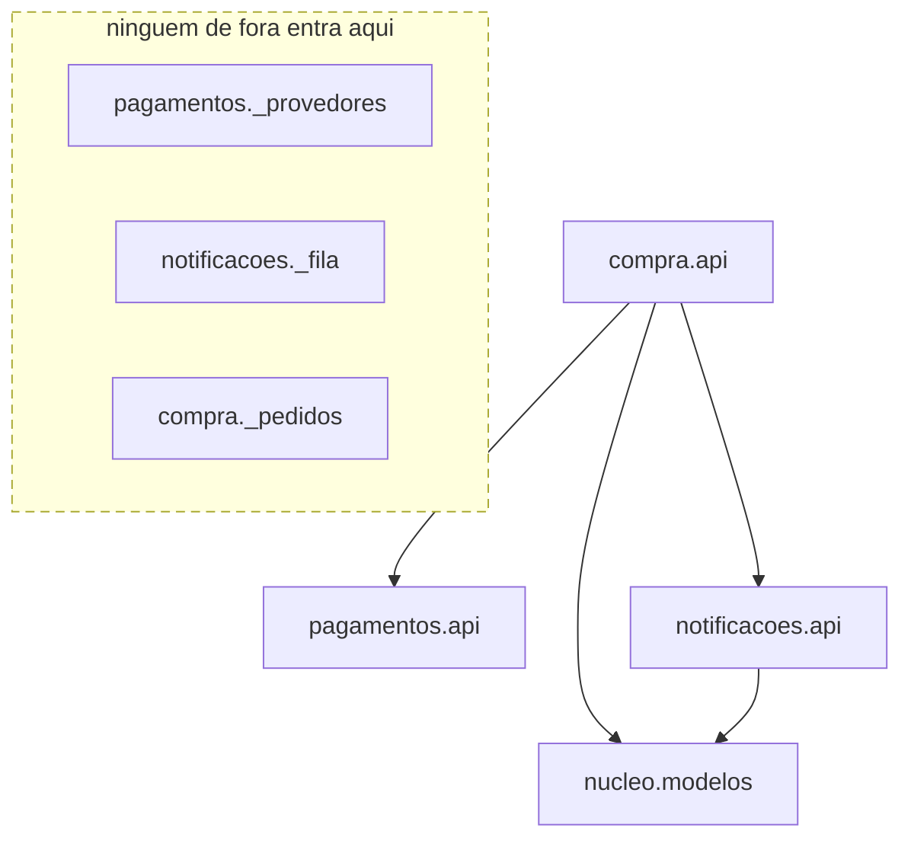

# Aula 11 — Monólito modular: fronteira lógica sem fronteira física

## Objetivo e competências

Ao terminar esta aula, temos condições de:

- distinguir um módulo de domínio de uma camada técnica, e dizer por qual critério cada um agrupa;
- separar, dentro de um pacote, o que é API pública do que é *internal* marcado com `_`;
- classificar uma dependência entre módulos pelos três eixos de connascência da Aula 6 e decidir se ela pode atravessar a fronteira;
- ler contratos `independence` e `forbidden` de um `setup.cfg` e apontar qual *reach-in* cada um barra;
- escrever a assinatura da API pública mínima que os outros módulos consomem;
- justificar em que situação a fronteira lógica, sem a física, já resolve o problema que se tem.

## Promocoes de novo, agora com uma porta só

A Aula 10 terminou com o cupom de frete grátis atravessando `Portal`, `Checkout`, `Promocoes` e `Pedidos`, com o contrato de camadas verde do começo ao fim. A camada governa a direção da dependência; ela não contém a mudança de negócio, que desce na vertical enquanto as faixas cortam na horizontal.

Na retrospectiva seguinte, a pergunta muda de forma. Em vez de "que camada isso atravessa", passa a ser: e se a fronteira acompanhasse o assunto? Concretamente — **o que muda se ninguém puder importar o interior de `Promocoes`, só a sua API?**

Hoje `Checkout` alcança o motor de regras de `Promocoes` por dentro: importa a classe que calcula desconto e conhece a forma dela. Se `Promocoes` ganhar uma porta única — um `api.py` com um contrato e um punhado de tipos — e todo o resto ficar inalcançável, três coisas acontecem. Um tipo novo de regra de desconto (frete grátis, leve três pague dois, cashback) vira mudança interna de `Promocoes`: nenhum outro módulo é recompilado ou retestado por causa dele, desde que a forma da API não mude. `Checkout` deixa de depender de *como* o desconto é calculado e passa a depender só do fato de que pode pedir um. E o que `Checkout` e `Promocoes` combinam entre si fica reduzido ao que passa pela porta — nome de método, tipo de retorno — em vez de qualquer detalhe interno.

O cupom ainda toca `Portal` (anúncio na vitrine) e `Pedidos` (o frete zerado gravado no pedido emitido). A fronteira em volta de `Promocoes` não faz nada por esses dois — são assuntos separados. Vamos ver onde a fronteira paga e onde ela não tem nada a oferecer.

## Cortar por assunto, não por papel técnico

### Módulo de domínio: a caixa acompanha o assunto

Um **módulo de domínio** agrupa componentes por assunto de negócio, não por papel técnico. `05-domain.md` fixa oito deles para o Orion: Vitrine junta `Catalogo` e `Promocoes`; Compra junta `Checkout` e `Pedidos`; Financeiro é `Pagamentos`; Comunicação é `Notificacoes`; e assim por diante. O critério de coesão é "muda pelo mesmo motivo de negócio", que a Aula 6 classifica como coesão forte — o oposto de "são todos serviços", que a camada usa.

A consequência prática é a que a Aula 10 pediu: uma mudança de assunto tende a ficar dentro de uma caixa, em vez de descer por todas as camadas.

### A porta é o `api.py`; o resto leva `_`

Python não tem `private`. O que ele tem é convenção, e o `import-linter` transforma convenção em verificação. A regra do checkpoint: tudo que um módulo expõe mora em `api.py`; todo o resto ganha prefixo `_` no nome do arquivo — `_provedores.py`, `_fila.py`, `_pedidos.py`. O `_` não bloqueia o `import`; ele marca o limite que a ferramenta lê.

`pagamentos.api` publica três nomes: o `Gateway` (`Protocol`), o `PedidoCobranca` (entrada) e o `ResultadoCobranca` (saída). As implementações concretas — `GatewayPagamentoX`, `GatewayPagamentoY`, o simulador de indisponibilidade — ficam em `_provedores.py`. `notificacoes.api` publica o trio que forma o contrato — `Notificador`, `EventoNotificacao`, `evento_de_confirmacao` — mais uma conveniência de fiação, `criar_notificador()`, que devolve um `Notificador` montado para que `compra` não precise tocar em `notificacoes._fila` para obter um.

### O que esconde é o pacote, não a classe

A unidade de encapsulamento aqui é o pacote. Uma classe pode ser pública e ter atributos privados; um pacote decide quais dos seus módulos são importáveis de fora e quais não são. A fronteira passa a ser "quais linhas de `import` são permitidas" — e isso se verifica por análise estática, sem executar nada.

### Fronteira lógica e fronteira física

Uma **fronteira lógica** é imposta pelo linter (no caso do Python) ou pelo compilador (em linguagens com sistema de módulos). Violá-la falha a integração contínua. Não há rede no meio; o custo é o de manter os contratos.

Uma **fronteira física** é imposta pela rede: o outro módulo é um processo separado, alcançável só por uma chamada sobre um socket. Um `import` proibido deixa de ser proibido e passa a ser impossível — não há o que importar. Essa é a fronteira do Módulo 3, e ela cobra o que a Aula 9 já nomeou: latência, falha parcial, ausência de commit único.

A fronteira lógica é o ensaio da física. Não se extrai o que não tem fronteira — mas um ensaio não é a apresentação.

### A heurística de connascência na fronteira do módulo

A Aula 6 deixou uma regra: connascência forte é tolerável quando a localidade é pequena; a que atravessa fronteira precisa ser fraca. Aplicada ao módulo, ela diz que as formas fortes — execução, tempo, valor, identidade — ficam dentro de um módulo, e só as formas fracas e estáticas — nome, tipo — passam pela API.

No Mini-Orion isso é literal. A ordem em que `compra` chama cobrar, emitir e publicar é connascência de execução: forte, dinâmica. Ela vive inteira dentro de `compra.api`, concentrada num método só (`fechar_pedido`) — localidade alta, a proximidade máxima; as chamadas ordenadas que participam ficam todas nesse método, não espalhadas pelos chamadores. O que cruza para `pagamentos` é connascência de tipo: os dois lados concordam que o resultado da cobrança é um `ResultadoCobranca`. Fraca, estática, verificável por ferramenta. A API é o ponto onde se garante que só as formas fracas passaram.

### O ponto honesto: `compra` ainda depende de duas APIs

`compra.api` continua importando `pagamentos.api` e `notificacoes.api`. Os contratos do `setup.cfg` não proíbem isso, e não deveriam: quem orquestra conhece o contrato de quem é orquestrado. A fronteira aqui é lógica — o linter garante que `compra` não alcança `pagamentos._provedores` — e não física: não há evento nem fila entre eles, `compra` chama `gateway.cobrar` e espera a resposta. Independência total entre `compra` e os outros dois exigiria `compra` publicar um evento e seguir sem esperar, e isso é o Módulo 4. Dizer que três contratos de `import-linter` entregam mais que isso seria vender o que eles não compram.

## Três alternativas de fronteira

O estado de partida é `03-governado`: um pacote plano com três contratos `forbidden`, sem separação entre nome público e nome interno. A partir dele, três caminhos, e os três têm quem defenda:

| Alternativa | O que resolve | O que custa | Quando não vale |
|---|---|---|---|
| Manter o pacote plano governado | fronteira mínima já verificável; poucos arquivos | "qual nome é público" fica na cabeça de quem revisa o PR | quando o time cresce e a convenção verbal decai |
| Módulos de domínio com `api.py` + `_` internos | encapsulamento no nível de pacote, verificável; base honesta para extrair depois | mais arquivos; uma fábrica para evitar *reach-in*; uma linha de `ignore_imports` a documentar | quando o sistema tem um assunto só e a separação não paga a indireção |
| Eventos entre os módulos agora | independência de verdade entre `compra` e os outros | falha assíncrona, ordem de entrega, observabilidade distribuída — sem ganho medido que peça isso | quando a chamada direta ainda cabe no orçamento de latência e de operação |

A decisão do checkpoint é a segunda linha. Ela não elimina a dependência de `compra` para as duas APIs; ela impõe que essa dependência passe só pela porta.

## 05-modular: três módulos e um teste que antes não existia

### A árvore de pacotes

```text title="code/mini-orion/05-modular/mini_orion/"
mini_orion/
    nucleo/         modelos.py                 shared kernel: so @dataclass
    compra/         api.py   _pedidos.py
    pagamentos/     api.py   _provedores.py
    notificacoes/   api.py   _fila.py
```

`compra.api` carrega `ServicoCheckout`, a fábrica `montar_servico` e o `Protocol` `RepositorioDePedidos`; `compra._pedidos` carrega a classe concreta `RepositorioPedidos`, em memória, que satisfaz o `Protocol` por estrutura. `pagamentos` e `notificacoes` seguem o mesmo molde: contrato na porta, concreto no `_`. O `nucleo` é *shared kernel* — só `@dataclass` de dados (`Carrinho`, `Cliente`, `Pedido`), sem regra de negócio; está disponível para os módulos que precisam dele — `compra` e `notificacoes` o importam, `pagamentos` não precisa — e depender do `nucleo` não faz um módulo depender dos outros.

### O mapa: as setas que saem de compra

Se `compra` ainda importa duas APIs, o que exatamente a fronteira impede?



Leitura das setas: `A --> B` significa que **A depende de B**. As setas saem só de `compra` para as APIs e daí para o `nucleo` — a dependência que a fronteira admite. Dentro da caixa tracejada estão os módulos `_*`: nenhum nome de fora do pacote os alcança. `compra` depende de `pagamentos.api`, e não pode depender de `pagamentos._provedores`; é essa diferença, e só ela, que os contratos impõem.

O que o diagrama **não** mostra: as classes dentro de cada módulo (`ServicoCheckout`, `Gateway`, `Notificador`, os `@dataclass`); a aresta de cada `api` para o seu próprio `_` interno — legítima, uma API usando o que é dela; e o sentido do fluxo de execução, que vai de `compra` ao gateway e volta com o resultado, ao contrário da seta de dependência.

### Os três contratos do setup.cfg

```ini title="code/mini-orion/05-modular/setup.cfg (recorte)"
[importlinter:contract:pagamentos-e-notificacoes-independentes]
name = Pagamentos e Notificacoes nao se conhecem
type = independence
modules =
    mini_orion.pagamentos
    mini_orion.notificacoes

[importlinter:contract:downstream-nao-importa-compra]
name = Pagamentos e Notificacoes nao dependem de Compra
type = forbidden
source_modules =
    mini_orion.pagamentos
    mini_orion.notificacoes
forbidden_modules =
    mini_orion.compra

[importlinter:contract:sem-reach-in-nos-internals]
name = Ninguem alcanca os internals de outro modulo
type = forbidden
source_modules =
    mini_orion.compra
forbidden_modules =
    mini_orion.pagamentos._provedores
    mini_orion.notificacoes._fila
ignore_imports =
    mini_orion.notificacoes.api -> mini_orion.notificacoes._fila
```

O primeiro, `independence`, garante que `pagamentos` e `notificacoes` não se importam em sentido algum — um não conhece a existência do outro. O segundo, `forbidden`, garante que nenhum dos dois olha para `compra`: a orquestração é de mão única. O terceiro, também `forbidden`, é o que impede o *reach-in*: `compra` pode importar `pagamentos.api` e `notificacoes.api`, mas não `pagamentos._provedores` nem `notificacoes._fila`.

Com o código como está, `lint-imports` fecha assim:

```text
Pagamentos e Notificacoes nao se conhecem KEPT
Pagamentos e Notificacoes nao dependem de Compra KEPT
Ninguem alcanca os internals de outro modulo KEPT

Contracts: 3 kept, 0 broken.
```

### A aresta que o ignore_imports isenta

A última linha do terceiro contrato isenta uma aresta: `mini_orion.notificacoes.api -> mini_orion.notificacoes._fila`. Ela existe porque `criar_notificador()`, dentro de `notificacoes.api`, importa `_fila` para montar o notificador padrão — uma API usando o próprio interno, não um vazamento. É por esse caminho, via `criar_notificador`, que `compra` obtém um notificador pronto sem tocar em `_fila`. *Reach-in* por qualquer outro caminho — em particular `compra` passando por `pagamentos.api` para chegar em `_provedores` — continua sendo detectado.

### O teste de isolamento é a evidência

Na Aula 10, testar a regra "acima do limite recusa" exigia montar `Carrinho`, `Cliente`, um gateway concreto, o repositório e o notificador, e chamar `fechar_pedido` inteiro. A regra que se queria exercitar estava cruzada com as outras dentro do mesmo caso de uso.

Agora `test_isolamento.py` roda cada módulo sozinho:

```python title="code/mini-orion/05-modular/tests/test_isolamento.py (recorte)"
from mini_orion.pagamentos.api import PedidoCobranca, ResultadoCobranca
from mini_orion.pagamentos._provedores import GatewayPagamentoX
from mini_orion.notificacoes.api import EventoNotificacao
from mini_orion.notificacoes._fila import FilaNotificacoes, NotificacaoTolerante


def test_pagamentos_isolado() -> None:
    resultado = GatewayPagamentoX().cobrar(PedidoCobranca(valor=100.0, cartao="4111111111"))
    assert resultado is ResultadoCobranca.APROVADA


def test_notificacoes_isolado() -> None:
    fila = FilaNotificacoes()
    NotificacaoTolerante(fila).publicar(EventoNotificacao(destinatario="a@b.c", assunto="x"))
    assert len(fila.pendentes) == 1
```

Nenhum nome de `compra` entra em cena. Um módulo que se testa sozinho é um módulo com fronteira de verdade — e é por isso que o teste que passou a ser possível **é** a evidência da decisão, não o argumento sobre ela. O que observaríamos se a fronteira fosse só retórica: `test_pagamentos_isolado` precisaria importar algo de `compra` para montar o cenário, e voltaríamos ao acoplamento da Aula 10.

## Exercícios

1. **Identifique a porta.** O pacote `pagamentos` do checkpoint tem esta forma:

    ```text
    pagamentos/
        api.py          Gateway, PedidoCobranca, ResultadoCobranca
        _provedores.py  GatewayPagamentoX, GatewayPagamentoY, GatewayForaDoAr
    ```

    Um módulo `compra` quer cobrar uma compra. Quais nomes ele pode importar e quais o `import-linter` recusaria? Justifique em uma frase por nome.

    ??? note "Resposta comentada"

        `compra` pode importar `Gateway`, `PedidoCobranca` e `ResultadoCobranca` — os três estão em `api.py`, que é a porta pública do módulo. `compra` monta um `PedidoCobranca`, recebe um `ResultadoCobranca` e tipa a dependência pelo `Protocol` `Gateway`.

        `compra` não pode importar `GatewayPagamentoX`, `GatewayPagamentoY` nem `GatewayForaDoAr` — os três estão em `_provedores.py`, marcado com `_`. O contrato `sem-reach-in-nos-internals` acusa `mini_orion.compra -> mini_orion.pagamentos._provedores`. A escolha do provedor concreto é de quem chama a fábrica, não do checkout.

2. **Classifique e decida.** Para cada dependência entre módulos, dê forma, força, localidade e grau, e diga se a heurística da Aula 6 a deixa atravessar a fronteira.

    a. `compra` e `pagamentos` concordam que o resultado da cobrança é um `ResultadoCobranca`.
    b. Dentro de `fechar_pedido`, a ordem cobrar → emitir → publicar.
    c. `compra._pedidos` grava `pedido.total` e `pagamentos` cobra `cobranca.valor`; os dois precisam permanecer iguais.

    ??? note "Resposta comentada"

        **a — Connascência de tipo.** Estática, fraca. Localidade: módulos diferentes. Grau 2. Atravessa a fronteira sem problema: viaja por `pagamentos.api`, o compilador de tipos a enxerga, e um teste rápido a pega.

        **b — Connascência de execução.** Dinâmica, forte. Localidade: alta — um método só, dentro de `compra.api`. Grau: as chamadas ordenadas da sequência (cobrar, emitir, publicar), todas nesse mesmo método, não espalhadas pelos chamadores. Não atravessa fronteira nenhuma, e é assim que deve ser: fica selada dentro de `compra`.

        **c — Connascência de valor.** Dinâmica, forte. Localidade: módulos diferentes. Grau 2. A heurística diz que uma forma forte cruzando fronteira é dívida. Aqui ela é tolerada só porque há um orquestrador único — `compra` — que deriva os dois valores de `carrinho.total` num ponto só. Eliminá-la de vez pediria um evento carregando o valor, o que é assunto do Módulo 4.

3. **Escreva a API mínima.** Um módulo de domínio `promocoes` precisa expor a `compra` o suficiente para aplicar desconto no fechamento, e nada além disso. O motor de regras fica em `promocoes/_regras.py`. Escreva o conteúdo público de `promocoes/api.py` — os tipos e o contrato que `compra` importa.

    ??? note "Resposta comentada"

        Uma resposta suficiente expõe um tipo de valor e um `Protocol`, e deixa o cálculo do lado de dentro:

        ```python
        from dataclasses import dataclass
        from typing import Protocol

        from mini_orion.nucleo.modelos import Carrinho


        @dataclass(frozen=True)
        class Desconto:
            valor: float
            descricao: str


        class Promocoes(Protocol):
            def desconto_para(self, carrinho: Carrinho) -> Desconto: ...
        ```

        O que **não** entra em `api.py`: a classe que percorre as regras, a tabela de campanhas vigentes, a leitura de `Catalogo`. Tudo isso vive em `_regras.py`. `compra` recebe um `Promocoes` pronto por uma fábrica e chama `desconto_para`; um tipo novo de regra muda `_regras.py` e mais nada.

4. **Julgue: vale a pena a fronteira lógica sem a física?** O checkpoint impõe que `compra` só fale com as APIs de `pagamentos` e `notificacoes`, mas mantém a chamada direta e síncrona — sem processo separado, sem rede, sem evento. Alguém pode argumentar que isso é meio caminho: a disciplina do contrato sem o isolamento de falha que só a separação de processo dá. Outro alguém pode argumentar que é exatamente a quantidade certa de fronteira para o problema atual.

    Mais de uma resposta é defensável. O que se avalia: se a sua resposta nomeia o **critério** que decide (custo de manter os contratos? risco de uma falha em `pagamentos` derrubar `compra`? cadência de release de cada módulo? ausência de ganho medido para pagar a rede?), reconhece o que a posição oposta tem de válido, e diz o que você observaria em seis meses para saber se a escolha envelheceu bem — por exemplo, quantas vezes um `import` de *reach-in* foi barrado no PR, ou se algum módulo passou a precisar de janela de manutenção própria. Resposta sem critério nomeado não conta como resposta técnica.

## Atividade em grupo

Sobre o recorte do seu grupo no Orion Evolution Lab:

1. Agrupem os componentes do recorte em módulos de domínio. Usem o agrupamento de `05-domain.md` como referência, mas registrem qualquer divergência e o motivo dela.
2. Para cada módulo, escrevam a **API pública mínima** que os outros módulos consomem — os tipos e os contratos, não a implementação. Se um módulo expõe mais de quatro nomes, expliquem por quê.
3. Marquem, para cada módulo, o que ficaria como *internal* `_` — o que os outros não têm razão de importar.
4. **Obrigatório:** nomeiem uma dependência entre dois módulos do recorte que **não** dá para eliminar sem eventos. Digam qual connascência a sustenta, por que a chamada direta ainda é aceitável hoje, e que sinal observável faria essa dependência virar candidata a um evento — assunto do Módulo 4.

O item 4 é o ponto da atividade. Toda proposta de modularização tem uma aresta que a fronteira lógica organiza mas não corta; reconhecer qual é, e por quê, diz mais sobre o recorte do que o desenho limpo dos módulos que se isolam bem. Formato e critérios em [Orion Evolution Lab](../orion/index.md).

## Três módulos aqui, dezessete arestas lá

O Mini-Orion em `05-modular` tem três módulos de domínio — `compra`, `pagamentos`, `notificacoes` — mais o `nucleo` como *shared kernel*. Cada módulo tem `api.py` como porta e arquivos `_` como interior; três contratos de `import-linter` fecham em `3 kept, 0 broken`; e cada módulo tem ao menos um teste que roda sem instanciar os outros. A fronteira é lógica: `compra` ainda depende de duas APIs, tirar essa dependência exige eventos (Módulo 4), e pôr uma chamada de rede no lugar da chamada direta é o Módulo 3 — com a conta de latência, falha parcial e commit único que a Aula 9 já abriu.

O Mini-Orion tem três módulos. O Orion inteiro tem dez componentes e dezessete arestas. Sob o agrupamento de domínio de `05-domain.md`, cada uma dessas dezessete arestas é uma de duas coisas: fronteira entre módulos, que custa e precisa ser justificada, ou detalhe interno de um módulo, que ninguém de fora enxerga. Quais são quais — e quanto a conta das que atravessam pesa — é o que a Aula 12 mede.

## Leitura complementar

- Richards, Mark; Ford, Neal. *Fundamentals of Software Architecture*. Cap. 8 — Component-Based Thinking (componente como partição física; coesão de componente); Cap. 3 — Modularity (connascência aplicada à fronteira).
- Martin, Robert C. *Clean Architecture*. Cap. 14 — Component Cohesion (o que agrupa o que dentro de um módulo).

## Referências

- RICHARDS, Mark; FORD, Neal. *Fundamentals of Software Architecture: An Engineering Approach*. O'Reilly, 2020.
- MARTIN, Robert C. *Clean Architecture: A Craftsman's Guide to Software Structure and Design*. Prentice Hall, 2017.
- PAGE-JONES, Meilir. *What Every Programmer Should Know About Object-Oriented Design*. Dorset House, 1995.
