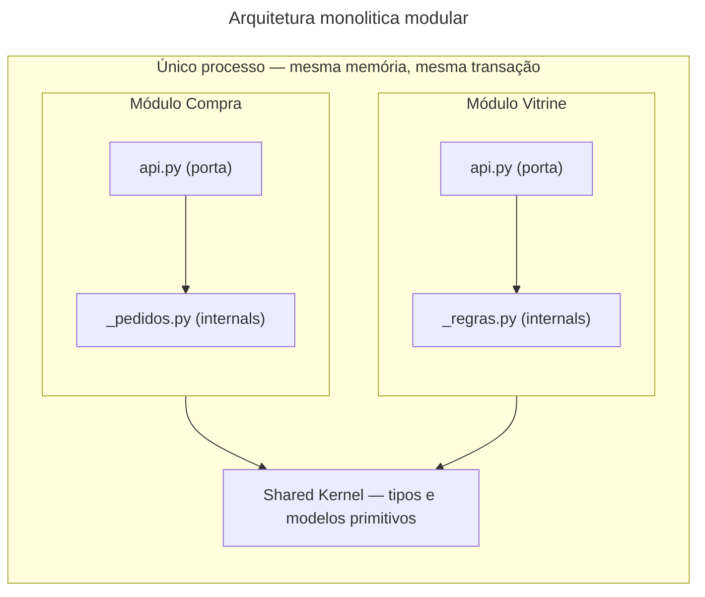
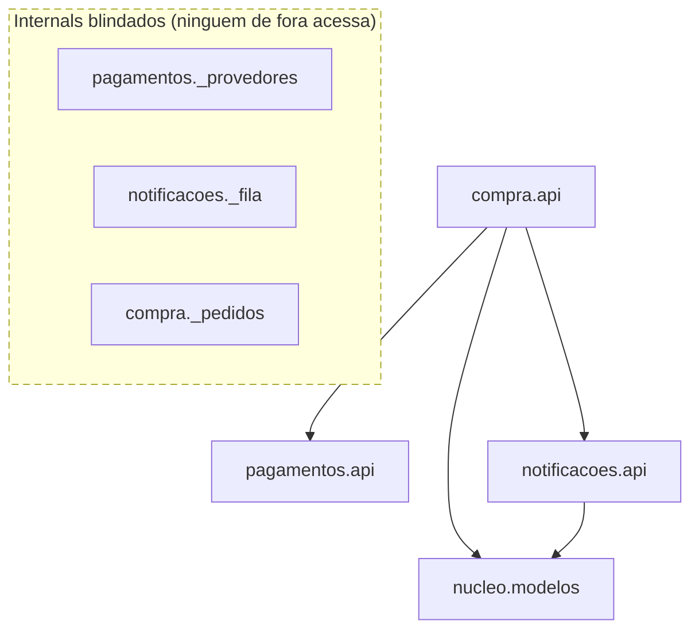

# Aula 11 — Monólito modular: fronteira lógica sem fronteira física

## Objetivo e competências

Ao terminar esta aula, você deve conseguir:

- definir formalmente o estilo arquitetural Monólito Modular e distingui-lo de monólitos planos (*Big Ball of Mud*), monólitos em camadas e sistemas distribuídos;
- fundamentar a estratégia *"Modular Monolith First"* e contrastar as propriedades de uma fronteira lógica com as de uma fronteira física;
- situar onde cada linguagem sustenta a fronteira de módulo — compilador, empacotamento ou CI — e por que Python depende inteiramente da última;
- aplicar a heurística de connascência à fronteira de um módulo, garantindo que formas fortes fiquem confinadas internamente e apenas formas fracas atravessem a API pública;
- configurar e interpretar contratos de arquitetura estática (`independence`, `forbidden` e isenções legítimas de `ignore_imports`) que barram o acesso a detalhes internos (*reach-in*);
- projetar a assinatura de uma API pública mínima de domínio e demonstrar, por meio de testes unitários isolados, a existência de fronteiras reais.

## Promocoes de novo: e se a fronteira acompanhasse o assunto?

A Aula 10 terminou com um diagnóstico desconfortável: o cupom de frete grátis vinculado à campanha ativa exigiu modificações em `Portal`, `Checkout`, `Promocoes` e `Pedidos`. Embora a regra de dependência em camadas tenha sido respeitada e o analisador estático tenha permanecido verde do início ao fim, quatro componentes distribuídos em três camadas técnicas distintas precisaram ser alterados conjuntamente. A camada governa a direção descendente da dependência; ela é estruturalmente incapaz de conter a dispersão de uma mudança de negócio.

Na retrospectiva seguinte, a equipe muda a pergunta estrutural de partida:
> *Em vez de fatiarmos o sistema por papel técnico horizontal, o que aconteceria se a fronteira acompanhasse o assunto de negócio? Concretamente: o que muda se ninguém puder importar o interior de `Promocoes`, exceto por uma porta pública estrita?*

Hoje, no grafo original do Orion, `Checkout` alcança o motor de regras de `Promocoes` por dentro: importa diretamente classes concretas e conhece a mecânica interna de cálculo de descontos. Se `Promocoes` ganhar uma porta única — contendo exclusivamente contratos abstratos e tipos de dados fundamentais — enquanto todo o seu maquinário interno de regras for blindado contra acessos externos, três transformações arquiteturais acontecem:

1. **Isolamento de evolução**: a inclusão de um novo tipo de promoção (frete grátis, "leve 3 pague 2", cupons progressivos ou cashback de parceiro) torna-se uma mudança estritamente interna de `Promocoes`. Nenhum módulo consumidor precisa ser recompilado, retestado ou alterado, desde que a assinatura da porta pública permaneça estável.
2. **Desacoplamento de conhecimento**: `Checkout` deixa de conhecer *como* o desconto é calculado e passa a depender apenas do fato abstrato de que *pode solicitar* a aplicação de promoções sobre um carrinho de compras.
3. **Minimização do acoplamento**: o contrato entre chamador e chamado fica restrito a tipos de dados explícitos e interfaces, reduzindo a connascência entre eles ao nível mais fraco e seguro possível.

O cupom ainda produz reflexos em `Portal` (que exibe o anúncio comercial na vitrine) e em `Pedidos` (que registra a isenção no pedido final). A fronteira em torno de `Promocoes` não elimina a existência desses outros assuntos — eles são legítimos e pertencem a outros domínios. O que ela elimina é o entrelaçamento de código e o vazamento de detalhes internos.

---

## O que é um Monólito Modular?

### Definição estrutural

Um **Monólito Modular** (*Modular Monolith*) é um estilo arquitetural no qual a aplicação:
- é executada em tempo de execução dentro de um **único processo de sistema operacional**;
- é empacotada e implantada por meio de um **único pipeline e artefato de entrega**;
- compartilha a mesma infraestrutura computacional e memória física;
- **mas** possui sua estrutura interna rigorosamente particionada em **módulos de domínio independentes**, com fronteiras lógicas bem estabelecidas, interfaces públicas explícitas e proibição estrita de acesso a detalhes de implementação interna.



> **Convenção de leitura das setas**: `A --> B` significa que **A depende de B**. Nenhuma seta toca um nó de *internals*: é a fronteira em desenho.
> **O que o diagrama omite**: a chamada direta de `compra.api` para `vitrine.api` (um módulo também consome a porta do outro, não só o Shared Kernel), os demais módulos do Orion — mostra só dois, para fixar o padrão —, os testes de isolamento de cada módulo, e o conteúdo interno de cada `_*.py`.

Para compreender sua posição no espectro arquitetural, compare os quatro arranjos fundamentais:

| Estilo | Empacotamento / Deploy | Processos em Execução | Organização Interna | Acoplamento entre Partes |
|---|---|---|---|---|
| **Big Ball of Mud** | Monolítico | Único | Desorganizada / Sem fronteiras | Alto / Caótico (qualquer arquivo acessa tudo) |
| **Monólito em Camadas** | Monolítico | Único | Faixas horizontais técnicas | Médio (regras dependem da direção, mas cortam faixas) |
| **Monólito Modular** | Monolítico | Único | Módulos verticais de negócio | Baixo / Controlado (somente via APIs públicas de domínio) |
| **Microsserviços** | Distribuído | Múltiplos processos | Serviços autônomos de negócio | Físico / Rede (isolamento total via sockets e serialização) |

### A estratégia "Modular Monolith First"

Ao longo da última década, uma quantidade expressiva de equipes de engenharia migrou prematuramente de monólitos tradicionais para microsserviços, atraída pela promessa de independência de desenvolvimento. O resultado recorrente foi a substituição de problemas de código por problemas de rede: sistemas que antes sofriam com acoplamento interno passaram a sofrer com latência acumulada, quebras parciais de chamadas remotas, perda de transações atômicas e pesada sobrecarga operacional de observabilidade distribuída — configurando o anti-padrão do *monólito distribuído*.

Autores como Martin Fowler, Simon Brown e Neal Ford sintetizaram a resposta da engenharia moderna na máxima:
> *"Se você não consegue construir um sistema com fronteiras limpas dentro do mesmo processo, que chance você tem de construí-lo separando as partes por uma rede?"*

O Monólito Modular oferece os principais benefícios que os desenvolvedores buscam nos microsserviços — isolamento cognitivo, limites claros de contexto (Bounded Contexts do DDD), testes rápidos e autonomia para equipes trabalharem em domínios específicos — **sem** incorrer na fatura da computação distribuída.

### Fronteira lógica versus fronteira física

A distinção entre essas duas categorias de fronteira é um dos fundamentos mais importantes da disciplina:

#### 1. Fronteira Lógica
- **Mecanismo**: imposta em tempo de compilação, pelo sistema de tipos da linguagem ou por ferramentas de análise estática de código (linters de arquitetura).
- **Runtime**: os módulos coabitam o mesmo espaço de memória. Uma chamada entre dois módulos é uma chamada de método/função em memória (*in-memory invocation*), executada em microssegundos ou nanossegundos.
- **Transacionalidade**: permite commits atômicos (ACID) no mesmo banco de dados relacional.
- **Custo**: quase exclusivamente de design (definir bons contratos e manter a disciplina das ferramentas de governança).

#### 2. Fronteira Física
- **Mecanismo**: imposta pela separação de processos de sistema operacional e cabos de rede (TCP/IP, HTTP, gRPC, mensageria).
- **Runtime**: a chamada de função é substituída por serialização de payload, handshake de rede, tráfego de pacotes e desserialização. A latência salta de nanossegundos para milissegundos.
- **Transacionalidade**: commits únicos deixam de existir; o sistema precisa adotar consistência eventual, padrões de compensação (*Sagas*) ou transações em duas fases.
- **Custo**: operacional, de infraestrutura, de monitoramento e de tolerância a falhas parciais.

> **Tese central**: *A fronteira lógica é o ensaio honesto da fronteira física.*  
> Se um módulo de domínio não possui sua API pública rigorosamente definida e seus internals blindados dentro da mesma memória, extraí-lo para um serviço distribuído causará falhas imediatas. No entanto, uma vez que a fronteira lógica esteja consolidada e estável, o monólito modular pode atender à empresa por anos — e, caso a separação física venha a ser justificável no futuro (Módulo 3), a extração será direta, pois o contorno do módulo já está pronto.

---

## A porta pública é um princípio, o mecanismo muda com a linguagem

O conceito de monólito modular é agnóstico a tecnologia: em qualquer ecossistema, a regra é a mesma — *o que pertence ao interior do módulo não pode ser importado por quem está de fora*. O que muda de linguagem para linguagem é quem garante isso, e em que ponto da cadeia de build.

Python é o caso mais exposto: a linguagem foi construída sob a filosofia de *"consenting adults"* e não tem modificador de acesso nativo que barre um `import` — qualquer arquivo `.py` pode, tecnicamente, importar qualquer outro. Por isso o Mini-Orion sustenta a fronteira em duas partes: uma convenção visual (porta pública em `api.py`, implementação interna com prefixo `_`) e uma verificação mecânica no CI (`import-linter`, lendo contratos declarativos e falhando o build quando alguém rompe a convenção). Sem a segunda parte, a primeira não passa de combinado verbal.

Outras linguagens resolvem o mesmo problema em lugares diferentes da cadeia de build. Java barra o acesso já na visibilidade de pacote (`package-private`) e formaliza módulos com o JPMS; Go proíbe no próprio compilador qualquer import que atravesse um diretório `internal/`; C#/.NET usa o modificador `internal` dentro do assembly; monorepos TypeScript aplicam tags de módulo do Nx ou o `dependency-cruiser` como regra de lint. A diferença entre elas é *onde* a barreira vive — compilador, empacotamento ou CI —, não se a barreira existe. Python empurra a barreira inteira para o CI porque não tem onde mais colocá-la.

---

## A anatomia de um módulo de domínio: o caso Orion

Aplicando esse desenho ao Marketplace Orion, contrastamos a abordagem horizontal da Aula 10 com a modularização por domínio.

### Cortar por assunto, não por tecnologia

Um **módulo de domínio** agrupa componentes por assunto de negócio, não por semelhança técnica. Aplicado aos dez componentes canônicos do Orion, esse critério produz oito módulos:

| Módulo de domínio | Componentes |
|---|---|
| Borda | `Portal` |
| Vitrine | `Catalogo`, `Promocoes` |
| Compra | `Checkout`, `Pedidos` |
| Financeiro | `Pagamentos` |
| Distribuição | `Logistica` |
| Comunicação | `Notificacoes` |
| Identidade | `Clientes` |
| Integração | `Integracoes` |

!!! note "Critério de agrupamento"

    O critério de agrupamento atende à definição de **coesão forte**: elementos que sofrem manutenção pelos mesmos motivos de negócio moram juntos. Esse agrupamento é uma decisão desta disciplina, do mesmo tipo que a convenção de contagem de Abstractness do Módulo 1: existe para dar ao exercício de reorganização uma resposta verificável, e um corte diferente — juntar `Financeiro` e `Distribuição` num módulo de pós-venda, por exemplo — seria igualmente defensável.

### A porta única de `Promocoes`

Retomemos o problema do cupom de desconto. Em um monólito modular, como desenhamos a fronteira do módulo `promocoes`?

```text
promocoes/
    api.py          <- Porta única: Protocol Promocoes, Desconto, factory
    _regras.py      <- Internal: MotorRegras, RegraFreteGratis, RegraCashback
    _campanhas.py   <- Internal: RepositorioCampanhasEmMemoria, cache local
```

Na porta pública (`api.py`), expomos apenas o contrato de consumo e os tipos de valor imutáveis:

```python title="promocoes/api.py (recorte conceitual da porta)"
from dataclasses import dataclass
from typing import Protocol
from mini_orion.nucleo.modelos import Carrinho


@dataclass(frozen=True)
class Desconto:
    """Resultado da avaliação promocional."""
    valor: float
    descricao: str


class Promocoes(Protocol):
    """Contrato abstrato que outros módulos consomem."""
    def desconto_para(self, carrinho: Carrinho) -> Desconto:
        """Calcula o melhor desconto aplicável ao carrinho."""
        ...
```

Todo o motor de regras de desconto, a lista de cupons e a mecânica de cálculo residem em `_regras.py`. 

Quando o time de marketing cria uma nova campanha ("leve 3 camisetas e pague 2"), a alteração é feita exclusivamente dentro de `_regras.py`. O módulo `Compra` (`Checkout`) sequer toma conhecimento da alteração: ele continua chamando `desconto_para(carrinho)` e recebendo um objeto imutável `Desconto`. O custo de propagação da mudança foi contido dentro da fronteira do módulo.

### A heurística de connascência na fronteira modular

Na Aula 6, introduzimos a connascência e sua regra de ouro:
> *Connascência forte só é aceitável quando a localidade é alta; connascência que cruza fronteiras deve ser fraca e estática.*

No monólito modular, essa heurística é aplicada de forma literal:

1. **Connascência de Execução (Forte, Dinâmica)**: Dentro do módulo `compra`, a sequência de fechamento do pedido executa:
   `validar_carrinho() -> calcular_desconto() -> cobrar() -> emitir_pedido() -> publicar_confirmacao()`.  
   Essa ordem rígida é uma connascência forte. No entanto, ela reside **inteira dentro de um único método** (`fechar_pedido`) em `compra.api`. A localidade é máxima (algumas linhas no mesmo arquivo). Nenhuma parte dessa sequência vaza para quem chama o checkout.
2. **Connascência de Tipo (Fraca, Estática)**: Entre `compra` e `pagamentos`, a dependência é restrita a tipos imutáveis: `compra` passa um `PedidoCobranca` e recebe um `ResultadoCobranca`. Se o tipo mudar, o verificador estático acusa o erro antes dos testes rodarem.
3. **Connascência de Nome (Fraca, Estática)**: Os módulos concordam apenas nos nomes dos métodos da interface (`cobrar`, `desconto_para`).

A API pública atua como um filtro sanitário: ela barra a passagem de connascências fortes para o exterior do módulo.

### O ponto honesto sobre acoplamento residual

É fundamental manter a honestidade técnica: **o monólito modular não elimina todas as dependências entre módulos, nem deve prometer isso.**

No Mini-Orion, o módulo `compra` continua importando as APIs de `pagamentos` e `notificacoes`. Isso é legítimo: quem é responsável por orquestrar um caso de uso precisa conhecer a interface de quem executa as etapas do processo. A invocação continua sendo uma chamada de função direta e síncrona dentro da mesma thread de execução.

Dizer que o monólito modular elimina dependências seria vender uma ilusão. O que ele elimina de forma categórica é o **reach-in**: a prática perigosa de um módulo alcançar implementações concretas e estruturas internas de outro módulo. A independência temporal completa (onde `compra` emite um evento e segue sem esperar resposta) só é atingida com arquiteturas orientadas a eventos, assunto do Módulo 4.

---

## Mini-Orion 05-modular: Código, contratos e isolamento de testes

No repositório do Mini-Orion, o checkpoint `05-modular` reorganiza o sistema em módulos de domínio estritos.

### A árvore de pacotes e o Shared Kernel

```text title="code/mini-orion/05-modular/mini_orion/"
mini_orion/
    nucleo/         modelos.py                 shared kernel: apenas @dataclass
    compra/         api.py   _pedidos.py       modulo de dominio
    pagamentos/     api.py   _provedores.py    modulo de dominio
    notificacoes/   api.py   _fila.py          modulo de dominio
```

O pacote `nucleo` desempenha o papel de **Shared Kernel** (Evans, DDD):
- Contém apenas estruturas de dados fundamentais (`Carrinho`, `Cliente`, `Pedido`) tipadas com `@dataclass(frozen=True)`.
- É estritamente desprovido de lógica de negócio comportamental.
- Serve como vocabulário comum entre os módulos: `compra` e `notificacoes` importam `nucleo`, mas depender do `nucleo` não introduz dependência entre eles.

### O mapa de dependências e a blindagem dos internals



> **Convenção de leitura das setas**: `A --> B` significa que **A depende estaticamente de B** (A importa B).
> **O que o diagrama destaca**: As setas de dependência tocam exclusivamente as portas públicas (`api.py`) e o `nucleo`. Nenhum módulo externo possui arestas apontando para os elementos dentro da caixa tracejada (`_*`).

### Os três contratos do setup.cfg

Para garantir que a blindagem não dependa de boa vontade, três contratos foram definidos no `setup.cfg`:

```ini title="code/mini-orion/05-modular/setup.cfg (recorte)"
[importlinter:contract:pagamentos-e-notificacoes-independentes]
name = Pagamentos e Notificacoes nao se conhecem
type = independence
modules =
    mini_orion.pagamentos
    mini_orion.notificacoes

[importlinter:contract:downstream-nao-importa-compra]
name = Pagamentos e Notificacoes nao dependem de Compra
type = forbidden
source_modules =
    mini_orion.pagamentos
    mini_orion.notificacoes
forbidden_modules =
    mini_orion.compra

[importlinter:contract:sem-reach-in-nos-internals]
name = Ninguem alcanca os internals de outro modulo
type = forbidden
source_modules =
    mini_orion.compra
forbidden_modules =
    mini_orion.pagamentos._provedores
    mini_orion.notificacoes._fila
ignore_imports =
    mini_orion.notificacoes.api -> mini_orion.notificacoes._fila
```

Análise funcional dos contratos:
1. **`type = independence`**: garante que `pagamentos` e `notificacoes` operem de forma totalmente ortogonal. Nenhum deles pode importar nada do outro, em nenhum sentido.
2. **`type = forbidden` (downstream)**: assegura a direção única de orquestração. Módulos especialistas não podem importar o orquestrador `compra`.
3. **`type = forbidden` (anti-reach-in)**: impede que `compra` importe `_provedores` ou `_fila`.

#### A fiação legítima e a diretiva `ignore_imports`
A última linha do contrato proíbe `compra` de acessar `notificacoes._fila`, mas contém a cláusula:
`ignore_imports = mini_orion.notificacoes.api -> mini_orion.notificacoes._fila`.

Por que essa isenção existe?  
Dentro de `notificacoes.api`, a fábrica `criar_notificador()` precisa instanciar a classe concreta `FilaNotificacoes` (que vive em `_fila.py`) para entregar um objeto pronto a quem chamou. Isso **não é vazamento arquitetural**: é o próprio módulo montando suas peças internas para oferecer uma conveniência de uso na sua porta pública. A diretiva `ignore_imports` documenta essa fiação interna como legítima, enquanto mantém o bloqueio absoluto para qualquer importação vinda de fora do pacote.

### O teste de isolamento é a evidência palpável

Na Aula 10, para testar se uma recusa de cartão funcionava, éramos obrigados a instanciar o grafo quase completo da aplicação: carrinho, cliente, gateway concreto, repositório e notificador, disparando o método `fechar_pedido` inteiro. A regra que queríamos testar estava enroscada na orquestração.

No Monólito Modular, a existência real da fronteira é comprovada por um teste que roda com cada módulo completamente isolado:

```python title="code/mini-orion/05-modular/tests/test_isolamento.py"
from mini_orion.pagamentos.api import PedidoCobranca, ResultadoCobranca
from mini_orion.pagamentos._provedores import GatewayPagamentoX
from mini_orion.notificacoes.api import EventoNotificacao
from mini_orion.notificacoes._fila import FilaNotificacoes, NotificacaoTolerante


def test_pagamentos_isolado() -> None:
    # Testa o provedor diretamente sem instanciar nada de compra ou pedidos
    resultado = GatewayPagamentoX().cobrar(
        PedidoCobranca(valor=100.0, cartao="4111111111")
    )
    assert resultado is ResultadoCobranca.APROVADA


def test_notificacoes_isolado() -> None:
    # Testa a fila de notificacoes sem subir checkout ou banco de dados
    fila = FilaNotificacoes()
    NotificacaoTolerante(fila).publicar(
        EventoNotificacao(destinatario="cliente@orion.com", assunto="Confirmacao")
    )
    assert len(fila.pendentes) == 1
```

Nenhum componente de `compra` é carregado. O teste é executado em milissegundos na memória.

> **Critério de validação**: *Um módulo com fronteira de verdade se testa sozinho.*  
> Se para testar unitariamente um módulo você for forçado a mockar ou subir as classes do orquestrador, a fronteira é apenas retórica e o acoplamento continua presente.

---

## Exercícios

1. **Identificação da porta.** O pacote `pagamentos` do Mini-Orion possui os seguintes arquivos:
   
    ```text
    pagamentos/
        api.py          Gateway (Protocol), PedidoCobranca, ResultadoCobranca
        _provedores.py  GatewayPagamentoX, GatewayPagamentoY, GatewayForaDoAr
    ```
    
    Um desenvolvedor do módulo `compra` precisa realizar a cobrança de um pedido. Quais elementos ele tem autorização arquitetural para importar e quais o linter deve proibir? Justifique o motivo para cada caso.

    ??? note "Resposta comentada"

        **Pode importar (de `pagamentos.api`):**
        - `Gateway`: protocolo abstrato que define a assinatura do método de cobrança;
        - `PedidoCobranca`: tipo de entrada que empacota os dados da transação;
        - `ResultadoCobranca`: enum ou tipo de retorno que expressa o status do pagamento.
        
        **Não pode importar (de `pagamentos._provedores`):**
        - `GatewayPagamentoX`, `GatewayPagamentoY`, `GatewayForaDoAr`: classes concretas que implementam o protocolo. O módulo de compra não deve conhecer provedores específicos. A escolha de qual provedor instanciar pertence à composição inicial do sistema (injeção de dependências), não à lógica do checkout. O linter acusa violação de *reach-in* se qualquer um desses arquivos for importado fora de `pagamentos`.

2. **Classificação de connascência entre módulos.** Avalie cada uma das seguintes conexões entre módulos, apontando a forma de connascência, a localidade e se a conexão é permitida na fronteira modular:
   
    a. `compra` e `pagamentos` concordam que a cobrança devolve um objeto imutável `ResultadoCobranca`.  
    b. Dentro do método `fechar_pedido`, a execução sequencial obrigatória: `gateway.cobrar()` antes de `repo.salvar()`.  
    c. O módulo `compra._pedidos` armazena `pedido.valor_total = 250.0` e o módulo `pagamentos._provedores` efetua a cobrança com base em `cobranca.valor = 250.0`.

    ??? note "Resposta comentada"

        **a — Connascência de Tipo.** Estática e fraca. Localidade: módulos distintos (atravessa fronteira). É **permitida e recomendada**: expressa um contrato estável de tipos, verificado em tempo de compilação ou checagem de tipos estáticos (`mypy`).

        **b — Connascência de Execução.** Dinâmica e forte. Localidade: máxima (confinada dentro do método `fechar_pedido` em `compra.api`). É **permitida apenas porque a localidade é alta**: não cruza fronteiras; quem chama `fechar_pedido` não precisa saber em que ordem as operações internas ocorrem.

        **c — Connascência de Valor.** Dinâmica e forte. Localidade: módulos distintos. É uma **dívida técnica tolerada**: os dois valores precisam coincidir exatamente. Ela só é sustentável hoje porque o orquestrador `compra` deriva ambos do mesmo `carrinho.total` no momento da chamada. A eliminação definitiva dessa connascência de valor exige eventos imutáveis com payload completo (Módulo 4).

3. **Projetando a API mínima.** O domínio `promocoes` precisa permitir que o módulo de fechamento aplique descontos no carrinho sem que nenhum detalhe de campanhas ou cupons vaze. Escreva o conteúdo completo de `promocoes/api.py`, contendo os tipos de dados e a interface que `compra` deve consumir.

    ??? note "Resposta comentada"

        Uma implementação exemplar expõe apenas estruturas de dados imutáveis e um protocolo tipado:

        ```python
        from dataclasses import dataclass
        from typing import Protocol
        from mini_orion.nucleo.modelos import Carrinho


        @dataclass(frozen=True)
        class Desconto:
            valor: float
            descricao: str


        class Promocoes(Protocol):
            def desconto_para(self, carrinho: Carrinho) -> Desconto:
                """Recebe o carrinho e retorna o desconto a aplicar."""
                ...
        ```

        O que **não** entra na API: classes de regras individuais (`RegraCupom200`, `RegraFreteGratis`), classes de acesso a banco de campanhas ou conexões externas. Esses elementos permanecem encapsulados nos arquivos internos `_regras.py` e `_campanhas.py`.

4. **Julgamento arquitetural: vale a pena a fronteira lógica sem a física?** Um engenheiro sênior da equipe argumenta: *"Monólito modular é uma meia-medida ilusória. Mantemos o acoplamento de runtime, o risco de concorrência no mesmo banco e a disputa de deploy em um artefato só. Deveríamos ir diretamente para microsserviços."*  
    Avalie criticamente esse argumento. Identifique quais pontos da afirmação são verdadeiros, quais são falaciosos e defina qual é o **critério decisório** para adotar o monólito modular.

    ??? note "Resposta comentada"

        **O que a afirmação tem de verdadeiro:** O monólito modular de fato não resolve disputas de deploy em equipes gigantescas (se o pipeline quebrar, ninguém faz deploy) e não isola falhas em nível de processo de SO (se uma thread consumir 100% de CPU ou causar um estouro de memória, o processo inteiro é impactado).
        
        **O que a afirmação tem de falacioso:** A ideia de que microsserviços resolvem acoplamento automaticamente. Se os domínios do Orion forem fatiados incorretamente e distribuídos em serviços pela rede, o acoplamento continuará existindo, acrescido da penalidade de latência de rede, falhas de conexão, serialização e transações distribuídas sem garantia ACID.
        
        **Critério decisório:** O monólito modular é a escolha correta quando o sistema precisa de organização cognitiva, divisão clara de código e governança de arquitetura, mas a empresa **não possui volume de tráfego que justifique a escala física independente**, nem equipe de operações para gerenciar orquestradores de containers e rastreamento distribuído. Ele é o patamar obrigatório de maturidade: extrai-se depois o que já está modularizado, se e quando houver evidência mensurável de necessidade de escala física.

---

## Atividade em grupo: Orion Evolution Lab

Com base no recorte arquitetural do seu grupo:

1. **Partição em módulos de domínio**: agrupe os componentes do seu recorte em módulos de domínio funcionais, tomando como base o agrupamento de oito módulos apresentado nesta aula. Registre qualquer divergência adotada em relação ao padrão da disciplina e justifique o motivo.
2. **Definição de API pública**: para cada módulo proposto, escreva a assinatura da **API pública mínima** (máximo de quatro classes/tipos expostos por módulo).
3. **Mapeamento de internals**: liste os arquivos e componentes que receberiam prefixo `_`, justificando por que nenhum outro módulo tem razão legítima para importá-los.
4. **A dependência que exige eventos (Obrigatório)**: aponte uma dependência entre dois módulos do seu recorte que **não pode ser eliminada** apenas com fronteiras lógicas sem quebrar a sincronia do fluxo. Explique qual connascência a sustenta e qual gatilho observável no futuro recomendaria transformá-la em um evento assíncrono.

---

## Síntese e o próximo passo: reorganizar o grafo

O Mini-Orion demonstrou que é viável criar fronteiras limpas, coesas e testáveis dentro do mesmo artefato monolítico:
- O sistema é particionado por **domínio**, não por tecnologia;
- As APIs públicas (`api.py`) funcionam como barreiras sanitárias que barram o vazamento de detalhes internos;
- Contratos automatizados no CI garantem a proibição do *reach-in*;
- Módulos se testam de forma unitária e instantânea sem instanciar outros domínios;
- Mantém-se o benefício do deploy simples em processo único e transações ACID.

No Mini-Orion, operamos com três módulos. No entanto, o sistema completo do **Marketplace Orion** possui **dez componentes e dezessete arestas de dependência**.

Quando aplicamos os oito módulos de domínio desta aula sobre esse grafo de 17 arestas, o que acontece?  
Quantas dependências ficam guardadas como detalhes internos e quantas cruzam fronteiras entre módulos? A resposta é contraintuitiva — e é o que a **Aula 12** calcula e demonstra.

---

## Leitura complementar

- RICHARDS, Mark; FORD, Neal. *Fundamentals of Software Architecture*. O'Reilly, 2020. Cap. 8 — *Component-Based Thinking* (componente como partição lógica e física; coesão e acoplamento entre domínios).
- LILIENTHAL, Carola. *Sustainable Software Architecture: Analyze and Reduce Technical Debt*. dpunkt.verlag, 2019. Cap. 3 — *Modularization Patterns*.
- FOWLER, Martin. *MonolithFirst*. MartinFowler.com, 2015. (Ensaio clássico sobre o custo de prematuramente distribuir arquiteturas).

## Referências

- EVANS, Eric. *Domain-Driven Design: Tackling Complexity in the Heart of Software*. Addison-Wesley, 2003.
- MARTIN, Robert C. *Clean Architecture: A Craftsman's Guide to Software Structure and Design*. Prentice Hall, 2017.
- PAGE-JONES, Meilir. *What Every Programmer Should Know About Object-Oriented Design*. Dorset House, 1995.
- RICHARDS, Mark; FORD, Neal. *Fundamentals of Software Architecture: An Engineering Approach*. O'Reilly, 2020.
