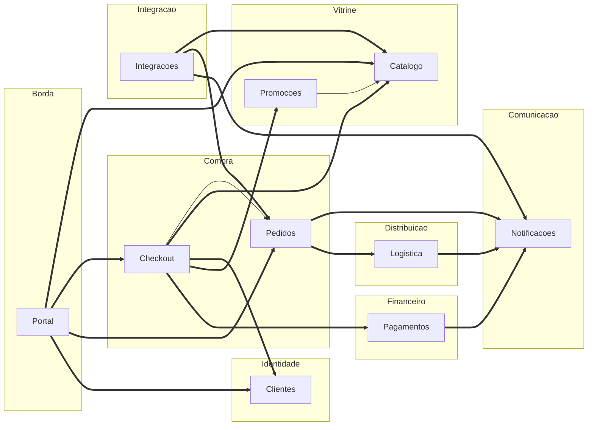

# Aula 12 — Reorganizar o grafo do Orion

## Objetivo e competências

Ao terminar esta aula, temos condições de:

- separar as arestas do grafo oficial em internas e inter-módulo usando o agrupamento de módulos de domínio da Aula 11;
- contar as arestas inter-módulo de um recorte e conferir a conta contra o total (`internas + inter-módulo = arestas do recorte`);
- reconhecer um ciclo entre módulos e dizer o que custaria removê-lo;
- reler um componente da *Zone of Uselessness* como problema de modularização, e não como categoria de métrica;
- montar a tabela de arestas inter-módulo de um recorte, com a fronteira que cada aresta exigiria.

## Dezessete arestas, e todas com o mesmo peso

A Aula 11 deixou oito módulos de domínio desenhados por cima do mapa do Orion. O grafo por baixo continua o de sempre — dez componentes, dezessete arestas, o mesmo que a Aula 7 mediu —, só que agora cada componente carrega um módulo declarado:

!!! tip "Lembrete — os oito módulos de domínio"

    | Módulo de domínio | Componentes |
    |---|---|
    | Borda | `Portal` |
    | Vitrine | `Catalogo`, `Promocoes` |
    | Compra | `Checkout`, `Pedidos` |
    | Financeiro | `Pagamentos` |
    | Distribuição | `Logistica` |
    | Comunicação | `Notificacoes` |
    | Identidade | `Clientes` |
    | Integração | `Integracoes` |

    Esse agrupamento é decisão da disciplina — existe para dar ao exercício de reorganização uma resposta verificável, não porque seja a única leitura defensável do domínio (a Aula 11 já registrou isso).

Na revisão do mapa, alguém faz a pergunta que esse agrupamento deixou em aberto: das dezessete dependências oficiais, quais ele tornou caras e quais ele tornou invisíveis? Sem os módulos, `Checkout --> Pagamentos` e `Checkout --> Pedidos` são a mesma coisa: duas setas. Com os módulos, a tabela acima diz que uma cruza de Compra para Financeiro e a outra não sai de Compra.

Alguém conta à mão, aresta por aresta, e chega a um número que parece um diagnóstico ruim: das dezessete arestas do grafo oficial, só duas ficam dentro de um módulo. As outras quinze atravessam fronteira. A reação imediata é achar que o agrupamento está errado — que um corte que deixa 15 de 17 dependências cruzando fronteira não pode ser um bom corte.

O diagrama abaixo é esse grafo oficial completo — as mesmas dez caixas e dezessete setas da Aula 7 —, com cada componente já dentro do módulo da tabela acima. Ele responde à pergunta que acabamos de fazer: quais das dezessete arestas ficam dentro de um módulo, e quais cruzam fronteira?



> **Convenção de leitura das setas**: `A --> B` significa que **A depende de B**. A seta fina (`-->`) é aresta interna, dentro de um módulo; a seta grossa (`==>`) é aresta inter-módulo — a distinção é de forma, não de cor. Contando: duas finas e quinze grossas, dezessete no total.
> **O que o diagrama omite**: a direção em que uma mudança de negócio se propaga pelo grafo, a frequência com que cada dependência muda, o volume de chamadas em produção e as classes dentro de cada componente.

Esta aula mostra que o número não é o agrupamento falhando. É a medição funcionando.

## O agrupamento que torna a conta possível

### Duas ficam em casa, quinze cruzam a fronteira

O agrupamento de módulos da Aula 11, recapitulado na caixa acima, é fixo pelo mesmo motivo já registrado ali. Aplicado ao grafo oficial, ele parte as dezessete arestas em dois grupos.

Ficam dentro de um módulo:

- `Checkout --> Pedidos` — os dois em Compra;
- `Promocoes --> Catalogo` — os dois em Vitrine.

As outras quinze ligam componentes de módulos diferentes. Podemos derivar a separação a partir da mesma lista de dependências da Aula 7, só acrescentando o mapa componente → módulo:

```python title="arestas_inter_modulo.py"
# As 17 arestas sao as do grafo oficial (Aula 7); nada novo aqui.
DEPENDENCIAS = [
    ("Portal", "Catalogo"), ("Portal", "Checkout"), ("Portal", "Pedidos"), ("Portal", "Clientes"),
    ("Checkout", "Catalogo"), ("Checkout", "Clientes"), ("Checkout", "Promocoes"),
    ("Checkout", "Pagamentos"), ("Checkout", "Pedidos"), ("Promocoes", "Catalogo"),
    ("Pedidos", "Notificacoes"), ("Pedidos", "Logistica"),
    ("Pagamentos", "Notificacoes"), ("Logistica", "Notificacoes"),
    ("Integracoes", "Catalogo"), ("Integracoes", "Pedidos"), ("Integracoes", "Notificacoes"),
]

MODULO = {
    "Portal": "Borda",
    "Catalogo": "Vitrine",      "Promocoes": "Vitrine",
    "Checkout": "Compra",       "Pedidos": "Compra",
    "Pagamentos": "Financeiro",
    "Logistica": "Distribuicao",
    "Notificacoes": "Comunicacao",
    "Clientes": "Identidade",
    "Integracoes": "Integracao",
}

internas = [(a, b) for a, b in DEPENDENCIAS if MODULO[a] == MODULO[b]]
inter = [(a, b) for a, b in DEPENDENCIAS if MODULO[a] != MODULO[b]]

assert len(internas) + len(inter) == len(DEPENDENCIAS) == 17
print(len(internas), len(inter))   # -> 2 15
```

O bloco é script de análise sobre o grafo oficial — não é código do Mini-Orion e não usa nomes dele. A conta que ele fecha, `2 + 15 = 17`, é a mesma verificação que a soma dos $C_a$ da Aula 7 já obedecia.

A técnica não depende de Python nem do `import-linter`: qualquer ferramenta que exporte um grafo de dependência — `pydeps` aqui, `madge` num projeto Node, o grafo de `Nx` num monorepo TypeScript, a saída de `ArchUnit` em Java — dá a mesma lista de arestas para colorir de interna ou inter-módulo. O que muda de projeto para projeto é quem gera a lista; a contagem que a divide em dois grupos é a mesma conta.

### Quinze de dezessete: o grafo mal é modular

Quinze arestas inter-módulo em dezessete é a informação central da aula, e precisa ser lida sem eufemismo: **o grafo atual do Orion mal é modular.** Quase toda dependência do sistema cruza uma fronteira de módulo. Uma aresta inter-módulo é o que se paga — é a dependência que, para virar fronteira de verdade, precisaria de uma API publicada, um contrato no `import-linter` e a disciplina de não alcançar o interior do outro módulo.

O ponto que costuma passar despercebido: esse 15 de 17 **não é o exercício mal montado**. O agrupamento não criou o problema; ele o tornou contável. Antes, "o Orion é pouco modular" era impressão. Agora é um número que fecha com o grafo, e um número que se acompanha: se uma reorganização baixar de quinze para dez arestas inter-módulo, isso é progresso mensurável; se subir, é regressão.

!!! warning "15 de 17 não é o agrupamento falhando"

    Um corte diferente — separar `Pedidos` de `Checkout`, juntar `Financeiro` e `Distribuição` num módulo de pós-venda — mudaria a contagem, e nenhum desses cortes estaria errado. O que não se admite é trocar de agrupamento a cada revisão só para o número ficar menor: contagens de agrupamentos diferentes não são comparáveis entre si. A base tem de ser fixa para a medição significar alguma coisa.

### Checkout aparece em cinco das quinze

Das quinze arestas inter-módulo, `Checkout` está em cinco: quatro saindo (`--> Catalogo`, `--> Clientes`, `--> Promocoes`, `--> Pagamentos`) e uma entrando (`Portal --> Checkout`). É o hub do grafo.

É o mesmo `Checkout` da Aula 7 com $D = 0{,}03$ — praticamente sobre a sequência principal, o melhor número da tabela depois do `Portal` — e o componente que mais causa incidente em produção. O contraexemplo do Módulo 1 reaparece com outra roupa: a métrica de distância não vê o caminho crítico, e o agrupamento em módulos também não vê o caminho crítico, mas vê o hub. Modularizar `Checkout` significa definir cinco contratos de fronteira ao mesmo tempo, e é por `Checkout` que passaria qualquer ciclo capaz de travar a extração do módulo Compra inteiro.

### Ciclo entre módulos trava a extração

A Aula 11 deixou a regra: extrair exige fronteira pronta. Um ciclo entre módulos é o caso em que a fronteira existe no desenho mas não separa nada — se o módulo A depende do B e o B depende do A, nenhum dos dois sai de dentro do processo sem o outro. A dependência mútua atravessa a fronteira nos dois sentidos, e a heurística da Aula 6 é direta: forma forte cruzando fronteira é dívida.

Sob o agrupamento de módulos da Aula 11, o grafo do Orion **não tem ciclo entre módulos** — as quinze arestas inter-módulo, contraídas ao nível de módulo, formam um grafo acíclico: Borda e Integração no topo, Comunicação no fim, ninguém apontando de volta. Essa é a única boa notícia da conta. O que trava a modularização do Orion hoje não é um ciclo; é o volume (quinze) e o hub (`Checkout` em cinco).

Um ciclo pode aparecer, no entanto, conforme o corte. O recorte legado da Aula 5 — quando `Checkout`, `Promocoes` e parte de `Pedidos` viviam num `CoreService` que tinha ciclo com `Promocoes` — é exatamente isso: um agrupamento em que a seta volta. Quebrá-lo custou dividir o `CoreService` em três e inverter uma direção de dependência por contrato. O Exercício 3 devolve essa situação num recorte pequeno.

### Integracoes de novo: quem ninguém importa não é fronteira

`Integracoes` foi construído há um ano para padronizar toda integração com parceiro. Foi projetado de forma altamente abstrata — cinco dos seis elementos são contrato, $A = 0{,}83$ — e nenhum time adotou: `Pagamentos` e `Logistica` continuaram falando direto com seus provedores. Hoje ele depende de três componentes ($C_e = 3$) e **ninguém depende dele** ($C_a = 0$). Na Aula 7 isso o pôs na *Zone of Uselessness*, com $D = 0{,}83$ — abstração paga e não consumida.

Relido como módulo, o diagnóstico fica mais concreto. O módulo Integração aporta três das quinze arestas inter-módulo: `Integracoes --> Catalogo`, `Integracoes --> Pedidos`, `Integracoes --> Notificacoes`. Uma fronteira de módulo existe para proteger quem está do outro lado — quem importa o módulo passa a depender de um contrato em vez da implementação. Um módulo que ninguém importa não protege ninguém. Aquelas três arestas são custo de fronteira sem o retorno da fronteira: três dependências a manter, zero módulos servidos. `Integracoes` não é uma fronteira mal desenhada; é peso morto que a reorganização precisa nomear como tal, e a decisão sobre ele não é "melhorar o contrato", é "dissolver ou dar consumidores".

## Decisão sobre o Orion: a tabela de arestas inter-módulo

O artefato desta aula é a tabela das quinze arestas inter-módulo do grafo oficial, cada uma com a fronteira que precisaria existir para a dependência deixar de ser custo solto. O formato é o da seção *Tabela de arestas inter-módulo* do [Orion Evolution Lab](../orion/index.md).

### 05-modular como referência: nenhum ciclo entre os módulos

O `code/mini-orion/05-modular/` é a versão resolvida em pequena escala. Três módulos de domínio — `compra`, `pagamentos`, `notificacoes` — mais o `nucleo` como *shared kernel*, e nenhum ciclo entre eles: o contrato `independence` garante que `pagamentos` e `notificacoes` não se conhecem, e o `forbidden` garante que nenhum dos dois olha para `compra`. Introduzir um ciclo ali exigiria quebrar `lint-imports`. A contagem de arestas inter-módulo desse checkpoint é pequena e acíclica; o grafo do Orion inteiro é o contraste — a mesma leitura, quinze vezes.

Não convém confundir as duas escalas. As duas arestas internas de que esta aula fala são as do grafo oficial do Orion (`Checkout --> Pedidos` e `Promocoes --> Catalogo`), as mesmas do diagrama no início desta aula. O `05-modular/` é um exemplo menor e separado; o que ele demonstra é a ausência de ciclo, não um número de arestas para somar ao do Orion.

A tabela abaixo detalha, aresta por aresta, o mesmo grafo que o diagrama do início já mostrou agrupado. Vale a ressalva feita ali: o diagrama e a tabela mostram estrutura, não prioridade. Frequência de mudança, volume de chamadas em produção e as classes dentro de cada componente pesam mais do que a contagem na hora de decidir qual fronteira introduzir primeiro — a estrutura é sintoma, não veredito, a mesma lição da Aula 7.

### As quinze arestas e a fronteira de cada uma

| Aresta | Fronteira (módulo → módulo) | O que a fronteira teria de impor |
|---|---|---|
| `Portal --> Catalogo` | Borda → Vitrine | API de leitura de vitrine; `Portal` não conhece o modelo interno de `Catalogo` |
| `Portal --> Checkout` | Borda → Compra | API de sessão de compra; `Portal` abre e acompanha, não orquestra |
| `Portal --> Pedidos` | Borda → Compra | API de consulta de pedido, somente leitura |
| `Portal --> Clientes` | Borda → Identidade | API de identificação e endereços; `Portal` exibe, não altera cadastro |
| `Checkout --> Catalogo` | Compra → Vitrine | mesma API de vitrine; conferência de preço e disponibilidade no fechamento |
| `Checkout --> Clientes` | Compra → Identidade | API de identidade; snapshot de endereço no momento da compra |
| `Checkout --> Promocoes` | Compra → Vitrine | API de desconto (Aula 11, Ex. 3); `Checkout` pede um desconto, não o calcula |
| `Checkout --> Pagamentos` | Compra → Financeiro | contrato `Gateway` do `05-modular`; `Checkout` pede cobrança, não escolhe provedor |
| `Pedidos --> Notificacoes` | Compra → Comunicação | contrato `Notificador` e evento de confirmação; `Pedidos` publica, não formata |
| `Pedidos --> Logistica` | Compra → Distribuição | API de despacho; `Pedidos` solicita envio, `Logistica` decide rota e parceiro |
| `Pagamentos --> Notificacoes` | Financeiro → Comunicação | mesmo contrato `Notificador`; aviso de cobrança e estorno como evento |
| `Logistica --> Notificacoes` | Distribuição → Comunicação | mesmo contrato `Notificador`; aviso de rastreio como evento |
| `Integracoes --> Catalogo` | Integração → Vitrine | nada a impor — módulo que ninguém importa; ver seção anterior |
| `Integracoes --> Pedidos` | Integração → Compra | idem |
| `Integracoes --> Notificacoes` | Integração → Comunicação | idem |

Cinco linhas envolvem `Checkout` (uma como destino, quatro como origem). Três têm `Integracoes` como origem — e são as únicas da tabela sem fronteira a justificar, porque não há do outro lado ninguém que a fronteira proteja. Das doze restantes, três convergem em `Comunicação` com o mesmo contrato (`Notificador`), o que sugere que a primeira fronteira a valer o esforço talvez seja a de `Notificacoes`: uma API, três dependentes vivos (`Pedidos`, `Pagamentos`, `Logistica`) atendidos por um contrato só. Contando também `Integracoes`, `Notificacoes` tem quatro dependentes ($C_a = 4$) — mas a quarta aresta é justamente a de peso morto, e não é ela que a fronteira precisa servir.

## Exercícios

1. **Interna ou inter-módulo?** Para cada uma das arestas abaixo, diga se ela fica dentro de um módulo ou atravessa fronteira, pelo agrupamento da Aula 11, e nomeie os módulos dos dois lados.

    a. `Promocoes --> Catalogo`
    b. `Checkout --> Pagamentos`
    c. `Checkout --> Pedidos`
    d. `Pedidos --> Notificacoes`

    ??? note "Resposta comentada"

        **a — interna.** `Promocoes` e `Catalogo` estão os dois em Vitrine. É uma das duas arestas internas do grafo.

        **b — inter-módulo.** `Checkout` (Compra) → `Pagamentos` (Financeiro).

        **c — interna.** `Checkout` e `Pedidos` estão os dois em Compra. É a outra aresta interna.

        **d — inter-módulo.** `Pedidos` (Compra) → `Notificacoes` (Comunicação).

2. **Conte e confira.** Considere o recorte `{Portal, Checkout, Catalogo, Promocoes}` com as arestas do grafo oficial que ligam esses quatro componentes. Liste as arestas do recorte, separe internas de inter-módulo pelo agrupamento da Aula 11, e confirme que `internas + inter-módulo` bate com o total de arestas do recorte.

    ??? note "Resposta comentada"

        Cinco arestas ligam os quatro componentes: `Portal --> Catalogo`, `Portal --> Checkout`, `Checkout --> Catalogo`, `Checkout --> Promocoes`, `Promocoes --> Catalogo`.

        Interna: só `Promocoes --> Catalogo` (Vitrine → Vitrine). As outras quatro atravessam fronteira: `Portal --> Catalogo` (Borda → Vitrine), `Portal --> Checkout` (Borda → Compra), `Checkout --> Catalogo` (Compra → Vitrine), `Checkout --> Promocoes` (Compra → Vitrine).

        Conta: `1 interna + 4 inter-módulo = 5 arestas`, igual ao total do recorte. É a mesma verificação que `2 + 15 = 17` faz no grafo inteiro.

3. **Ache o ciclo e precifique.** Um grupo propõe, para o recorte `{Portal, Checkout, Catalogo, Promocoes}`, este agrupamento: módulo `Entrada` = `{Portal, Catalogo}` ("é o que o cliente vê primeiro"), módulo `Fechamento` = `{Checkout, Promocoes}`. Contraia as arestas do recorte ao nível de módulo. Há ciclo entre `Entrada` e `Fechamento`? Se houver, diga o que custaria removê-lo.

    ??? note "Resposta comentada"

        Contraindo as cinco arestas: `Portal --> Catalogo` fica interna a `Entrada`; `Checkout --> Promocoes` fica interna a `Fechamento`; sobram `Portal --> Checkout` (`Entrada → Fechamento`), mais `Checkout --> Catalogo` e `Promocoes --> Catalogo` (as duas `Fechamento → Entrada`).

        `Entrada → Fechamento` e `Fechamento → Entrada`: há ciclo. Nenhum dos dois módulos se extrai sem o outro.

        Remover o ciclo custa uma de duas coisas. Ou se muda o agrupamento — tirar `Catalogo` de `Entrada` e pô-lo junto de `Promocoes` (que é o corte Vitrine da Aula 11), o que dissolve o módulo `Entrada` e o critério "o que o cliente vê primeiro". Ou se inverte `Portal --> Checkout`, fazendo `Checkout` publicar um evento que `Portal` lê — mudança maior do que o agrupamento vale. O ciclo apareceu porque o corte foi por papel de apresentação, não por assunto de negócio; é a mesma diferença de coesão que separa a Aula 10 da Aula 11.

4. **Julgue: o agrupamento de módulos da Aula 11 é bom?** Ele deixa 15 de 17 arestas atravessando fronteira e concentra cinco delas em `Checkout`. Um corte alternativo — separar `Pedidos` de `Checkout`, ou juntar `Financeiro`, `Distribuição` e `Comunicação` num módulo de pós-venda — produziria outra contagem.

    Mais de uma resposta é aceitável, e os dois lados têm defensores competentes. O que se avalia: se a sua resposta define o **critério** de "bom" que está usando — número de arestas inter-módulo? alinhamento de cada módulo a um time? tamanho da API pública que cada fronteira exigiria? número de módulos servidos por fronteira? —, aplica esse critério aos dois cortes e reconhece o que o corte que você não escolheu tem de defensável. Uma resposta que só diz "15 de 17 é ruim, logo o agrupamento é ruim" confunde a medição com o que ela mede: o número alto é do grafo, não do corte. Resposta sem critério nomeado não conta como resposta técnica.

## Atividade em grupo

Sobre o recorte do seu grupo no Orion Evolution Lab, partindo do mapa com os módulos de domínio já marcados (Aula 11):

1. Preencham a **tabela de arestas inter-módulo** do recorte, no formato da seção 2 do [Orion Evolution Lab](../orion/index.md): origem (módulo), destino (módulo) e a fronteira que cada aresta exigiria — a API ou o contrato, não a implementação.
2. Confiram a conta: `arestas internas + arestas inter-módulo = total de arestas do recorte`. Se não fechar, há erro de leitura antes de qualquer análise.
3. Verifiquem se há **ciclo entre módulos**. Se houver, nomeiem o ciclo e o custo de removê-lo — inverter uma dependência por contrato, mover um componente de módulo, ou fundir dois módulos. Ciclo não nomeado é pendência escondida.
4. **Obrigatório:** apontem a aresta inter-módulo do recorte que o grupo **não consegue justificar como fronteira** — aquela em que não dá para dizer que API o outro lado publicaria, ou em que um dos módulos não tem quem o importe. Digam o que isso revela: um módulo mal traçado, um componente no módulo errado, ou um componente que, como `Integracoes`, é peso morto e não fronteira.

O item 4 é o ponto da atividade. Todo agrupamento tem uma aresta que ele organiza no desenho mas não sustenta como fronteira real; achar qual é diz mais sobre o recorte do que a lista limpa das arestas que se justificam sozinhas.

## O que ficou medido e o próximo formato de monólito

A reorganização do grafo do Orion produziu três fatos, todos verificáveis contra o grafo oficial. Das dezessete arestas, quinze atravessam fronteira de módulo e duas ficam dentro — o sistema mal é modular, e agora isso é um número que se acompanha, não uma impressão. O agrupamento de módulos da Aula 11 é acíclico ao nível de módulo: nenhuma extração está travada por ciclo. E `Checkout` é o hub, presente em cinco das quinze arestas inter-módulo, enquanto `Integracoes` aporta três fronteiras que não protegem ninguém, porque nenhum módulo o importa.

Nada disso mudou o empacotamento. O Orion "modular" desta aula é o mesmo processo único das Aulas 9 a 11, com fronteiras que existem no diagrama e valeriam contratos de `import-linter` se fossem introduzidas. Camadas governam a direção da dependência; módulos de domínio governam o encapsulamento. Nenhum dos dois diz nada sobre um sistema cuja forma é uma sequência fixa — no Mini-Orion, `fechar_pedido` percorre sempre a mesma ordem: validar, montar, cobrar, emitir, notificar — nem sobre um sistema construído em torno de um núcleo estável com regras que entram e saem, como `Promocoes`, que recebe um tipo novo de desconto quase todo trimestre e obriga o deploy do sistema inteiro. Existe forma de monólito que responda a isso? É o que a Aula 13 examina.

## Leitura complementar

- Richards, Mark; Ford, Neal. *Fundamentals of Software Architecture*. Cap. 3 — Modularity (métricas de acoplamento entre módulos; connascência na fronteira); Cap. 8 — Component-Based Thinking (particionar por domínio e o efeito no acoplamento).
- Martin, Robert C. *Clean Architecture*. Cap. 14 — Component Cohesion; Cap. 15 — Component Coupling (o princípio das dependências acíclicas).

## Referências

- RICHARDS, Mark; FORD, Neal. *Fundamentals of Software Architecture: An Engineering Approach*. O'Reilly, 2020.
- MARTIN, Robert C. *Clean Architecture: A Craftsman's Guide to Software Structure and Design*. Prentice Hall, 2017.
