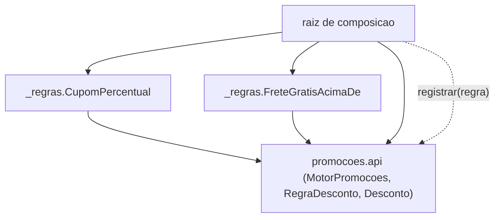

# Aula 13 — Pipeline e microkernel: monólitos com forma

## Objetivo e competências

Esta aula desenvolve a capacidade de:

- reconhecer, pela forma do domínio, quando um fluxo é uma transformação em etapas e o pipeline é a forma adequada;
- distinguir composição de plugins (microkernel) de encadeamento de filtros (pipeline), mesmo quando as duas têm uma ordem;
- ler o contrato `RegraDesconto` e o `MotorPromocoes` do checkpoint `06-microkernel` e dizer o que o `import-linter` proíbe e por quê;
- escrever a assinatura de um plugin de regra de desconto que o `MotorPromocoes` aceita sem alteração no núcleo;
- redigir um ADR que nomeia o custo do microkernel — contrato de plugin, teste de composição, plugin mal-comportado —, e não só o ganho;
- justificar o uso de pipeline pela forma do domínio, e não por estética.

## Uma sequência que não muda e uma regra que muda toda hora

A Aula 12 fechou com dois fatos sobre o Mini-Orion que as fronteiras de módulo não explicam.

O primeiro: `fechar_pedido`, no módulo `compra`, percorre a mesma ordem em toda execução — validar o carrinho, montar o pedido, cobrar, emitir, notificar. Não há ramo que pule uma etapa nem caminho que as reordene; o método *é* essa sequência.

O segundo: `Promocoes` — responsável em `05-domain.md` por "cupons, campanhas, regras de desconto" — recebe um tipo novo de regra quase todo trimestre. Cupom percentual, frete grátis acima de um piso, leve três pague dois, cashback para cliente recorrente: cada um entra no corpo do componente, e cada um obriga um deploy do sistema inteiro para uma mudança que não toca `Checkout`, `Pedidos` nem `Pagamentos`.

Camadas governam a direção da dependência. Módulos de domínio governam o encapsulamento. Nenhum dos dois diz nada sobre um componente cuja forma é uma sequência fixa, nem sobre um componente que é um miolo estável com regras entrando e saindo. Esta aula trata das duas formas — e do preço de cada uma.

## Quando a forma do domínio é uma transformação

### Filtros e um fluxo de mão única

Uma **arquitetura em pipeline** organiza o sistema como uma sequência de **filtros**: cada filtro recebe um dado, aplica uma transformação e entrega o resultado ao filtro seguinte. O fluxo é unidirecional — um filtro não chama o anterior nem conhece o próximo; ele conhece só o formato do que entra e o do que sai. A ordem dos filtros é a arquitetura: trocar dois de lugar muda o resultado, porque cada filtro assume a pós-condição do anterior.

O pipeline serve quando o domínio *é* uma transformação em etapas — quando descrever o que o sistema faz já produz a lista de filtros. `fechar_pedido` tem esse formato: validar produz um carrinho conferido; montar produz um pedido a partir dele; cobrar produz um pedido pago; emitir produz um pedido registrado; notificar produz o aviso. São cinco etapas, cada uma consumindo o resultado da anterior e nada além disso.

### Onde o pipeline paga e onde atrapalha

O pipeline paga quando a sequência é real e estável: a forma do código espelha a forma do domínio, cada filtro se testa com uma entrada e uma saída, e inserir uma etapa nova — um filtro de antifraude entre cobrar e emitir — é acrescentar um elo, não reabrir o fluxo.

Ele atrapalha quando o fluxo tem muitos ramos condicionais. Se metade das execuções pula etapas ou muda a ordem conforme o caso, a sequência deixa de descrever o domínio e o pipeline vira uma camada de indireção sobre um `if`. E a ordem, que é a força do pipeline, é também connascência de execução (Aula 11): forte, dinâmica, e agora distribuída pelos filtros em vez de selada num método. O ganho é a etapa isolável; o custo é que a corretude depende de uma ordem que o tipo não verifica.

## Quando a variação é conhecida e recorrente

### Núcleo estável, plugins removíveis

Uma **arquitetura em microkernel** separa o sistema em duas partes: um **núcleo** que muda pouco e um conjunto de **plugins** que entram e saem. O núcleo sabe fazer três coisas — definir o contrato que um plugin precisa satisfazer, registrar plugins e compor o resultado dos plugins registrados. Não conhece nenhum plugin concreto.

A forma serve quando a variação é **conhecida e recorrente**: sabe-se de antemão a dimensão em que o sistema vai variar — aqui, o tipo de regra de desconto — e essa variação chega em ritmo previsível. `Promocoes` é o caso. A parte que varia (`05-domain.md`: "regras de desconto") é identificável e separável do resto do componente, que é estável.

### O contrato que o núcleo enxerga

No checkpoint `06-microkernel`, o núcleo de `Promocoes` é `promocoes.api`. Ele define `RegraDesconto`, um `Protocol` com um método — `avalia(carrinho)` devolve um `Desconto` ou `None` — e `MotorPromocoes`, que guarda uma lista de regras, aceita novas por `registrar` e as compõe em `aplicar`. Um plugin é qualquer objeto com o método `avalia`; não há classe base para herdar, só o formato.

Os plugins concretos vivem em `promocoes._regras` e importam `promocoes.api` para falar `Desconto` — o sentido `_regras -> api` é permitido e esperado. O inverso, `api -> _regras`, é o que quebraria a forma: o núcleo passaria a conhecer o que ele existe para não conhecer.

### ⚖️ O trade-off do microkernel

| Alternativa | O que resolve | O que custa | Quando não vale |
|---|---|---|---|
| Regras no corpo de `Promocoes`, com `if`/`match` por tipo | zero indireção; um arquivo; o time já lê assim | cada tipo novo arrasta o deploy do componente inteiro; o corpo cresce sem teto | quando os tipos são poucos e entram raramente |
| Microkernel: núcleo mais plugins registrados | tipo novo é arquivo novo e uma linha de `registrar`; o núcleo não muda | contrato de plugin a versionar; teste de composição por regra nova; plugin que lança exceção derruba `aplicar` | quando não há variação recorrente e conhecida a isolar |
| Extrair `Promocoes` para um serviço próprio | cadência de release e janela de manutenção independentes | rede, falha parcial, observabilidade distribuída (Módulo 3) | quando nenhum sinal operacional pede deploy separado |

O item que costuma passar despercebido é o terceiro custo da linha do meio. `aplicar` chama `regra.avalia` sem isolar a chamada: um plugin que levanta exceção interrompe a composição, e as regras bem-comportadas registradas depois dele não rodam. Um `match` no corpo do componente teria o mesmo risco — mas ali o conjunto de ramos é fechado e revisado junto; aqui, qualquer plugin registrado na raiz de composição entra no caminho. O microkernel troca "mudar o núcleo a cada regra" por "confiar em cada plugin registrado".

## Forma de monólito, não saída dele

Pipeline e microkernel organizam um monólito, no mesmo sentido que camadas e módulos de domínio: mudam a estrutura interna, não o empacotamento. O checkpoint `06-microkernel` continua um único *deployable*. `MotorPromocoes`, seus plugins e o resto do Mini-Orion vivem no mesmo pacote e sobem juntos — `promocoes` roda isolado neste checkpoint, sem ligação com o `fechar_pedido` do módulo `compra`, mas no mesmo processo.

O deploy isolado que o microkernel entrega é isolado *dentro do processo*: adicionar `LeveTresPagueDois` não recompila nem retesta o núcleo, e ainda assim entra no mesmo release que tudo o mais. Chamar isso de "cadência de release independente" seria vender o que a forma não compra — a distinção que a Aula 11 fez entre fronteira lógica e física vale aqui igual.

## Decisão sobre o Orion: o checkout ilustrado e o motor de promoções real

Esta aula produz dois artefatos e um registro. O primeiro artefato é um esboço — o `Checkout` desenhado como pipeline, para fixar a forma. O segundo é o recorte do checkpoint `06-microkernel`, onde `Promocoes` já é um microkernel de verdade, com contrato no `import-linter` e testes. O registro é o ADR que escolhe essa forma e nomeia o que ela cobra.

### O checkout como pipeline: um esboço ilustrativo

O bloco abaixo é **ilustrativo** — nomes genéricos, não os do Mini-Orion, e não roda isolado. Ele existe para mostrar uma coisa: num pipeline, cada filtro conhece só a `Encomenda` que entra e a que sai, e a ordem da lista é a arquitetura.

```python title="pipeline_checkout.py — esboco ilustrativo, fora do Mini-Orion"
from typing import Protocol

class Etapa(Protocol):
    def processa(self, encomenda: "Encomenda") -> "Encomenda": ...

class FiltroValidacao:
    def processa(self, encomenda: "Encomenda") -> "Encomenda":
        return encomenda.com(validada=bool(encomenda.itens))

class FiltroMontagem:
    def processa(self, encomenda: "Encomenda") -> "Encomenda":
        return encomenda.com(numero="PED-1")

class FiltroCobranca:
    # Cada filtro conhece so a encomenda que entra e a que sai.
    def processa(self, encomenda: "Encomenda") -> "Encomenda":
        return encomenda.com(paga=encomenda.validada)

def executa(etapas: list[Etapa], encomenda: "Encomenda") -> "Encomenda":
    for etapa in etapas:
        encomenda = etapa.processa(encomenda)
    return encomenda
```

`Encomenda` é um agregado simples de itens, número e marcadores de progresso; o foco é a cadeia. Trocar `FiltroValidacao` e `FiltroMontagem` de lugar não é um detalhe: `FiltroMontagem` passaria a rodar sobre uma encomenda ainda não conferida. O `Checkout` real do Mini-Orion não usa essa estrutura — `fechar_pedido` é a sequência escrita à mão dentro de um método. O esboço mostra a forma que `fechar_pedido` teria se a sequência fosse dado, e não código.

### O recorte de 06-microkernel: o núcleo e um plugin

No checkpoint, `promocoes.api` é o núcleo. O contrato e o motor, no mesmo arquivo (recorte com linhas em branco reduzidas):

```python title="code/mini-orion/06-microkernel/mini_orion/promocoes/api.py (recorte)"
from dataclasses import dataclass
from typing import Protocol
from mini_orion.nucleo.modelos import Carrinho

@dataclass(frozen=True)
class Desconto:
    origem: str
    valor: float

class RegraDesconto(Protocol):
    # Um plugin e qualquer objeto com este metodo; sem classe base para herdar.
    def avalia(self, carrinho: Carrinho) -> Desconto | None: ...

class MotorPromocoes:
    def __init__(self) -> None:
        self._regras: list[RegraDesconto] = []

    def registrar(self, regra: RegraDesconto) -> None:
        # Unica porta de entrada de plugins; sem descoberta automatica.
        self._regras.append(regra)

    def aplicar(self, carrinho: Carrinho) -> list[Desconto]:
        resultados = (regra.avalia(carrinho) for regra in self._regras)
        return [desconto for desconto in resultados if desconto is not None]
```

`aplicar` não soma os descontos nem decide prioridade: devolve a lista, e compor o efeito final é de quem chama. Um plugin concreto — o cupom percentual:

```python title="code/mini-orion/06-microkernel/mini_orion/promocoes/_regras/cupom_percentual.py (recorte)"
from dataclasses import dataclass

from mini_orion.nucleo.modelos import Carrinho
from mini_orion.promocoes.api import Desconto   # sentido permitido: _regras -> api


@dataclass
class CupomPercentual:
    fracao: float

    def avalia(self, carrinho: Carrinho) -> Desconto | None:
        if self.fracao <= 0:
            return None
        return Desconto(origem="cupom_percentual", valor=carrinho.total * self.fracao)
```

O plugin importa `promocoes.api` para falar `Desconto`. O sentido inverso é proibido por contrato:

```ini title="code/mini-orion/06-microkernel/setup.cfg (recorte)"
[importlinter:contract:nucleo-nao-conhece-plugins]
name = O nucleo de promocoes nao importa regras concretas
type = forbidden
source_modules =
    mini_orion.promocoes.api
forbidden_modules =
    mini_orion.promocoes._regras
```

`type = forbidden`, com `promocoes.api` como origem e `promocoes._regras` como alvo: o núcleo não pode importar as regras concretas. É o quarto contrato do `setup.cfg` — os outros três são os da fronteira de módulos da Aula 11 — e `lint-imports` fecha em `4 kept, 0 broken`. Dois testes exercitam a composição:

```python title="code/mini-orion/06-microkernel/tests/test_microkernel.py (recorte)"
def test_composicao_de_dois_plugins() -> None:
    motor = MotorPromocoes()
    motor.registrar(CupomPercentual(0.10))
    motor.registrar(FreteGratisAcimaDe(150.0))
    descontos = motor.aplicar(_carrinho())
    assert len(descontos) == 2


def test_motor_funciona_sem_nenhum_plugin() -> None:
    assert MotorPromocoes().aplicar(_carrinho()) == []
```

O primeiro registra dois plugins e confere que `aplicar` devolve dois descontos — a composição funciona sem que o motor saiba que `CupomPercentual` ou `FreteGratisAcimaDe` existem. O segundo confere que um `MotorPromocoes` sem plugin nenhum devolve `[]` — o núcleo é exercível sozinho. Um terceiro teste lê `api.py` com `ast` e falha se aparecer um `import` de `_regras`: a regra do contrato vira também teste de `pytest`, para quem não instalou o `import-linter`. São 3 testes no arquivo, 17 no checkpoint.

### O diagrama: como uma regra entra num núcleo que não a importa

Pergunta que o diagrama responde: se `promocoes.api` não importa `promocoes._regras`, por que caminho uma regra chega ao `MotorPromocoes`?



Leitura das setas cheias: `A --> B` significa que A depende de B. Toda seta cheia aponta para `promocoes.api` e nenhuma sai dele — o núcleo está no fundo do grafo de dependências. A seta pontilhada `registrar(regra)` é fluxo em tempo de composição, não dependência: a raiz injeta cada plugin no motor chamando `registrar`.

Três coisas o diagrama não representa: a ordem em que `aplicar` compõe os descontos (é a ordem das chamadas a `registrar`); o que cada regra decide por dentro — o `if self.fracao <= 0` do cupom, o piso do frete grátis; e o fato de `promocoes` rodar isolado neste checkpoint, sem ligação com o `fechar_pedido` do módulo `compra`.

### 📐 ADR — regra de desconto como plugin de Promocoes

| Campo | Conteúdo |
|---|---|
| **Identificador** | ADR — regra de desconto como plugin de `Promocoes` |
| **Status** | Aceita para o checkpoint `06-microkernel` |
| **Contexto** | `Promocoes` recebe um tipo novo de regra de desconto quase todo trimestre. Hoje cada tipo entra no corpo do componente e obriga o deploy do sistema inteiro, para uma mudança que não toca `Checkout`, `Pedidos` nem `Pagamentos`. A responsabilidade de `Promocoes` em `05-domain.md` — "cupons, campanhas, regras de desconto" — é justamente a parte que varia; o resto do componente é estável. |
| **Decisão** | Tratar `Promocoes` como microkernel. O núcleo (`promocoes.api`) define o contrato `RegraDesconto` — `avalia(carrinho)` devolve um `Desconto` ou `None` — e o `MotorPromocoes`, que compõe regras registradas por `registrar`. Cada regra concreta é um plugin em `promocoes._regras` que importa o núcleo para falar `Desconto`. O contrato `nucleo-nao-conhece-plugins` do `import-linter` proíbe o sentido `promocoes.api -> promocoes._regras`. |
| **Alternativas** | (a) Manter as regras no corpo de `Promocoes`, com um `if`/`match` por tipo: menos indireção, um arquivo, e o time já conhece; some quando o número de tipos cresce e cada mudança arrasta o deploy do componente todo. (b) Extrair `Promocoes` para um serviço com deploy independente: resolve a cadência de release de verdade, mas cobra rede, falha parcial e observabilidade distribuída (Módulo 3), sem sinal medido que peça isso hoje. |
| **Consequências positivas** | Um tipo novo de regra é um arquivo em `_regras` e uma linha de `registrar` na raiz de composição; o núcleo não muda e não é retestado. O contrato do linter documenta e verifica a direção núcleo↛plugin. `MotorPromocoes` sem plugin nenhum devolve `[]` — o núcleo é exercível sozinho. |
| **Consequências negativas** | Passa a existir um contrato de plugin — `RegraDesconto` mais o formato de `Desconto` — que precisa ser mantido e versionado: alterá-lo toca todos os plugins de uma vez. Cada regra nova pede um teste de composição — o `test_composicao_de_dois_plugins` cresce, não some. E `aplicar` chama `regra.avalia` sem isolamento: um plugin que levanta exceção derruba a aplicação de desconto, inclusive as regras que se comportam. O ganho de deploy é interno ao processo, não cadência de release independente. |
| **Reversão** | Baixa enquanto há poucos plugins: reincorporar as regras ao corpo de `Promocoes`, remover `registrar`/`aplicar` e o contrato do `setup.cfg`. Fica cara depois que outro componente passar a registrar plugins ou a depender do formato de `Desconto`. |

O campo que sustenta este ADR é o das consequências negativas. Um microkernel descrito só pelo ganho — "regra nova sem tocar no núcleo" — é anúncio. O contrato de plugin a versionar, o teste de composição que cresce a cada regra e o plugin que derruba `aplicar` são o preço, e são observáveis: dá para contar quantas vezes o contrato mudou e quantas vezes um plugin quebrou a composição.

## Exercícios

1. **Pipeline se aplica?** Para cada ponto do Orion, diga se a arquitetura em pipeline descreve a forma do domínio, e por quê.

    a. `fechar_pedido` no módulo `compra`: validar, montar, cobrar, emitir, notificar.
    b. `Catalogo` respondendo a uma busca de produto por texto.
    c. `MotorPromocoes.aplicar` compondo as regras registradas.

    ??? note "Resposta comentada"

        **a — pipeline descreve a forma.** Cada etapa consome o resultado da anterior e nada além disso; o fluxo é de mão única, sem ramo que reordene. Descrever o caso de uso já produz a lista de filtros.

        **b — pipeline não descreve.** Uma busca é requisição e resposta: não há sequência de transformações em que uma etapa dependa da saída da anterior. Modelar como pipeline acrescenta maquinário sem forma correspondente no domínio.

        **c — pipeline não descreve, apesar da ordem.** `aplicar` compõe regras que veem todas o mesmo `carrinho`, não a saída da regra anterior. É composição fan-out (microkernel), não uma cadeia. Se fosse pipeline, `FreteGratisAcimaDe` avaliaria o carrinho já modificado por `CupomPercentual`.

2. **Reordene e diga o efeito.** Um pipeline ilustrativo roda com a lista `[FiltroValidacao, FiltroMontagem, FiltroCobranca]`, onde `FiltroCobranca` só cobra se `encomenda.validada` for verdadeira.

    a. O que acontece se `FiltroValidacao` e `FiltroMontagem` trocam de posição?
    b. O que acontece se `FiltroValidacao` é removido da lista?

    ??? note "Resposta comentada"

        **a —** `FiltroMontagem` passa a atribuir `numero` a uma encomenda ainda não conferida. `FiltroCobranca` lê `validada` no valor default e não cobra, mas a encomenda já saiu com número: estado inconsistente. A ordem, num pipeline, é connascência de execução (Aula 11) — forte e não verificada pelo tipo.

        **b —** sem o filtro que preenche `validada`, o campo fica no default e `FiltroCobranca` não cobra em nenhuma execução. Remover um filtro não é uma mudança local: os filtros seguintes assumem a pós-condição do que foi tirado.

3. **Escreva a assinatura do plugin.** `Promocoes` vai ganhar a regra "leve três pague dois". Escreva a assinatura da classe do plugin — os campos e o método que o `MotorPromocoes` precisa —, sem implementar o cálculo. Diga também o que muda em `promocoes.api` e no `setup.cfg`.

    ??? note "Resposta comentada"

        ```python
        from dataclasses import dataclass

        from mini_orion.nucleo.modelos import Carrinho
        from mini_orion.promocoes.api import Desconto


        @dataclass
        class LeveTresPagueDois:
            sku_alvo: str

            def avalia(self, carrinho: Carrinho) -> Desconto | None: ...
        ```

        O plugin satisfaz `RegraDesconto` por estrutura — tem `avalia(carrinho) -> Desconto | None` — sem herdar nada. Nada muda em `promocoes.api`: o núcleo não conhece a regra. Nada muda no `setup.cfg`: o `import` é `_regras -> api`, o sentido permitido, e o contrato segue verde. O que muda é a raiz de composição, que ganha `motor.registrar(LeveTresPagueDois("TEC-01"))`, e o `test_composicao_*`, que ganha um caso — o custo nomeado no ADR.

4. **Julgue: `Promocoes` como microkernel vale o custo?** O ADR troca "deploy do sistema a cada regra" por um contrato de plugin, um teste de composição por regra nova e o risco de um plugin derrubar `aplicar`.

    Mais de uma resposta é aceitável, e os dois lados têm defensores competentes. O que se avalia: se a sua resposta nomeia o **critério** que decide — número de tipos de regra por trimestre? esforço de manter o contrato? risco operacional de um plugin mal-comportado? prazo de entrega de uma regra? —, aplica esse critério, e reconhece o que a posição oposta tem de defensável (manter o `if`/`match` no corpo do componente enquanto os tipos forem poucos). Diga também o que você observaria em seis meses para saber se a escolha envelheceu bem: por exemplo, quantos tipos novos entraram sem tocar `api.py`, ou se algum plugin já interrompeu a composição de um jeito que um `match` revisado não interromperia. Resposta sem critério nomeado não conta como resposta técnica.

## Atividade em grupo

Sobre o recorte do seu grupo no Orion Evolution Lab:

1. Encontrem no recorte um ponto cuja forma seja **uma transformação em etapas de mão única** (candidato a pipeline) **ou** **um núcleo estável com variação recorrente e conhecida entrando e saindo** (candidato a microkernel). Justifiquem pela forma do domínio, não por estética — se não der para descrever a forma sem citar a arquitetura, o candidato é fraco.
2. Para o candidato a pipeline: listem as etapas, a pós-condição de cada uma e a connascência de execução que a ordem cria. Para o candidato a microkernel: nomeiem o núcleo, o contrato do plugin e quem chamaria o `registrar`.
3. **Obrigatório:** nomeiem o custo que a forma escolhida cobra, em dimensão concreta — contrato de plugin a versionar, teste de composição por regra nova, plugin mal-comportado que derruba o núcleo, ou ordem de filtros que vira connascência forte não verificada. Proposta que só lista o ganho está incompleta.
4. Digam o que continua sendo um processo só depois da mudança. Pipeline e microkernel não distribuem nada; se o grupo espera cadência de release ou isolamento de falha, a forma escolhida não entrega isso.

O item 3 é o ponto da atividade. Toda forma tem um preço estrutural, e reconhecê-lo antes de propor a mudança é o que separa uma decisão de um anúncio.

## O que ficou registrado e o limite das duas formas

Esta aula acrescentou duas formas de monólito às da Aula 12. Pipeline é a forma de um domínio que *é* uma transformação em etapas — filtros, fluxo de mão única, ordem como arquitetura. Microkernel é a forma de um componente com um miolo estável e variação conhecida e recorrente — núcleo, contrato de plugin, composição. O ADR escolheu microkernel para `Promocoes` e nomeou o preço: um contrato a versionar, um teste de composição por regra, e um plugin que pode derrubar `aplicar`.

Nenhuma das duas mudou o empacotamento. O `06-microkernel` roda como um processo, com `pytest` e `lint-imports` verdes — 17 testes, 4 contratos mantidos. Camadas, módulos, pipeline e microkernel são formas *dentro* do monólito.

Adiar a distribuição é de graça enquanto todas as partes do Orion toleram o mesmo ritmo operacional: um deploy, uma janela de manutenção, uma escala. A Aula 14 parte do primeiro ponto do Orion em que uma parte deixa de tolerar — quando o custo de continuar junto passa a pesar mais que o custo da rede.

## Leitura complementar

- Richards, Mark; Ford, Neal. *Fundamentals of Software Architecture*. Cap. 12 — Pipeline Architecture Style (filtros, tipos de filtro, fluxo unidirecional); Cap. 13 — Microkernel Architecture Style (core system e plug-in components; contrato e registro de plugin).

## Referências

- RICHARDS, Mark; FORD, Neal. *Fundamentals of Software Architecture: An Engineering Approach*. O'Reilly, 2020.
