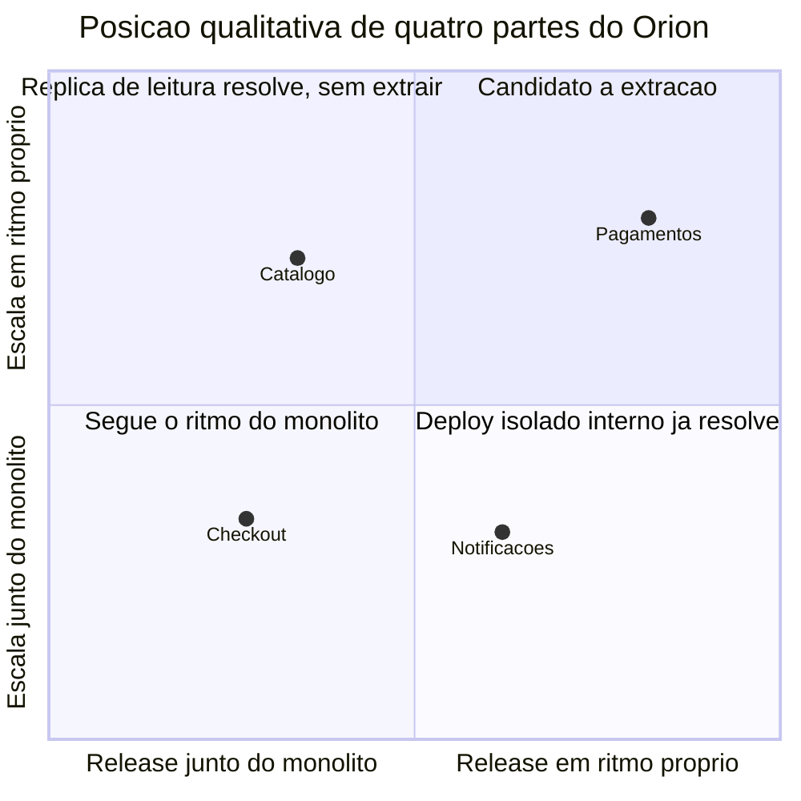

# Aula 14 — Quando o monólito deixa de servir

## Objetivo e competências

Ao fechar esta aula, conseguimos:

- separar um sinal legítimo de extração — escala própria, cadência de release própria, isolamento de falha, autonomia de time — de um sinal que não sustenta a decisão: moda, estética, "monólito é feio";
- usar os contratos de um checkpoint modular como evidência de que a fronteira lógica de um módulo já está pronta para virar fronteira física;
- nomear o que a extração cobra — a transação local que passa a ser distribuída, o deploy único que vira dois deploys coordenados, o teste que rodava sem rede e passa a precisar de uma;
- redigir um ADR de candidato a extração com gatilho mensurável e condição de falseamento;
- dizer, para um módulo dado, o que ainda não justifica extraí-lo.

## A conciliação que pede outro relógio

A Aula 13 fechou com uma condição: adiar a distribuição é de graça enquanto todas as partes do Orion toleram o mesmo ritmo operacional — um deploy, uma janela de manutenção, uma escala. Esta aula parte do primeiro ponto em que essa condição deixa de valer.

`Pagamentos` responde, em `05-domain.md`, por "cobrança, estorno, conciliação com provedores". A cobrança acontece no fluxo síncrono do fechamento de compra, junto com o checkout. A conciliação, não: ela cruza o que o Orion registrou com o que cada provedor reporta, e em campanha esse volume acumula depressa. O time de conciliação precisa reprocessar em lote, num ritmo que ele controla, e derrubar temporariamente o processamento para ajustar uma regra de casamento de transação — uma janela de manutenção que não pode cair no horário de pico do checkout.

Hoje `Pagamentos` sobe e desce junto com o checkout. Não há como dar à conciliação uma janela própria sem parar o fechamento de compra, nem como reprocessar um lote grande sem disputar recurso com o tráfego interativo. É o primeiro caso no Orion em que uma parte tem um requisito operacional genuinamente diferente do resto — não "mais carga", que todo o sistema tem em campanha, mas *outro ritmo*.

O Módulo 1 mediu `Pagamentos` com $C_a = 1$ e $C_e = 1$: um dos menores acoplamentos do grafo de dez componentes. Isso torna a extração *possível*. Não é o que a *justifica* — acoplamento baixo é pré-condição, não motivo.

## Ler o sinal antes de mexer na fronteira

### Quatro sinais que pesam a favor

Um módulo é candidato legítimo a virar processo próprio quando aparece ao menos um destes, medido e não suposto:

- **escala própria** — a carga do módulo cresce por uma causa que não é a do resto do sistema. A conciliação de `Pagamentos` em campanha é isso; o volume de `Notificacoes`, que cresce na mesma proporção dos pedidos, não é.
- **cadência de release própria** — o módulo precisa entregar correções num ritmo que o deploy compartilhado atrasa. Um contrato novo com provedor de pagamento sai quando o provedor manda, não quando o trem de release do Orion passa.
- **isolamento de falha** — uma falha no módulo precisa parar de derrubar os outros. Hoje um erro em `Pagamentos` que trave o processo leva o checkout junto.
- **autonomia de time** — um time dono do módulo precisa decidir sozinho sobre stack, schema e deploy, e a fronteira compartilhada obriga coordenação a cada mudança.

Nenhum dos quatro é sobre o código ser feio. Todos são sobre o módulo e o resto do sistema terem passado a viver em relógios diferentes.

### Três que não sustentam a decisão

- **moda** — as arquiteturas de referência do ano são distribuídas. Isso descreve o circuito de conferência, não o Orion.
- **estética** — "o monólito é grande e desconfortável de ler". Um monólito modular se lê pela API de cada módulo; se não se lê, o problema é fronteira interna, e a Aula 11 já tratou disso sem rede.
- **"monólito não escala"** — a frase que abriu a Aula 9. Sem um componente apontado e uma carga descrita, ela não aponta para lugar nenhum.

!!! question "Pausa"

    A diretoria pediu, na Aula 9, um plano de migração para microsserviços. O sintoma desta aula — a conciliação precisando de outro ritmo — atende ao pedido da diretoria, ou é outra coisa que por acaso caminha na mesma direção?

### Não se extrai o que não tem fronteira

A Aula 11 deixou `05-modular/` com três módulos, cada um com `api.py` público e *internals* marcados com `_`. O módulo `pagamentos` tem a API que os outros enxergam:

```python title="code/mini-orion/05-modular/mini_orion/pagamentos/api.py (recorte)"
class ResultadoCobranca(Enum):
    APROVADA = "aprovada"
    RECUSADA_PELO_EMISSOR = "recusada_pelo_emissor"
    ACIMA_DO_LIMITE = "acima_do_limite"
    PROVEDOR_INDISPONIVEL = "provedor_indisponivel"


@dataclass(frozen=True)
class PedidoCobranca:
    valor: float
    cartao: str
    parcelas: int = 1


class Gateway(Protocol):
    def cobrar(self, pedido: PedidoCobranca) -> ResultadoCobranca: ...
```

Os provedores concretos vivem em `pagamentos._provedores` e ninguém de fora os importa. Três contratos do `setup.cfg` prendem isso:

```ini title="code/mini-orion/05-modular/setup.cfg (recorte)"
[importlinter:contract:pagamentos-e-notificacoes-independentes]
type = independence
modules =
    mini_orion.pagamentos
    mini_orion.notificacoes

[importlinter:contract:downstream-nao-importa-compra]
type = forbidden
source_modules =
    mini_orion.pagamentos
    mini_orion.notificacoes
forbidden_modules =
    mini_orion.compra

[importlinter:contract:sem-reach-in-nos-internals]
type = forbidden
source_modules =
    mini_orion.compra
forbidden_modules =
    mini_orion.pagamentos._provedores
    mini_orion.notificacoes._fila
```

`pagamentos` não conhece `compra` nem `notificacoes`; `compra` fala com `pagamentos.api` e não alcança `pagamentos._provedores`. E há um teste que exercita o módulo sem instanciar nenhum outro:

```python title="code/mini-orion/05-modular/tests/test_isolamento.py (recorte)"
def test_pagamentos_isolado() -> None:
    resultado = GatewayPagamentoX().cobrar(
        PedidoCobranca(valor=100.0, cartao="4111111111")
    )
    assert resultado is ResultadoCobranca.APROVADA
```

Esse conjunto — API pública, *internals* fechados, contrato que falha na CI se alguém violar, teste que roda isolado — é a fronteira lógica pronta. Um componente *big ball of mud*, em que qualquer parte alcança qualquer outra, não tem nada disso: extraí-lo é primeiro construir a fronteira, sob pressão, com o cabo de rede já comprado. `pagamentos` está do lado bom dessa linha; é por isso que ele, e não outro módulo, entra no ADR desta aula.

### O que a extração cobra

Passar `pagamentos` para um processo próprio, atrás da rede, muda três coisas concretas — todas hoje de graça no checkpoint:

- **a transação local vira distribuída.** No `fechar_pedido` de `compra`, cobrar e emitir o pedido acontecem no mesmo processo: ou os dois ocorrem, ou nenhum, sem trabalho extra. Com `pagamentos` fora, cobrar é uma chamada de rede e emitir é local — não há commit único, e passa a existir o caso de a cobrança ter acontecido e a emissão não.
- **um deploy vira dois deploys coordenados.** Hoje `compra` e `pagamentos` sobem no mesmo artefato; uma mudança no formato de `PedidoCobranca` ou de `ResultadoCobranca` entra atômica. Separados, os dois lados versionam o contrato e coordenam a ordem de subida — o campo novo primeiro no consumidor ou no produtor.
- **o teste que rodava sem rede passa a precisar de uma.** `test_pagamentos_isolado` hoje instancia uma classe e chama um método. Com `pagamentos` remoto, o teste equivalente do lado de `compra` sobe o serviço e fala com ele pela rede, ou usa um dublê que imita a resposta — e um dublê que diverge do serviço real é uma fonte de erro nova.

!!! warning "Distribuir troca a classe de falha, não a remove"

    Com `pagamentos` isolado, um bug que trave o módulo para de derrubar o checkout — o isolamento de falha é real. Em troca, `pagamentos` indisponível deixa de ser uma exceção que o Python levanta na hora e vira timeout, repetição e estado ambíguo do lado de `compra`. A Aula 9 já nomeou esses cinco custos; o Módulo 3 os mede.

### O gatilho do ADR-009, relido

A [Aula 9](aula09-monolito-nao-e-o-problema.md) registrou o **ADR-009**: "o Orion permanece um único *deployable* pelos próximos 12 meses". Aquele ADR não fechou a porta — deixou um gatilho de reabertura observável, e uma das cláusulas era, quase à letra, o sintoma desta aula: *uma parte do sistema passar a exigir escala independente medida — por exemplo, a conciliação de `Pagamentos` precisando de janela e ritmo próprios que o deploy único impede*.

O sintoma agora existe. O que ainda não existe é a medição. "A conciliação precisa de outro ritmo" é uma descrição do time de operação; o gatilho do ADR-009 pede um número — a cadência de release de `Pagamentos` divergindo da dos demais módulos, observada ao longo de um trimestre. Esta aula produz o ADR que fixa esse número e diz o que fazer enquanto ele não dispara.

## Decisão sobre o Orion: Pagamentos como candidato a extração

### As três respostas na mesa

| Alternativa | O que resolve | O que custa | Quando não vale |
|---|---|---|---|
| Separar a carga de conciliação dentro do processo — agendador e fila próprios, mesmo *deployable* | dá à conciliação um ritmo de execução próprio e uma janela que não é a do checkout | um agendador e uma fila internos a manter; não dá cadência de release própria nem isola falha por processo | quando o que diverge é a cadência de *release*, e não só o horário de execução |
| Extrair `Pagamentos` para um serviço agora | cadência de release, janela de manutenção e escala próprias, de fato | transação distribuída no fechamento, dois deploys coordenados, teste de `compra` com rede ou dublê, observabilidade distribuída | quando o ganho não está medido e o gatilho do ADR-009 não disparou |
| Não registrar nada e revisitar quando incomodar | zero trabalho agora | a decisão volta a ser tomada de memória, sob pressão, no meio de um incidente de campanha | quando já há sintoma nomeado — como agora |

A primeira e a segunda alternativas têm defensores competentes. Quem separa a carga dentro do processo aposta que o sintoma é de agendamento e se resolve sem rede. Quem extrai agora aposta que a fronteira lógica sem a física demora a sair do papel, e que forçar a separação enquanto o acoplamento é baixo ($C_a = 1$, $C_e = 1$) sai mais barato do que esperar.

### O diagrama: dois eixos que separam o candidato

Pergunta que o gráfico responde: por que `Pagamentos`, e não `Catalogo`, `Checkout` ou `Notificacoes`, é o módulo que entra no ADR?



As setas dos eixos indicam a direção de crescimento — da esquerda para a direita e de baixo para cima —, não dependência. `Pagamentos` fica no quadrante alto-alto: a conciliação pede escala própria *e* a integração com provedores pede cadência de release própria. `Catalogo` tem carga de leitura que cresce sozinha em campanha ($C_a = 4$), mas sua cadência de release acompanha o resto e seus quatro dependentes tornam a fronteira cara — escala isolada, ou uma réplica de leitura, resolve sem separar processo. `Checkout` é o hub, em 5 das 15 arestas inter-módulo e no caminho crítico; move-se com todo o sistema e não tem ritmo próprio de nada. `Notificacoes` entrega mudança de canal num ritmo relativamente próprio, mas seu volume cresce colado ao de pedidos.

Nada no gráfico é medido: as posições vêm de julgamento, não de instrumentação. Ele também não mostra o custo de rede de cada extração, nem por que os quatro dependentes de `Catalogo` pesam mais que o acoplamento baixo de `Pagamentos`, nem o volume de tráfego em cada aresta. Serve para ordenar candidatos, não para decidir por si.

### 📐 ADR — Pagamentos como candidato a extração

| Campo | Conteúdo |
|---|---|
| **Identificador** | ADR — `Pagamentos` como candidato a extração |
| **Status** | Aceito. Não autoriza a extração; registra o candidato e o gatilho. |
| **Contexto** | A conciliação de `Pagamentos` com provedores precisa reprocessar em lote, num ritmo próprio, e derrubar o processamento numa janela de manutenção que não pode coincidir com o pico do checkout. Hoje `Pagamentos` sobe e desce com o checkout. É o primeiro requisito operacional do Orion genuinamente distinto do resto — outro ritmo, não mais carga. `Pagamentos` tem $C_a = 1$ e $C_e = 1$, e em `05-modular/` já tem API pública (`Gateway`, `PedidoCobranca`, `ResultadoCobranca`), *internals* fechados e três contratos de `import-linter` que falham a CI se a fronteira for violada. A fronteira lógica existe; a física, não. |
| **Decisão** | Registrar `Pagamentos` como candidato a extração. Enquanto o gatilho abaixo não disparar, o trabalho é separar a carga de conciliação dentro do processo — agendador e fila próprios, mesmo *deployable* —, medida reversível que não compra rede. A extração só é autorizada por um ADR posterior, disparado pelo gatilho. |
| **Gatilho mensurável** | Medir, durante um trimestre, a cadência de release de `Pagamentos` contra a dos demais módulos. O gatilho dispara se as correções de `Pagamentos` — contrato de provedor, regra de casamento de transação — precisarem sair fora do trem de release compartilhado mais de uma vez por sprint, ou se a janela de manutenção da conciliação bloquear um deploy de outro módulo mais de uma vez no trimestre. |
| **Alternativas** | (a) Extrair `Pagamentos` agora: dá cadência e janela próprias de fato, mas cobra transação distribuída no fechamento, dois deploys coordenados e teste de `compra` com rede ou dublê, sem ganho medido. (b) Não registrar nada: evita trabalho agora, ao custo de a decisão voltar a ser tomada de memória, sob pressão, num incidente de campanha. |
| **Consequências positivas** | O candidato fica nomeado com um número que decide, não com "quando incomodar". A separação de carga em processo resolve o conflito de janela sem rede e é reversível. Se o gatilho disparar, a extração começa com a fronteira lógica já pronta e testada. |
| **Consequências negativas** | Registrar um candidato cria expectativa: diretoria e time podem tratar a extração como decidida e antecipar contrato de rede e infraestrutura antes de o gatilho disparar. O gatilho depende de medir cadência de release por módulo, instrumentação que o Orion não tem hoje — enquanto não existir, o ADR não é falseável na prática. O agendador e a fila internos da separação de carga são código novo a manter, e podem aliviar a pressão o bastante para adiar indefinidamente uma extração que já se justificaria. Se o gatilho disparar, entra a conta inteira da rede — transação distribuída entre cobrar e emitir, dois deploys coordenados, testes de `compra` dependendo de um dublê de `Pagamentos`. |
| **Reversão** | Enquanto for só o registro mais a separação de carga em processo: apagar o ADR e remover o agendador — barato. Depois que a extração acontecer: reintroduzir o processo único e recuperar o commit local entre cobrança e emissão — caro, e mais caro a cada mês que outro consumidor passar a falar com o serviço de `Pagamentos`. |
| **Condição de falseamento** | Este ADR estaria errado se, medida durante um trimestre, a cadência de release de `Pagamentos` não divergir da dos demais módulos. Nesse caso o sinal é de ritmo de execução — resolvido pela separação de carga dentro do processo — e a extração não se justifica. |

O que **não** justifica extrair `Pagamentos` agora: o pico de 8x em campanha (é carga do sistema inteiro, não de `Pagamentos`); o acoplamento baixo ($C_a = 1$, $C_e = 1$), que torna a extração viável mas não necessária; o pedido de "plano de microsserviços" da diretoria; e o desconforto de ler um sistema grande. O único sinal em pé é o da janela e do ritmo da conciliação — e ele ainda não foi medido como divergência de cadência de release.

## Exercícios

1. **Legítimo ou não.** Para cada sinal, diga se sustenta a decisão de extrair um módulo e por quê, em uma frase.

    a. A conciliação de `Pagamentos` precisa de janela de manutenção fora do horário de pico.
    b. Um integrante leu que monólito modular é um estágio, e que o passo obrigatório seguinte é distribuir.
    c. Um bug em `Catalogo` derrubou o checkout duas vezes no último mês.
    d. O volume diário de `Notificacoes` cresceu no trimestre, na mesma proporção do volume de pedidos.
    e. As três palestras de arquitetura da conferência deste ano eram sobre malha de serviços.

    ??? note "Resposta comentada"

        **a — sustenta.** É requisito operacional próprio: outro ritmo de execução e uma janela que o deploy único impede. É o sinal do ADR desta aula, ainda a medir como cadência de release.

        **b — não sustenta.** "É o próximo estágio obrigatório" é sequência de slide, não sinal do Orion. Módulo modular é preparação para uma extração *possível*, não promessa de uma extração *devida*.

        **c — sustenta, com ressalva.** Isolamento de falha é sinal legítimo. Mas distribuir `Catalogo` — quatro dependentes, $C_a = 4$ — move a falha para trás de uma chamada de rede e acrescenta falha parcial; o tratamento pode caber dentro do processo (limite de carga, timeout curto), como a Aula 9 mostrou no log do incidente.

        **d — não sustenta.** Crescer *junto* com os pedidos é escala compartilhada, não escala própria. `Notificacoes` não tem causa de carga independente da do resto.

        **e — não sustenta.** Descreve o circuito de palestras, não o Orion. Nenhum componente apontado, nenhuma carga descrita.

2. **O sinal justifica avançar?** Para cada cenário, diga se o gatilho de uma extração disparou ou não.

    a. Medida por um trimestre, a cadência de `Pagamentos` divergiu: correções de contrato com provedor saíram fora do trem de release em quatro dos seis sprints, e uma janela de conciliação bloqueou um deploy de `Pedidos`.
    b. `Promocoes` recebe um tipo de regra de desconto por trimestre; cada um obriga o deploy do sistema inteiro, mas nenhum bloqueou outro time.
    c. `Checkout` concentra 5 das 15 arestas inter-módulo e é o que mais causa incidente em produção.

    ??? note "Resposta comentada"

        **a — disparou.** É o gatilho do ADR: divergência de cadência de release medida no trimestre, mais uma janela bloqueando deploy alheio. O próximo passo é o ADR de autorização da extração, com a conta da rede explícita.

        **b — não disparou.** Isso é variação conhecida e recorrente numa dimensão só — o caso de microkernel da Aula 13. Regra de desconto como plugin resolve a cadência de deploy sem processo novo. O sinal é de forma interna, não de release divergente.

        **c — não disparou, e extrair pioraria.** O hub no caminho crítico, com $C_e = 5$, é caso de reforço de fronteira, não de extração: separá-lo multiplica chamadas de rede no fluxo mais sensível. Métrica alta de acoplamento é sintoma, não gatilho de distribuição.

3. **Complete o ADR.** O registro abaixo está sem o gatilho mensurável e sem a condição de falseamento. Escreva as duas partes.

    > **Contexto.** `Logistica` tem $C_a = 1$ e $C_e = 1$. O parceiro logístico novo exige homologação com deploys frequentes durante seis semanas, e a equipe de `Logistica` fica presa ao trem de release do Orion.
    > **Decisão.** Registrar `Logistica` como candidato a extração; enquanto o gatilho não disparar, negociar uma faixa de release mais frequente para o módulo dentro do *deployable* atual.
    > **Alternativas.** Extrair já — descartada porque a homologação é temporária e o custo de rede é permanente.
    > **Consequências positivas.** A fronteira lógica de `Logistica` já existe em `05-modular/`; candidato nomeado com critério.

    ??? note "Resposta comentada"

        **Gatilho mensurável** — algo observável e datável. Por exemplo: passadas as seis semanas de homologação, `Logistica` continuar precisando de mais de um release fora do trem compartilhado por sprint, por dois sprints seguidos; ou a homologação forçar o adiamento de um deploy de outro módulo mais de uma vez. Enquanto for só a homologação temporária, o gatilho não conta.

        **Condição de falseamento** — este ADR estaria errado se, terminada a homologação, a cadência de release de `Logistica` voltar a caber no trem compartilhado sem atraso. Nesse caso a divergência era do evento, não do módulo, e não há o que extrair.

4. **Julgue: extrair `Pagamentos` agora?** O ADR desta aula registra o candidato e espera o gatilho. Um time competente extrairia já; outro esperaria. As duas posições são defensáveis.

    O que se avalia na sua resposta: se ela nomeia o **critério** que decide — cadência de release medida? existência de instrumentação para medir? custo da transação distribuída no fechamento? risco de a fronteira lógica não sair do papel? —, aplica esse critério ao cenário, e reconhece o que a posição oposta tem de válido (separar a carga dentro do processo compra tempo sem rede; ou, do outro lado, extrair enquanto o acoplamento é $C_a = 1$/$C_e = 1$ evita fazer isso depois sob pressão). Diga também o que você observaria em seis meses para saber se a escolha envelheceu bem — por exemplo, quantas vezes a conciliação precisou de janela própria, ou se a separação de carga em processo já foi suficiente. Resposta sem critério nomeado não conta como resposta técnica.

## Atividade em grupo

Sobre o recorte do seu grupo no Orion Evolution Lab, escrevam o ADR "candidato a extração" no formato Contexto / Decisão / Alternativas / Consequências (positivas **e** negativas) / Reversão, acrescido do gatilho mensurável e da condição de falseamento.

1. **Escolham um módulo** do recorte cuja fronteira lógica já esteja proposta (atividade da Aula 11) e para o qual exista um sinal operacional próprio — escala, cadência de release, isolamento de falha ou autonomia de time. Se nenhum módulo tem sinal, o ADR registra isso e para aqui.
2. **Gatilho mensurável:** um número com prazo. "Quando crescer" e "quando incomodar" não valem.
3. **Condição de falseamento:** a medição que, se der um certo resultado no fim do prazo, mostra que o sinal não era do módulo.
4. **Obrigatório — o que o grupo perde ao extrair esse módulo.** Nomeiem em dimensão concreta: qual transação hoje local passa a não ter commit único e entre quais operações; qual teste do recorte passa a exigir rede ou um dublê; quantos deploys hoje atômicos passam a ser coordenados, e quem coordena.

O item 4 é o ponto da atividade. Um ADR de candidato a extração que só lista o que se ganha está incompleto — a extração cobra, e o grupo precisa saber o preço antes de o gatilho disparar. Formato e critérios em [Orion Evolution Lab](../orion/index.md).

## O que ficou registrado e a conta que o Módulo 3 abre

Ficou registrado um candidato: `Pagamentos`, pelo requisito de janela e ritmo da conciliação, com a fronteira lógica de `05-modular/` como prova de que a extração não seria feita no escuro. O ADR não autoriza a extração — fixa o gatilho (cadência de release divergente medida num trimestre), diz o que fazer enquanto ele não dispara (separar a carga dentro do processo) e nomeia o que a extração custaria: a transação local entre cobrar e emitir vira distribuída, um deploy vira dois coordenados, um teste sem rede passa a precisar de rede.

Se o gatilho disparar e a decisão for extrair, tudo o que a rede cobra entra na conta — latência, falha parcial, transação sem commit único, operação de mais um artefato, observabilidade distribuída. A Aula 9 nomeou esses custos; nenhuma aula ainda os mediu. É isso que o Módulo 3 faz antes de recomendar qualquer coisa: transforma cada item dessa conta em número, para que "vale a pena distribuir `Pagamentos`?" deixe de ser uma aposta e passe a ser uma comparação.

## Leitura complementar

- Richards, Mark; Ford, Neal. *Fundamentals of Software Architecture*. Cap. 7 — Component-Based Thinking (granularidade de componente; forças que integram e forças que desintegram um componente).
- Ford, Neal; Parsons, Rebecca; Kua, Patrick. *Building Evolutionary Architectures*. Cap. 4 — Architectural Coupling (*architectural quantum*: a menor unidade que se pode implantar de forma independente).

## Referências

- RICHARDS, Mark; FORD, Neal. *Fundamentals of Software Architecture: An Engineering Approach*. O'Reilly, 2020.
- FORD, Neal; PARSONS, Rebecca; KUA, Patrick. *Building Evolutionary Architectures*. O'Reilly, 2017.
