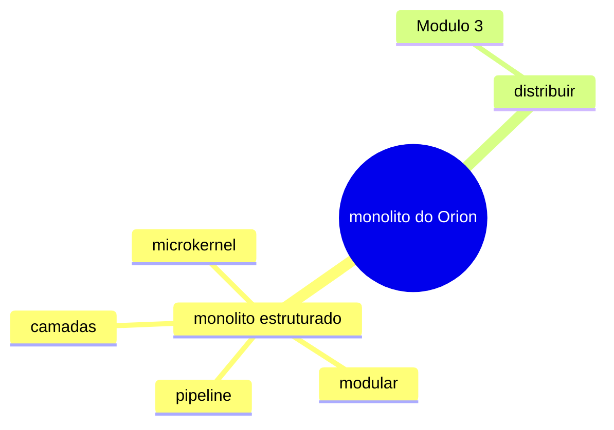

# Módulo 2 — Arquiteturas Monolíticas

## A tese do módulo

O Módulo 1 diagnosticou o monólito do Orion: dez componentes com responsabilidade nomeada, um grafo de 17 arestas entre eles, acoplamento e connascência atravessando fronteiras. A oficina da Aula 8 encerrou com uma pergunta em aberto — ser um monólito é o problema?

A resposta deste módulo é que não é. Um monólito é uma decisão de empacotamento e de deploy, legítima e revisável. O que trava a entrega no Orion não é o sistema caber em um único artefato; é a fronteira entre os componentes existir apenas no nome, sem nada que a imponha. As sete aulas a seguir tratam de impor essa fronteira sem partir o sistema em processos que conversam por rede: camadas, módulos de domínio, e duas formas de monólito com estrutura própria — pipeline e microkernel. Distribuir fica para o Módulo 3, e entra em cena só depois de a fronteira lógica existir.

## As quatro semanas

| Semana | Aulas |
|---|---|
| 5 | **9** — O monólito não é o problema · **10** — Monólito em camadas: o que governa e o que não isola |
| 6 | **11** — Monólito modular: fronteira lógica sem fronteira física · **12** — Reorganizar o grafo do Orion |
| 7 | **13** — Pipeline e microkernel: monólitos com forma · **14** — Quando o monólito deixa de servir |
| 8 | **15** — Oficina: o Orion modular sob restrição (dois encontros) |

A Aula 15 ocupa os dois encontros da semana 8, como a Aula 8 fez no Módulo 1: priorizar a introdução de fronteiras sob orçamento é a competência central do módulo e não cabe em um encontro só.

## O espaço de opções

O diagrama reúne as formas que o Orion pode assumir sem deixar de ser um único *deployable* e separa delas a opção de distribuir, tratada no Módulo 3.

O que ele **não** mostra: não é a ordem das aulas nem uma escala de preferência. Os quatro estilos de monólito estruturado não se excluem — um sistema em camadas pode ter um módulo interno organizado como microkernel. É um espaço de opções, não um percurso.

## O Mini-Orion neste módulo

O recorte executável do professor parte de `03-governado`, o estado em que o Módulo 1 o deixou — com três contratos de `import-linter` já verificados na integração contínua —, e evolui por `04-camadas`, `05-modular` e `06-microkernel`. A leitura mais proveitosa é comparar o `setup.cfg` de um estado para o seguinte: cada contrato novo é uma fronteira interna que passou a ser imposta, e a diferença entre dois arquivos é a decisão da aula escrita como verificação.

## O Orion Evolution Lab

Cada grupo aplica o mesmo percurso ao seu recorte: agrupar componentes em módulos de domínio, decidir quais arestas viram fronteira, registrar cada decisão como ADR e fechar o módulo com um critério explícito de até onde modularizar e por que não distribuir além disso. Formato, artefatos e critérios em [Orion Evolution Lab](../orion/index.md).

## Aulas

1. [O monólito não é o problema](aula09-monolito-nao-e-o-problema.md) — empacotamento contra ausência de fronteira; ADR de não distribuir, com gatilho de reversão observável.

As demais aulas entram nesta lista conforme são publicadas.
