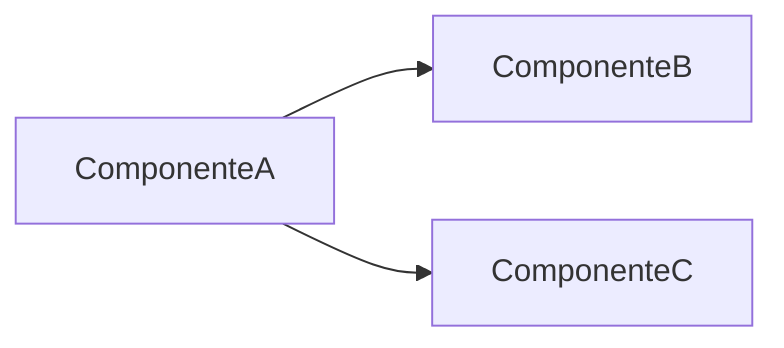

# Orion Evolution Lab

Projeto que acompanha vocês pelo semestre inteiro. Cada grupo analisa um recorte do Marketplace Orion e produz, aula após aula, uma proposta arquitetural sustentada por evidência.

!!! info "O material nunca resolve o Evolution Lab"

    O Mini-Orion — o recorte que o professor resolve em aula — existe para mostrar o método. O Evolution Lab existe para vocês aplicarem o método a um problema que ninguém resolveu na sua frente.

    Por isso aqui você encontra **formatos e critérios**, e nunca conteúdo preenchido. Se houvesse um gabarito, a única coisa exercitada seria a leitura dele.

## Como a avaliação funciona

**Avalia-se a qualidade da justificativa, não a escolha.**

Duas propostas opostas podem receber nota máxima, se ambas nomearem o contexto, as alternativas e o custo. Uma proposta que coincide com a preferência do professor mas não sustenta o porquê recebe nota baixa.

Isso costuma ser desconfortável no começo. As disciplinas anteriores tinham resposta certa; esta não tem, e o hábito de procurar a resposta do professor atrapalha mais do que ajuda aqui.

### O que separa argumento de opinião

| | Opinião | Argumento |
|---|---|---|
| **Contexto** | vale sempre | nomeia a restrição sob a qual vale |
| **Alternativa** | ausente, ou montada para perder | alternativa real, que alguém competente escolheria |
| **Custo** | só benefícios | nomeia o que a escolha custa e o que ela impede |
| **Evidência** | "é mais limpo", "é melhor" | métrica, teste, dependência que sumiu, incidente evitado |
| **Falseabilidade** | não se pode discordar | diz o que observaríamos se estivesse errado |

O quinto critério é o mais raro e o que mais pesa. Uma proposta que não diz sob que condição estaria errada não é uma proposta técnica.

### Pesos

| Critério | Peso | Nota máxima exige |
|---|---|---|
| **Diagnóstico** | 20% | problemas localizados em componentes específicos, cada um com evidência no grafo, no código ou na métrica |
| **Vocabulário** | 15% | acoplamento, coesão, connascência e métricas usados com precisão; connascência classificada pelos três eixos |
| **Alternativas** | 20% | no mínimo duas por decisão relevante, ambas defensáveis; a descartada explicada sem caricatura |
| **Trade-off** | 20% | custo nomeado em dimensão concreta: prazo, operação, testabilidade, pessoas, reversão |
| **Priorização** | 15% | ordem justificada por critério explícito; diz o que fica de fora e por quê |
| **Comunicação** | 10% | diagrama legível que declara o que omite; texto que outra pessoa entende sem o autor presente |

### Penalidades

- Proposta sem nenhum custo nomeado: **teto de 60**, independentemente do resto.
- Alternativa montada só para perder: **zera** o critério de alternativas.
- Números que não batem entre si dentro da mesma entrega: **zera** o diagnóstico. É o mesmo padrão que cobramos deste material.

## Os artefatos

Acumulam ao longo do módulo. Não recomecem a cada entrega — cada aula acrescenta uma camada à mesma análise.

### 1. Mapa de componentes e dependências

Diagrama mais tabela. Aparece a partir da Aula 4.



Leitura das setas: `A --> B` significa que **A depende de B**. Declarem isso na legenda — é a convenção da disciplina e dela dependem todos os cálculos.

Acompanha:

| Componente | Responsabilidade | Não é responsável por |
|---|---|---|

E, obrigatoriamente, uma frase dizendo **o que o mapa não representa**. Todo diagrama arquitetural omite; omitir sem avisar é o defeito clássico.

### 2. Registro de diagnóstico

A partir da Aula 5.

| Componente | Problema | Evidência | Impacto |
|---|---|---|---|

Evidência é o que sustenta a linha: uma dependência no grafo, um trecho de código, um número, um incidente. "Parece confuso" não é evidência.

### 3. ADR

A partir da Aula 2, um por decisão relevante.

```markdown
# ADR-001 — <título em uma linha>

## Contexto
A situação e a restrição que forçam uma decisão agora.

## Decisão
O que foi decidido, em uma frase.

## Alternativas consideradas
O que mais foi avaliado, e por que foi descartado.
Alternativa descartada sem motivo real não conta.

## Consequências
Positivas E negativas. As duas são obrigatórias.

## Reversão
O que custaria voltar atrás daqui a seis meses.
```

ADR sem consequência negativa está incompleto. Não é decisão, é anúncio.

### 4. Tabela de métricas

A partir da Aula 7.

| Componente | $C_a$ | $C_e$ | $I$ | $N_a$ | $N_c$ | $A$ | $D$ |
|---|---|---|---|---|---|---|---|

Três exigências:

- declarem a convenção de contagem usada para $N_a$ — sem ela os números não são verificáveis;
- confiram que $\sum C_a = \sum C_e$ = número de arestas do grafo;
- incluam a posição dos componentes no plano $A \times I$, não apenas o ranking de $D$.

A leitura deve conter **um caso em que a métrica não aponta o problema real**. Ele quase sempre existe.

### 5. Proposta de evolução

Entrega final.

Para cada ação: o que resolve, o que custa, em que ordem, e **como saberemos que funcionou**. No máximo três ações — a restrição é parte do exercício.

## Estrutura da entrega

```
1. Recorte analisado          o que está dentro, o que ficou fora, por quê
2. Mapa de dependências       diagrama + tabela
3. Diagnóstico                por componente: problema, evidência, impacto
4. Métricas                   tabela + leitura, incluindo onde a métrica engana
5. Decisões propostas         uma seção por decisão, em formato ADR
6. Priorização                ordem, critério, e o que fica para depois
7. Critério de sucesso        o que observaríamos se as decisões funcionassem
```

A seção 7 é a mais esquecida e a que mais diferencia.

## Defesa final

Na semana 18, cada grupo defende a proposta diante de perguntas.

| Critério | Peso |
|---|---|
| Sustenta a decisão diante de contestação | 40% |
| **Reconhece o limite da própria proposta** | 25% |
| Responde com evidência, não com repetição | 20% |
| Clareza na exposição | 15% |

O segundo critério vale mais do que parece. O grupo que diz "essa parte da nossa proposta é frágil porque não medimos X" demonstra a competência central da disciplina. O que defende tudo com a mesma convicção, não.

As perguntas incluirão sempre ao menos uma alternativa legítima que vocês não escolheram — não para derrubar a proposta, mas para verificar se vocês entendem por que não a escolheram.
